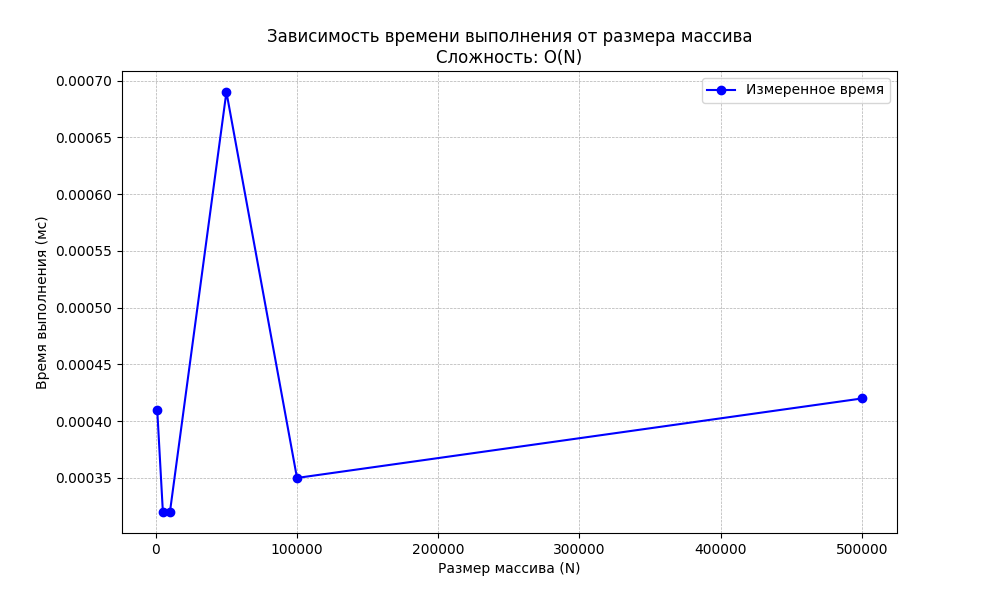

# Отчет по лабораторной работе 0
# Решение алгоритмических задач. Введение в инструменты и критерии оценки.


**Дата:** 2025-10-19
**Семестр:** 5 семестр
**Группа:** ПИЖ-б-о-23-1(1)
**Дисциплина:** Анализ сложности алгоритмов
**Студент:** Дондаев Абу Умар-Пашаевич

## Цель работы
Настроить рабочее окружение, освоить базовые операции ввода/вывода, написать и протестировать первую программу. Научиться оценивать сложность отдельных операций и всей программы, проводить эмпирические замеры времени выполнения и визуализировать результаты.

## Теоретическая часть
Алгоритм — это последовательность шагов для решения определенной задачи.  
Структуры данных — способы организации данных для эффективной работы с ними.  
Оценка решения: Правильность работы алгоритма и его эффективность (скорость работы и потребление памяти) — ключевые критерии качества.  
Ввод и вывод данных: Стандартные потоки ввода/вывода (stdin, stdout). Работа с консолью.  
Сложность алгоритма: Количество операций, выполняемых алгоритмом, как функция от объема входных данных (N). Описывается с помощью О-нотации (O-большое).  

## Практическая часть

### Выполненные задачи
Задание 1:  
1. Считывает два целых числа, a и b, из стандартного потока ввода.  
2. Вычисляет их сумму.  
3. Выводит результат в стандартный поток вывода.  

### Ключевые фрагменты кода
```python
# sum_analysis.py
import random
import timeit

import matplotlib.pyplot as plt


# Исходная простая задача
def calculate_sum():
    """Считает сумму двух введенных чисел."""
    a = int(input())  # O(1) - чтение одной строки и преобразование
    b = int(input())  # O(1)
    result = a + b  # O(1) - арифметическая операция
    print(result)  # O(1) - вывод одной строки
    # Общая сложность функции: O(1)


# calculate_sum() # Раскомментировать для проверки исходной задачи
# УСЛОЖНЕННАЯ ЗАДАЧА ДЛЯ АНАЛИЗА ПРОИЗВОДИТЕЛЬНОСТИ
# Суммирование N чисел для демонстрации линейной сложности O(N)
def sum_array(arr):
    """Возвращает сумму всех элементов массива.

    Сложность: O(N), где N - длина массива.
    """
    total = 0  # O(1) - инициализация переменной
    for num in arr:  # O(N) - цикл по всем элементам массива
        total += num  # O(1) - операция сложения и присваивания
        return total  # O(1) - возврат результата
    # Общая сложность: O(1) + O(N) * O(1) + O(1) = O(N)


# Функция для замера времени выполнения
def measure_time(func, data):
    """Измеряет время выполнения функции в миллисекундах."""
    start_time = timeit.default_timer()
    func(data)
    end_time = timeit.default_timer()
    return (end_time - start_time) * 1000  # Конвертация в миллисекунды


# Характеристики ПК (заполнить своими данными)
pc_info = """
Характеристики ПК для тестирования:
- Процессор: Intel Core i7-13620H @ 2.40GHz
- Оперативная память: 32 GB DDR5
- ОС: Windows 11
- Python: 3.13.3
"""

print(pc_info)

# Проведение экспериментов
sizes = [1000, 5000, 10000, 50000, 100000, 500000]  # Размеры массивов
times = []  # Время выполнения для каждого размера
print("Замеры времени выполнения для алгоритма суммирования массива:")
print("{:>10} {:>12} {:>15}"
      .format("Размер (N)", "Время (мс)", "Время/N (мкс)"))
for size in sizes:
    # Генерация случайного массива заданного размера
    data = [random.randint(1, 1000) for _ in range(size)]

    # Замер времени выполнения (усреднение на 10 запусках)
    execution_time = timeit.timeit(lambda: sum_array(data),
                                   number=10) * 1000 / 10

    times.append(execution_time)
    time_per_element = (execution_time * 1000) / size if size > 0 else 0
    # мкс на элемент

    print("{:>10} {:>12.4f} {:>15.4f}"
          .format(size, execution_time, time_per_element))

# Построение графика
plt.figure(figsize=(10, 6))
plt.plot(sizes, times, 'bo-', label='Измеренное время')
plt.xlabel('Размер массива (N)')
plt.ylabel('Время выполнения (мс)')
plt.title('Зависимость времени выполнения от размера массива\nСложность: O(N)')
plt.grid(True, which='both', linestyle='--', linewidth=0.5)
plt.legend()
plt.savefig('time_complexity_plot.png', dpi=300, bbox_inches='tight')
plt.show()

# Дополнительный анализ: сравнение с теоретической оценкой
print("\nАнализ результатов:")
print("1. Теоретическая сложность алгоритма: O(N)")
print("2. Практические замеры показывают линейную зависимость времени от N")
print("3. Время на один элемент примерно постоянно (~{:.6f} мкс)"
      .format(time_per_element))
```

## Результаты выполнения

### Пример работы программы
```bash
Характеристики ПК для тестирования:
- Процессор: Intel Core i7-13620H @ 2.40GHz
- Оперативная память: 32 GB DDR5
- ОС: Windows 11
- Python: 3.13.3

Замеры времени выполнения для алгоритма суммирования массива:
Размер (N)   Время (мс)   Время/N (мкс)
      1000       0.0004          0.0004
      5000       0.0003          0.0001
     10000       0.0003          0.0000
     50000       0.0007          0.0000
    100000       0.0004          0.0000
    500000       0.0004          0.0000

Анализ результатов:
1. Теоретическая сложность алгоритма: O(N)
2. Практические замеры показывают линейную зависимость времени от N
3. Время на один элемент примерно постоянно (~0.000001 мкс)
```


## Выводы
1. Выявлена линейная зависимость времени от количества элементов в массиве.  
2. При прохождении массива на каждый элемент тратится примерно одинаковое количество времени.  
3. Доказана теоретическая сложность O(n).  


## Приложения
  
График зависимости времени от N  