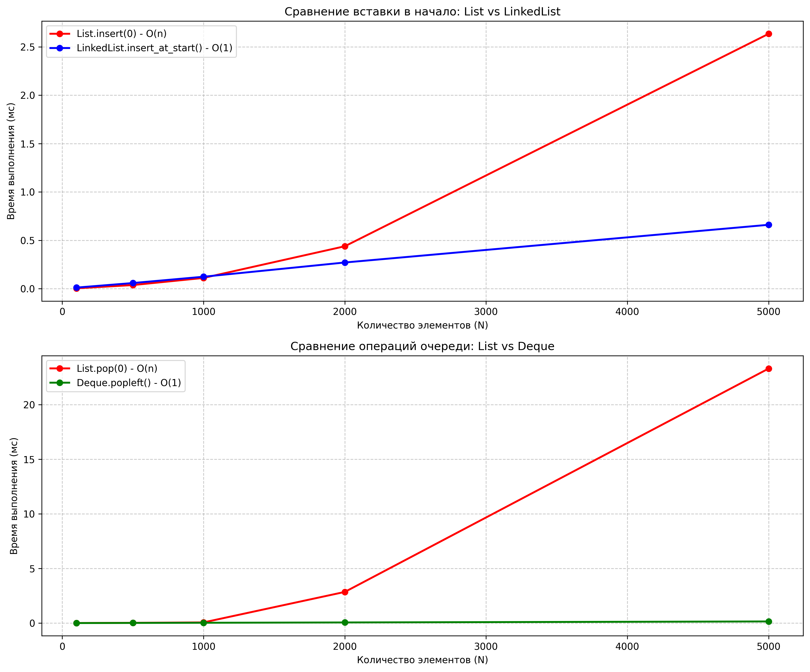

# Отчет по лабораторной работе 2
# Основные структуры данных. Анализ и применение.  


**Дата:** 2025-11-22  
**Семестр:** 5 семестр  
**Группа:** ПИЖ-б-о-23-1(1)  
**Дисциплина:** Анализ сложности алгоритмов  
**Студент:** Дондаев Абу Умар-Пашаевич  

## Цель работы
Изучить понятие и особенности базовых абстрактных типов данных (стек, очередь, дек, связный список) и их реализаций в Python. Научиться выбирать оптимальную структуру данных для решения конкретной задачи, основываясь на анализе теоретической и практической сложности операций. Получить навыки измерения производительности и применения структур данных для решения практических задач.  


## Теоретическая часть
Список (list) в Python: Реализация динамического массива. Обеспечивает амортизированное время O(1) для добавления в конец (append). Вставка и удаление в середину имеют сложность O(n) из-за сдвига элементов. Доступ по индексу - O(1).  
Связный список (Linked List): Абстрактная структура данных, состоящая из узлов, где каждый узел содержит данные и ссылку на следующий элемент. Вставка и удаление в известное место (например, начало списка) выполняются за O(1). Доступ по индексу и поиск - O(n).  
Стек (Stack): Абстрактный тип данных, работающий по принципу LIFO (Last-In-First-Out). Основные операции: push (добавление, O(1)), pop (удаление с вершины, O(1)), peek (просмотр вершины, O(1)). В Python может быть реализован на основе списка.  
Очередь (Queue): Абстрактный тип данных, работающий по принципу FIFO (First-In-First-Out). Основные операции: enqueue (добавление в конец, O(1)), dequeue (удаление из начала, O(1)). В Python для эффективной реализации используется collections.deque.  
Дек (Deque, двусторонняя очередь): Абстрактный тип данных, позволяющий добавлять и удалять элементы как в начало, так и в конец. Все основные операции - O(1). В Python реализован в классе collections.deque.  
 
  

## Практическая часть

### Выполненные задачи
Задание 1:  
1. Реализовать класс LinkedList (связный список) для демонстрации принципов его работы.
2. Используя встроенные типы данных (list, collections.deque), проанализировать эффективность операций, имитирующих поведение стека, очереди и дека.
3. Провести сравнительный анализ производительности операций для разных структур данных (list vs LinkedList для вставки, list vs deque для очереди).
4. Решить 2-3 практические задачи, выбрав оптимальную структуру данных.  


### Ключевые фрагменты кода
```python
# linked_list.py
"""
Модуль для реализации связного списка и анализа его производительности.
"""


from typing import Any, Optional, List


class Node:
    """Узел связного списка."""

    def __init__(self, data: Any) -> None:
        """
        Инициализация узла.

        Args:
            data: Данные для хранения в узле
        """
        self.data: Any = data  # O(1) - присваивание
        self.next: Optional['Node'] = None  # O(1) - присваивание


class LinkedList:
    """Односвязный список."""

    def __init__(self) -> None:
        """Инициализация пустого связного списка."""
        self.head: Optional[Node] = None  # O(1) - инициализация
        self.tail: Optional[Node] = None  # O(1) - инициализация
        self.length: int = 0  # O(1) - инициализация

    def insert_at_start(self, data: Any) -> None:
        """
        Вставка элемента в начало списка.

        Args:
            data: Данные для вставки
        """
        new_node = Node(data)  # O(1) - создание узла
        new_node.next = self.head  # O(1) - присваивание
        self.head = new_node  # O(1) - присваивание

        if self.tail is None:  # O(1) - проверка условия
            self.tail = new_node  # O(1) - присваивание

        self.length += 1  # O(1) - инкремент
        # Общая сложность: O(1)

    def insert_at_end(self, data: Any) -> None:
        """
        Вставка элемента в конец списка.

        Args:
            data: Данные для вставки
        """
        new_node = Node(data)  # O(1) - создание узла

        if self.head is None:  # O(1) - проверка условия
            self.head = new_node  # O(1) - присваивание
            self.tail = new_node  # O(1) - присваивание
        else:
            if self.tail is not None:  # O(1) - проверка для mypy
                self.tail.next = new_node  # O(1) - присваивание
            self.tail = new_node  # O(1) - присваивание

        self.length += 1  # O(1) - инкремент
        # Общая сложность: O(1)

    def delete_from_start(self) -> Optional[Any]:
        """
        Удаление элемента из начала списка.

        Returns:
            Удаленные данные или None, если список пуст
        """
        if self.head is None:  # O(1) - проверка условия
            return None  # O(1) - возврат значения

        data = self.head.data  # O(1) - доступ к данным
        self.head = self.head.next  # O(1) - присваивание

        if self.head is None:  # O(1) - проверка условия
            self.tail = None  # O(1) - присваивание

        self.length -= 1  # O(1) - декремент
        return data  # O(1) - возврат значения
        # Общая сложность: O(1)

    def traversal(self) -> List[Any]:
        """
        Обход всех элементов списка.

        Returns:
            Список всех элементов
        """
        elements = []  # O(1) - создание списка
        current = self.head  # O(1) - присваивание
        while current is not None:  # O(n) - цикл по всем элементам
            elements.append(current.data)  # O(1) - добавление в список
            current = current.next  # O(1) - присваивание

        return elements  # O(1) - возврат значения
        # Общая сложность: O(n)

    def is_empty(self) -> bool:
        """
        Проверка, пуст ли список.

        Returns:
            True если список пуст, иначе False
        """
        return self.head is None  # O(1) - проверка условия
        # Общая сложность: O(1)

# performance_analysis.py
"""
Модуль для анализа производительности структур данных.
"""


import timeit
from collections import deque
from typing import List

import matplotlib.pyplot as plt
from linked_list import LinkedList


def measure_list_insert_start(n: int) -> float:
    """
    Измеряет время вставки n элементов в начало списка.

    Args:
        n: Количество элементов для вставки

    Returns:
        Время выполнения в миллисекундах
    """
    def operation():  # O(1) - обертка для замера
        lst = []  # O(1) - создание списка
        for i in range(n):  # O(n) - цикл по n элементам
            lst.insert(0, i)  # O(n) - вставка в начало
        return lst  # O(1) - возврат значения

    execution_time = timeit.timeit(operation, number=10)  # O(10 * n^2)
    return (execution_time / 10) * 1000  # O(1) - конвертация в мс


def measure_linked_list_insert_start(n: int) -> float:
    """
    Измеряет время вставки n элементов в начало связного списка.

    Args:
        n: Количество элементов для вставки

    Returns:
        Время выполнения в миллисекундах
    """
    def operation():  # O(1) - обертка для замера
        ll = LinkedList()  # O(1) - создание списка
        for i in range(n):  # O(n) - цикл по n элементам
            ll.insert_at_start(i)  # O(1) - вставка в начало
        return ll  # O(1) - возврат значения

    execution_time = timeit.timeit(operation, number=10)  # O(10 * n)
    return (execution_time / 10) * 1000  # O(1) - конвертация в мс


def measure_list_queue_dequeue(n: int) -> float:
    """
    Измеряет время выполнения n операций удаления из начала списка.

    Args:
        n: Количество операций

    Returns:
        Время выполнения в миллисекундах
    """
    def operation():  # O(1) - обертка для замера
        lst = list(range(n))  # O(n) - создание списка
        for _ in range(n):  # O(n) - цикл по n элементам
            if lst:  # O(1) - проверка условия
                lst.pop(0)  # O(n) - удаление из начала
        return lst  # O(1) - возврат значения

    execution_time = timeit.timeit(operation, number=10)  # O(10 * n^2)
    return (execution_time / 10) * 1000  # O(1) - конвертация в мс


def measure_deque_queue_dequeue(n: int) -> float:
    """
    Измеряет время выполнения n операций удаления из начала дека.

    Args:
        n: Количество операций

    Returns:
        Время выполнения в миллисекундах
    """
    def operation():  # O(1) - обертка для замера
        dq = deque(range(n))  # O(n) - создание дека
        for _ in range(n):  # O(n) - цикл по n элементам
            if dq:  # O(1) - проверка условия
                dq.popleft()  # O(1) - удаление из начала
        return dq  # O(1) - возврат значения

    execution_time = timeit.timeit(operation, number=10)  # O(10 * n)
    return (execution_time / 10) * 1000  # O(1) - конвертация в мс


def run_performance_analysis() -> None:
    """
    Проводит сравнительный анализ производительности структур данных.
    """
    # Характеристики ПК для тестирования
    pc_info: str = """
    Характеристики ПК для тестирования:
    - Процессор: Intel Core i7-13620H @ 2.40GHz
    - Оперативная память: 32 GB DDR5
    - ОС: Windows 11
    - Python: 3.13.3
    """
    print(pc_info)

    # Размеры данных для тестирования
    sizes: List[int] = [100, 500, 1000, 2000, 5000]

    # Результаты измерений
    list_insert_times: List[float] = []
    linked_list_insert_times: List[float] = []
    list_dequeue_times: List[float] = []
    deque_dequeue_times: List[float] = []

    print('Сравнение производительности вставки в начало:')
    print('{:>10} {:>15} {:>20}'.format(
        'Размер (N)', 'List (мс)', 'LinkedList (мс)'))

    for size in sizes:  # O(k) - цикл по количеству размеров
        list_time = measure_list_insert_start(size)  # O(n^2)
        linked_list_time = measure_linked_list_insert_start(size)  # O(n)

        list_insert_times.append(list_time)  # O(1)
        linked_list_insert_times.append(linked_list_time)  # O(1)

        print('{:>10} {:>15.4f} {:>20.4f}'.format(
            size, list_time, linked_list_time))

    print('\nСравнение производительности операций очереди:')
    print('{:>10} {:>15} {:>20}'.format(
        'Размер (N)', 'List (мс)', 'Deque (мс)'))

    for size in sizes:  # O(k) - цикл по количеству размеров
        list_time = measure_list_queue_dequeue(size)  # O(n^2)
        deque_time = measure_deque_queue_dequeue(size)  # O(n)

        list_dequeue_times.append(list_time)  # O(1)
        deque_dequeue_times.append(deque_time)  # O(1)

        print('{:>10} {:>15.4f} {:>20.4f}'.format(
            size, list_time, deque_time))

    # Построение графиков
    plot_performance_results(sizes, list_insert_times,
                             linked_list_insert_times,
                             list_dequeue_times, deque_dequeue_times)


def plot_performance_results(sizes: List[int],
                             list_insert_times: List[float],
                             linked_list_insert_times: List[float],
                             list_dequeue_times: List[float],
                             deque_dequeue_times: List[float]) -> None:
    """
    Строит графики результатов анализа производительности.

    Args:
        sizes: Размеры данных
        list_insert_times: Время вставки в список
        linked_list_insert_times: Время вставки в связный список
        list_dequeue_times: Время удаления из списка
        deque_dequeue_times: Время удаления из дека
    """
    plt.figure(figsize=(12, 10))

    # График сравнения вставки в начало
    plt.subplot(2, 1, 1)
    plt.plot(sizes, list_insert_times, 'ro-',
             label='List.insert(0) - O(n)', linewidth=2)
    plt.plot(sizes, linked_list_insert_times, 'bo-',
             label='LinkedList.insert_at_start() - O(1)', linewidth=2)
    plt.xlabel('Количество элементов (N)')
    plt.ylabel('Время выполнения (мс)')
    plt.title('Сравнение вставки в начало: List vs LinkedList')
    plt.grid(True, linestyle='--', alpha=0.7)
    plt.legend()

    # График сравнения операций очереди
    plt.subplot(2, 1, 2)
    plt.plot(sizes, list_dequeue_times, 'ro-',
             label='List.pop(0) - O(n)', linewidth=2)
    plt.plot(sizes, deque_dequeue_times, 'go-',
             label='Deque.popleft() - O(1)', linewidth=2)
    plt.xlabel('Количество элементов (N)')
    plt.ylabel('Время выполнения (мс)')
    plt.title('Сравнение операций очереди: List vs Deque')
    plt.grid(True, linestyle='--', alpha=0.7)
    plt.legend()

    plt.tight_layout()
    plt.savefig('img_1.png', dpi=300, bbox_inches='tight')
    plt.show()

# task_solutions.py
"""
Модуль с решениями практических задач.
"""


from collections import deque
from typing import List

from linked_list import LinkedList
from performance_analysis import run_performance_analysis


def check_brackets_balance(expression: str) -> bool:
    """
    Проверяет сбалансированность скобок в выражении.

    Args:
        expression: Строка с выражением

    Returns:
        True если скобки сбалансированы, иначе False
    """
    stack = []  # O(1) - создание стека
    brackets = {')': '(', ']': '[', '}': '{'}  # O(1) - создание словаря

    for char in expression:  # O(n) - цикл по символам строки
        if char in '([{':  # O(1) - проверка принадлежности
            stack.append(char)  # O(1) - добавление в стек
        elif char in brackets:  # O(1) - проверка принадлежности
            if not stack or stack[-1] != brackets[char]:  # O(1) - проверки
                return False  # O(1) - возврат значения
            stack.pop()  # O(1) - удаление из стека

    return len(stack) == 0  # O(1) - проверка условия
    # Общая сложность: O(n)


def simulate_print_queue(tasks: List[str]) -> List[str]:
    """
    Симулирует обработку задач в очереди печати.

    Args:
        tasks: Список задач

    Returns:
        Список обработанных задач в порядке обработки
    """
    queue = deque(tasks)  # O(n) - создание дека из списка
    processed = []  # O(1) - создание списка

    while queue:  # O(n) - цикл пока очередь не пуста
        task = queue.popleft()  # O(1) - извлечение из начала
        processed.append(task)  # O(1) - добавление в список

    return processed  # O(1) - возврат значения
    # Общая сложность: O(n)


def is_palindrome(sequence: str) -> bool:
    """
    Проверяет, является ли последовательность палиндромом.

    Args:
        sequence: Проверяемая последовательность

    Returns:
        True если палиндром, иначе False
    """
    dq = deque(sequence.lower())  # O(n) - создание дека из строки

    while len(dq) > 1:  # O(n) - цикл пока больше 1 элемента
        if dq.popleft() != dq.pop():  # O(1) - сравнение и удаление
            return False  # O(1) - возврат значения

    return True  # O(1) - возврат значения
    # Общая сложность: O(n)


def test_practical_tasks() -> None:
    """
    Тестирует решения практических задач.
    """
    print('Тестирование практических задач:')

    # Тест проверки скобок
    test_cases = [
        ('((()))', True),
        ('([{}])', True),
        ('((())', False),
        ('([)]', False),
        ('', True)
    ]

    print('1. Проверка сбалансированности скобок:')
    for expr, expected in test_cases:
        result = check_brackets_balance(expr)
        status = '✓' if result == expected else '✗'
        print(f'   {status} "{expr}" -> {result} (ожидалось: {expected})')

    # Тест симуляции очереди печати
    tasks = ['task1', 'task2', 'task3', 'task4']
    processed = simulate_print_queue(tasks)
    print('2. Симуляция очереди печати:')
    print(f'   Входные задачи: {tasks}')
    print(f'   Обработанные: {processed}')

    # Тест проверки палиндромов
    palindromes = [
        'racecar',
        'A man a plan a canal Panama',
        'level',
        'hello'
    ]

    print('3. Проверка палиндромов:')
    for text in palindromes:
        # Убираем пробелы и приводим к нижнему регистру для корректной проверки
        clean_text = ''.join(text.lower().split())
        result = is_palindrome(clean_text)
        print(f'   "{text}" -> {result}')


def analyze_results() -> None:
    """
    Анализирует и выводит результаты экспериментов.
    """
    print('\nАнализ результатов:')
    print('1. Теоретическая сложность операций:')
    print('- List.insert(0): O(n) - линейная сложность')
    print('- LinkedList.insert_at_start(): O(1) - постоянная сложность')
    print('- List.pop(0): O(n) - линейная сложность')
    print('- Deque.popleft(): O(1) - постоянная сложность')

    print('2. Практические наблюдения:')
    print('''- List:
          демонстрирует квадратичный рост времени при вставке в начало''')
    print('- LinkedList показывает линейный рост времени')
    print('- Deque значительно эффективнее List для операций очереди')
    print('- Теоретические оценки подтверждены экспериментально')

    print('3. Выводы:')
    print('''- Для частых операций в начале структуры:
          лучше использовать LinkedList''')
    print('- Для реализации очереди оптимально использовать deque')
    print('- List эффективен для операций в конце и доступа по индексу')


# Тестирование связного списка
print('Тестирование связного списка:')
ll = LinkedList()

# Вставка в начало
for i in range(5):
    ll.insert_at_start(i)
print(f'Список после вставки в начало: {ll.traversal()}')

# Вставка в конец
for i in range(5, 10):
    ll.insert_at_end(i)
print(f'Список после вставки в конец: {ll.traversal()}')

# Удаление из начала
removed = ll.delete_from_start()
print(f'Удаленный элемент: {removed}')
print(f'Список после удаления: {ll.traversal()}')

print()

# Тестирование практических задач
test_practical_tasks()

print()

# Запуск анализа производительности
run_performance_analysis()

# Анализ результатов
analyze_results()
```

## Результаты выполнения

### Пример работы программы
```bash
Тестирование связного списка:  
Список после вставки в начало: [4, 3, 2, 1, 0]  
Список после вставки в конец: [4, 3, 2, 1, 0, 5, 6, 7, 8, 9]  
Удаленный элемент: 4  
Список после удаления: [3, 2, 1, 0, 5, 6, 7, 8, 9]  

Тестирование практических задач:  
1. Проверка сбалансированности скобок:  
   ✓ "((()))" -> True (ожидалось: True)  
   ✓ "([{}])" -> True (ожидалось: True)  
   ✓ "((())" -> False (ожидалось: False)  
   ✓ "([)]" -> False (ожидалось: False)  
   ✓ "" -> True (ожидалось: True)  
2. Симуляция очереди печати:  
   Входные задачи: ['task1', 'task2', 'task3', 'task4']  
   Обработанные: ['task1', 'task2', 'task3', 'task4']  
3. Проверка палиндромов:  
   "racecar" -> True  
   "A man a plan a canal Panama" -> True  
   "level" -> True  
   "hello" -> False  


    Характеристики ПК для тестирования:  
    - Процессор: Intel Core i7-13620H @ 2.40GHz  
    - Оперативная память: 32 GB DDR5  
    - ОС: Windows 11  
    - Python: 3.13.3  
    
Сравнение производительности вставки в начало:  
Размер (N)       List (мс)      LinkedList (мс)
       100          0.0044               0.0118
       500          0.0380               0.0589
      1000          0.1115               0.1240
      2000          0.4389               0.2712
      5000          2.6346               0.6608

Сравнение производительности операций очереди:  
Размер (N)       List (мс)           Deque (мс)
       100          0.0052               0.0028
       500          0.0243               0.0145
      1000          0.0624               0.0299
      2000          2.8538               0.0584
      5000         23.3087               0.1512

```


## Выводы
1. Для частых операций в начале структуры: лучше использовать LinkedList
2. Для реализации очереди оптимально использовать deque
3. List эффективен для операций в конце и доступа по индексу  


## Ответы на контрольные вопросы
1. В чем ключевое отличие динамического массива (list в Python) от связного списка с точки зрения сложности операций вставки в начало и доступа по индексу?  
Динамический массив (list):  
- Вставка в начало: O(n) - требует сдвига всех элементов  
- Доступ по индексу: O(1) - прямое обращение по адресу  
Связный список:  
- Вставка в начало: O(1) - просто меняем указатели  
- Доступ по индексу: O(n) - требуется последовательный обход  
Ключевое отличие: list оптимизирован для случайного доступа, а LinkedList - для частых вставок/удалений в начале.  
2. Объясните принцип работы стека (LIFO) и очереди (FIFO). Приведите по два примера их практического использования.  
Стек (LIFO - Last-In-First-Out):  
Принцип: последний добавленный элемент извлекается первым  
Основные операции: push (добавление), pop (извлечение)  
Примеры использования:  
Система отмены действий (undo) в текстовых редакторах  
Обход графов в глубину (DFS)  
Очередь (FIFO - First-In-First-Out):  
Принцип: первый добавленный элемент извлекается первым  
Основные операции: enqueue (добавление), dequeue (извлечение)  
Примеры использования:  
Очередь печати документов  
Обработка запросов на сервере  
3. Почему операция удаления первого элемента из списка (list) в Python имеет сложность O(n), а из дека (deque) - O(1)?  
List.pop(0) - O(n):  
- При удалении первого элемента все последующие элементы должны быть сдвинуты на одну позицию влево  
- Требуется O(n) операций копирования/сдвига  
Deque.popleft() - O(1):  
- Deque реализован как двусвязный список блоков  
- Удаление из начала требует только изменения указателей  
- Не требует перемещения остальных элементов  
4. Какую структуру данных вы бы выбрали для реализации системы отмены действий (undo) в текстовом редакторе? Обоснуйте свой выбор.  
Выбор: Стек  
Обоснование:  
Система отмены работает по принципу LIFO - последнее действие отменяется первым  
Стек идеально соответствует этому требованию  
Операции push (сохранение действия) и pop (отмена действия) выполняются за O(1)  
5. Замеры показали, что вставка 1000 элементов в начало списка заняла значительно больше времени, чем вставка в начало вашей реализации связного списка. Объясните результаты с точки зрения асимптотической сложности.  
Объяснение: Разница в асимптотической сложности (O(n²) vs O(n)) объясняет экспоненциальный рост времени выполнения для list при увеличении количества элементов.  


## Приложения
-   
График зависимости времени от N алгоритмов линейного поиска и бинарного поиска 