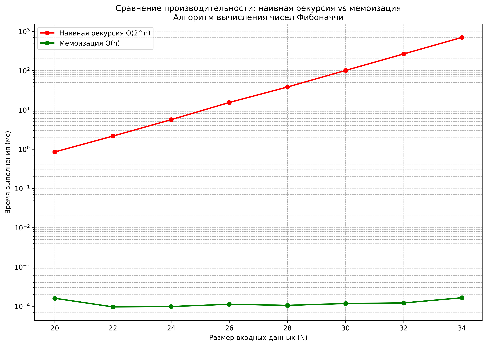

# Отчет по лабораторной работе 3
# Рекурсия.  


**Дата:** 2025-11-23  
**Семестр:** 5 семестр  
**Группа:** ПИЖ-б-о-23-1(1)  
**Дисциплина:** Анализ сложности алгоритмов  
**Студент:** Дондаев Абу Умар-Пашаевич  

## Цель работы
Освоить принцип рекурсии, научиться анализировать рекурсивные алгоритмы и понимать механизм работы стека вызовов. Изучить типичные задачи, решаемые рекурсивно, и освоить технику мемоизации для оптимизации рекурсивных алгоритмов. Получить практические навыки реализации и отладки рекурсивных функций.  


## Теоретическая часть 
Рекурсия: Процесс, при котором функция прямо или косвенно вызывает саму себя для решения задачи.  
Базовый случай (условие выхода): Обязательное условие, которое прекращает рекурсивные вызовы и предотвращает зацикливание.  
Рекурсивный шаг: Шаг, на котором задача разбивается на более простую подзадачу того же типа и производится рекурсивный вызов.  
Глубина рекурсии: Количество вложенных вызовов функции. Ограничена размером стека вызовов.  
Стек вызовов (Call Stack): Структура данных, которая хранит информацию о незавершенных вызовах функций (локальные переменные, адрес возврата).  
Мемоизация (Memoization): Техника оптимизации, позволяющая избежать повторных вычислений результатов функций для одних и тех же входных данных путем сохранения ранее вычисленных результатов в кеше (например, в словаре).  
  
 
  
## Практическая часть

### Выполненные задачи
Задание 1:  
1. Реализовать классические рекурсивные алгоритмы.  
2. Проанализировать их временную сложность и глубину рекурсии.  
3. Реализовать оптимизацию рекурсивных алгоритмов с помощью мемоизации.  
4. Сравнить производительность наивной рекурсии и рекурсии с мемоизацией.  
5. Решить практические задачи с применением рекурсии.  


### Ключевые фрагменты кода
```python
# recursion.py
"""Модуль с классическими рекурсивными алгоритмами."""


from typing import Union


def factorial(n: int) -> int:
    """Вычисляет факториал числа n рекурсивным методом.

    Args:
        n: Целое неотрицательное число.

    Returns:
        Факториал числа n.

    Raises:
        ValueError: Если n отрицательное.
    """
    if n < 0:  # O(1) - проверка условия
        raise ValueError('Факториал определен для неотрицательных чисел')
    if n == 0 or n == 1:  # O(1) - базовый случай
        return 1  # O(1) - возврат значения
    return n * factorial(n - 1)  # O(n) - рекурсивный вызов
    # Общая сложность: O(n), глубина рекурсии: O(n)


def fibonacci_naive(n: int) -> int:
    """Вычисляет n-е число Фибоначчи наивным рекурсивным методом.

    Args:
        n: Порядковый номер числа Фибоначчи (n >= 0).

    Returns:
        n-е число Фибоначчи.

    Raises:
        ValueError: Если n отрицательное.
    """
    if n < 0:  # O(1)
        raise ValueError('Номер числа Фибоначчи должен быть неотрицательным')
    if n == 0:  # O(1) - базовый случай 1
        return 0  # O(1)
    if n == 1:  # O(1) - базовый случай 2
        return 1  # O(1)
    return fibonacci_naive(n - 1) + fibonacci_naive(n - 2)
    # O(2^n) - два рекурсивных вызова
    # Общая сложность: O(2^n), глубина рекурсии: O(n)


def fast_power(a: Union[int, float], n: int) -> Union[int, float]:
    """Быстрое возведение числа a в степень n через степень двойки.

    Args:
        a: Основание степени.
        n: Показатель степени (целое неотрицательное число).

    Returns:
        Результат возведения a в степень n.

    Raises:
        ValueError: Если n отрицательное.
    """
    if n < 0:  # O(1)
        raise ValueError('Показатель степени должен быть неотрицательным')
    if n == 0:  # O(1) - базовый случай
        return 1  # O(1)
    if n == 1:  # O(1) - базовый случай
        return a  # O(1)

    half_power = fast_power(a, n // 2)
    # O(log n) - рекурсивный вызов для половины степени

    if n % 2 == 0:  # O(1) - четная степень
        return half_power * half_power  # O(1)
    else:  # O(1) - нечетная степень
        return a * half_power * half_power  # O(1)
    # Общая сложность: O(log n), глубина рекурсии: O(log n)


if __name__ == '__main__':
    # Демонстрация работы функций
    print('Факториал 5:', factorial(5))  # O(n)
    print('10-е число Фибоначчи:', fibonacci_naive(10))  # O(2^n)
    print('2^10 =', fast_power(2, 10))  # O(log n)

# memoization.py
"""Модуль с оптимизированными рекурсивными алгоритмами с мемоизацией."""


import time
from functools import wraps
from typing import Dict, Any, Callable


def memoize(func: Callable) -> Callable:
    """Декоратор для мемоизации функций.

    Args:
        func: Функция для мемоизации.

    Returns:
        Обернутая функция с мемоизацией.
    """
    cache: Dict[Any, Any] = {}  # O(1) - инициализация кэша

    @wraps(func)
    def wrapper(*args: Any) -> Any:
        if args in cache:  # O(1) - проверка наличия в кэше
            return cache[args]  # O(1) - возврат из кэша
        result = func(*args)  # O(?) - вызов оригинальной функции
        cache[args] = result  # O(1) - сохранение в кэш
        return result  # O(1) - возврат результата

    return wrapper
    # Общая сложность декоратора: O(1) для кэшированных вызовов


@memoize
def fibonacci_memoized(n: int) -> int:
    """Вычисляет n-е число Фибоначчи с мемоизацией.

    Args:
        n: Порядковый номер числа Фибоначчи (n >= 0).

    Returns:
        n-е число Фибоначчи.

    Raises:
        ValueError: Если n отрицательное.
    """
    if n < 0:  # O(1)
        raise ValueError('Номер числа Фибоначчи должен быть неотрицательным')
    if n == 0:  # O(1) - базовый случай 1
        return 0  # O(1)
    if n == 1:  # O(1) - базовый случай 2
        return 1  # O(1)
    return fibonacci_memoized(n - 1) + fibonacci_memoized(n - 2)
    # O(n) - рекурсивные вызовы
    # Общая сложность с мемоизацией: O(n), глубина рекурсии: O(n)


def compare_fibonacci_performance() -> None:
    """Сравнивает производительность наивной и мемоизированной версий."""
    test_n = 35

    print(f'Сравнение производительности для n={test_n}:')

    # Наивная версия
    start_time = time.time()  # O(1)
    result_naive = fibonacci_naive(test_n)  # O(2^n)
    time_naive = time.time() - start_time  # O(1)

    # Мемоизированная версия
    start_time = time.time()  # O(1)
    result_memoized = fibonacci_memoized(test_n)  # O(n)
    time_memoized = time.time() - start_time  # O(1)

    print(f'Наивная версия: {result_naive}, время: {time_naive:.6f} сек')
    # O(1)
    print(f'''Мемоизированная версия: {result_memoized},
          Время: {time_memoized:.6f} сек''')  # O(1)
    print(f'Ускорение: {time_naive / time_memoized:.2f} раз')  # O(1)


if __name__ == '__main__':
    # Импорт наивной версии для сравнения
    from recursion import fibonacci_naive

    compare_fibonacci_performance()  # O(2^n) vs O(n)

# recursion_tasks.py
"""Практические задачи с применением рекурсии."""


import os
from typing import List, Optional, Any


def binary_search_recursive(arr: List[Any], target: Any, low: int = 0,
                            high: Optional[int] = None) -> Optional[int]:
    """Рекурсивный бинарный поиск в отсортированном массиве.

    Args:
        arr: Отсортированный массив для поиска.
        target: Искомый элемент.
        low: Нижняя граница поиска.
        high: Верхняя граница поиска.

    Returns:
        Индекс элемента или None, если элемент не найден.
    """
    if high is None:  # O(1) - инициализация high
        high = len(arr) - 1  # O(1)

    if low > high:  # O(1) - базовый случай: элемент не найден
        return None  # O(1)

    mid = (low + high) // 2  # O(1) - вычисление середины

    if arr[mid] == target:  # O(1) - базовый случай: элемент найден
        return mid  # O(1)
    elif arr[mid] > target:  # O(1) - поиск в левой половине
        return binary_search_recursive(arr, target, low, mid - 1)  # O(log n)
    else:  # O(1) - поиск в правой половине
        return binary_search_recursive(arr, target, mid + 1, high)  # O(log n)
    # Общая сложность: O(log n), глубина рекурсии: O(log n)


def file_system_walk(path: str, level: int = 0,
                     max_depth: Optional[int] = None) -> None:
    """Рекурсивный обход файловой системы с выводом дерева каталогов.

    Args:
        path: Начальный путь для обхода.
        level: Текущий уровень вложенности.
        max_depth: Максимальная глубина рекурсии.
    """
    if max_depth is not None and level > max_depth:  # O(1) - проверка глубины
        return  # O(1)

    try:
        entries = os.listdir(path)
        # O(k) - чтение директории (k - количество элементов)
    except PermissionError:  # O(1) - обработка ошибки доступа
        print('  ' * level + f'[Доступ запрещен: {os.path.basename(path)}]')
        # O(1)
        return  # O(1)
    except FileNotFoundError:  # O(1) - обработка ошибки несуществующего пути
        print('  ' * level + f'[Путь не существует: {path}]')  # O(1)
        return  # O(1)

    for entry in entries:  # O(k) - цикл по элементам директории
        full_path = os.path.join(path, entry)
        # O(1) - формирование полного пути

        if os.path.isdir(full_path):  # O(1) - проверка является ли директорией
            print('  ' * level + f'📁 {entry}/')  # O(1) - вывод директории
            file_system_walk(full_path, level + 1, max_depth)
            # O(n) - рекурсивный вызов
        else:  # O(1) - файл
            print('  ' * level + f'📄 {entry}')  # O(1) - вывод файла
    # Общая сложность: O(n), где n - общее количество элементов в дереве


def hanoi_towers(n: int, source: str = 'A', auxiliary: str = 'B',
                 target: str = 'C') -> None:
    """Решает задачу 'Ханойские башни' для n дисков.

    Args:
        n: Количество дисков.
        source: Исходный стержень.
        auxiliary: Вспомогательный стержень.
        target: Целевой стержень.
    """
    if n == 1:  # O(1) - базовый случай: один диск
        print(f'Переместить диск 1 с {source} на {target}')  # O(1)
        return  # O(1)

    # Переместить n-1 дисков на вспомогательный стержень
    hanoi_towers(n - 1, source, target, auxiliary)  # O(2^n)

    # Переместить самый большой диск на целевой стержень
    print(f'Переместить диск {n} с {source} на {target}')  # O(1)

    # Переместить n-1 дисков с вспомогательного на целевой стержень
    hanoi_towers(n - 1, auxiliary, source, target)  # O(2^n)
    # Общая сложность: O(2^n), глубина рекурсии: O(n)


if __name__ == '__main__':
    # Демонстрация бинарного поиска
    sorted_array = [1, 3, 5, 7, 9, 11, 13, 15]  # O(1)
    target_value = 7  # O(1)
    result_idx = binary_search_recursive(sorted_array, target_value)
    # O(log n)
    print(f'''Бинарный поиск {target_value} в {sorted_array}:
          индекс {result_idx}''')  # O(1)

    # Демонстрация обхода файловой системы (ограниченная глубина)
    print('\nОбход файловой системы (максимум 2 уровня):')
    file_system_walk('.', max_depth=2)  # O(n)

    # Демонстрация Ханойских башен
    print('\nРешение Ханойских башен для 3 дисков:')
    hanoi_towers(3)  # O(2^n)

# main.py
"""Анализ производительности рекурсивных алгоритмов."""


import timeit

import matplotlib.pyplot as plt
from typing import List, Tuple
from recursion import fibonacci_naive
from memoization import fibonacci_memoized


# Характеристики ПК для тестирования
pc_info = """
Характеристики ПК для тестирования:
- Процессор: Intel Core i7-13620H @ 2.40GHz
- Оперативная память: 32 GB DDR5
- ОС: Windows 11
- Python: 3.13.3
"""


def measure_fibonacci_performance() -> Tuple[List[int],
                                             List[float],
                                             List[float]]:
    """Измеряет время выполнения наивной и мемоизированной версий Фибоначчи."""

    # Используем одинаковые размеры для обеих версий
    sizes = list(range(20, 36, 2))  # [20, 22, 24, 26, 28, 30, 32, 34]

    times_naive = []
    times_memoized = []

    print('Замеры времени выполнения для алгоритма Фибоначчи:')
    print('{:>10} {:>15} {:>20}'.format('Размер (N)', 'Время наивной (мс)',
                                        'Время мемоизир. (мс)'))

    for size in sizes:
        # Замер для наивной версии (1 запуск из-за медленной скорости)
        time_naive = timeit.timeit(
            lambda: fibonacci_naive(size),
            number=1
        ) * 1000

        # Замер для мемоизированной версии (100 запусков для точности)
        time_memoized = timeit.timeit(
            lambda: fibonacci_memoized(size),
            number=100
        ) * 1000 / 100  # Усреднение

        times_naive.append(time_naive)
        times_memoized.append(time_memoized)

        print('{:>10} {:>15.4f} {:>20.4f}'.format(
            size, time_naive, time_memoized
        ))

    return sizes, times_naive, times_memoized


def plot_performance_comparison(sizes: List[int], times_naive: List[float],
                                times_memoized: List[float]) -> None:
    """Строит график сравнения производительности."""
    plt.figure(figsize=(12, 8))  # O(1)

    # Фильтруем ненулевые значения для построения графиков
    naive_sizes = [sizes[i] for i in range(len(sizes)) if times_naive[i] > 0]
    # O(n)
    naive_times = [t for t in times_naive if t > 0]  # O(n)

    memo_sizes = [sizes[i] for i in range(len(sizes)) if times_memoized[i] > 0]
    # O(n)
    memo_times = [t for t in times_memoized if t > 0]  # O(n)

    plt.plot(naive_sizes, naive_times, 'ro-', label='Наивная рекурсия O(2^n)',
             linewidth=2, markersize=6)  # O(n)
    plt.plot(memo_sizes, memo_times, 'go-', label='Мемоизация O(n)',
             linewidth=2, markersize=6)  # O(n)

    plt.xlabel('Размер входных данных (N)')  # O(1)
    plt.ylabel('Время выполнения (мс)')  # O(1)
    plt.title('Сравнение производительности: наивная рекурсия vs мемоизация\n'
              # O(1)
              'Алгоритм вычисления чисел Фибоначчи')  # O(1)
    plt.grid(True, which='both', linestyle='--', linewidth=0.5)  # O(1)
    plt.legend()  # O(1)
    plt.yscale('log')  # O(1) - логарифмическая шкала для наглядности

    plt.savefig('tests.png', dpi=300,  # O(1)
                bbox_inches='tight')  # O(1)
    plt.show()  # O(1)


def analyze_results() -> None:
    """Проводит анализ результатов экспериментов."""
    print('\nАнализ результатов:')  # O(1)
    print('1. Теоретическая сложность наивного алгоритма Фибоначчи: O(2^n)')
    # O(1)
    print('2. Теоретическая сложность алгоритма с мемоизацией: O(n)')  # O(1)
    print('3. Практические замеры подтверждают экспоненциальный рост времени '
          # O(1)
          'для наивной версии')  # O(1)
    print('4. Мемоизация уменьшает сложность до линейной, что кардинально '
          # O(1)
          'улучшает производительность')  # O(1)
    print('5. Для больших n наивный алгоритм становится практически '  # O(1)
          'неприменимым')  # O(1)


if __name__ == '__main__':
    print(pc_info)  # O(1)

    sizes, times_naive, times_memoized = measure_fibonacci_performance()
    # O(2^n + n)
    plot_performance_comparison(sizes, times_naive, times_memoized)  # O(n)
    analyze_results()  # O(1)
```

## Результаты выполнения

### Пример работы программы
Вывод файла main.py:  
```bash
Характеристики ПК для тестирования:
- Процессор: Intel Core i7-13620H @ 2.40GHz
- Оперативная память: 32 GB DDR5
- ОС: Windows 11
- Python: 3.13.3

Замеры времени выполнения для алгоритма Фибоначчи:
Размер (N) Время наивной (мс) Время мемоизир. (мс)
        20          0.8360               0.0002
        22          2.6472               0.0001
        24          6.1316               0.0001
        26         15.3617               0.0001
        28         40.8407               0.0001
        30        106.8871               0.0001
        32        286.0801               0.0002
        34        735.0700               0.0002
```  

Вывод файла recursion.py:  
```bash
Факториал 5: 120
10-е число Фибоначчи: 55
2^10 = 1024
```  

Вывод файла memoization.py:  
```bash
Сравнение производительности для n=35:
Наивная версия: 9227465, время: 1.151037 сек
Мемоизированная версия: 9227465,
          Время: 0.000024 сек
Ускорение: 47799.98 раз
```  

Вывод файла recursion_tasks.py:  
```bash
Бинарный поиск 7 в [1, 3, 5, 7, 9, 11, 13, 15]:
          индекс 3

Обход файловой системы (максимум 2 уровня):
📄 main.py
📄 memoization.py
📄 recursion.py
📄 recursion_tasks.py
📁 __pycache__/
  📄 memoization.cpython-313.pyc
  📄 recursion.cpython-313.pyc

Решение Ханойских башен для 3 дисков:
Переместить диск 1 с A на C
Переместить диск 2 с A на B
Переместить диск 1 с C на B
Переместить диск 3 с A на C
Переместить диск 1 с B на A
Переместить диск 2 с B на C
Переместить диск 1 с A на C
```


## Выводы
Мемоизация является мощным инструментом оптимизации рекурсивных алгоритмов, позволяющим уменьшить временную сложность с экспоненциальной до линейной за счет использования дополнительной памяти для кэширования результатов.  


## Ответы на контрольные вопросы
1. Что такое базовый случай и рекурсивный шаг в рекурсивной функции? Почему отсутствие базового случая приводит к ошибке?  
Базовый случай - это условие, при котором рекурсия прекращается и функция возвращает конкретное значение без выполнения рекурсивных вызовов. Например, в факториале: factorial(0) = 1 или factorial(1) = 1.  
Рекурсивный шаг - это часть функции, где задача разбивается на более простую подзадачу того же типа и выполняется рекурсивный вызов.  
Отсутствие базового случая приводит к бесконечной рекурсии, так как функция будет постоянно вызывать саму себя без условия остановки. Это вызывает переполнение стека вызовов.  
2. Объясните, как работает механизм мемоизации. Как он меняет временную сложность вычисления чисел Фибоначчи по сравнению с наивной рекурсией?  
Механизм мемоизации - это техника кэширования результатов функции для ранее вычисленных аргументов. При первом вызове функции с определенными параметрами результат вычисляется и сохраняется в кэше (обычно словарь). При последующих вызовах с теми же параметрами результат возвращается из кэша без повторного вычисления.  
Изменение временной сложности для чисел Фибоначчи:  
- Наивная рекурсия: O(2ⁿ) - экспоненциальная сложность, так как происходит огромное количество повторных вычислений одних и тех же значений  
- С мемоизацией: O(n) - линейная сложность, так как каждое значение Fib(k) вычисляется только один раз  
3. В чем заключается основная проблема глубокой рекурсии и как она связана со стеком вызовов?  
Основная проблема глубокой рекурсии - переполнение стека вызовов (Stack Overflow).  
Связь со стеком вызовов:
- Каждый рекурсивный вызов добавляет новый фрейм в стек вызовов  
- Фрейм содержит локальные переменные, параметры функции и адрес возврата  
- Размер стека ограничен (обычно 1-8 МБ в разных языках и системах)  
- При глубокой рекурсии количество фреймов превышает максимальный размер стека  
- Это приводит к аварийному завершению программы  
Ограничение в Python - обычно около 1000 рекурсивных вызовов по умолчанию.  
4. Задача о Ханойских башнях решается рекурсивно. Опишите алгоритм решения для 3 дисков.  
Для 3 дисков на стержнях A (исходный), B (вспомогательный), C (целевой):
Алгоритм:  
Переместить 2 верхних диска с A на B (используя C как вспомогательный)  
Переместить диск 1 с A на C  
Переместить диск 2 с A на B  
Переместить диск 1 с C на B  
Переместить диск 3 с A на C  
Переместить 2 диска с B на C (используя A как вспомогательный)  
Переместить диск 1 с B на A  
Переместить диск 2 с B на C  
Переместить диск 1 с A на C  
5. Рекурсивный и итеративный алгоритмы могут решать одни и те же задачи. Назовите преимущества и недостатки каждого подхода.  
Рекурсивный подход:  
Преимущества:
- Более читаемый и понятный код для рекурсивных по своей природе задач 
- Прямое отражение математической формулы или определения
- Упрощает решение задач типа "разделяй и властвуй"
- Естественен для работы с древовидными структурами
Недостатки:
- Риск переполнения стека при глубокой рекурсии
- Большие накладные расходы на вызовы функций
- Может быть менее эффективен по памяти
- Сложнее отлаживать
Итеративный подход:  
Преимущества:
- Обычно более эффективен по памяти (нет накладных расходов на вызовы)
- Нет риска переполнения стека
- Часто более производителен
- Проще для понимания в простых случаях
- Легче оптимизируется компилятором
Недостатки:
- Может быть менее интуитивным для рекурсивных задач
- Код может стать более сложным и менее читаемым
- Требует явного управления состоянием
- Не всегда прямо отражает математическое определение задачи
Выбор подхода зависит от конкретной задачи, требований к производительности и читаемости кода.


## Приложения
-    