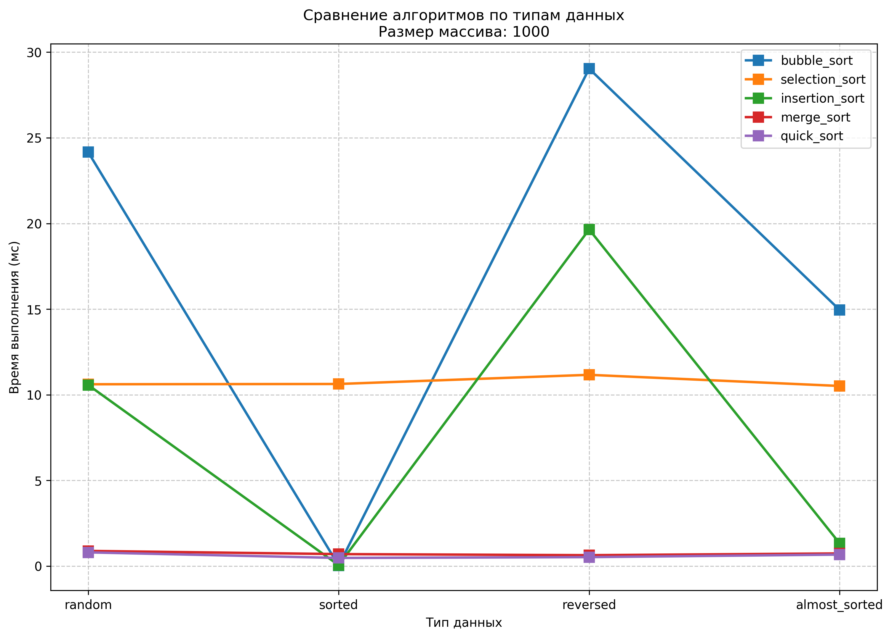
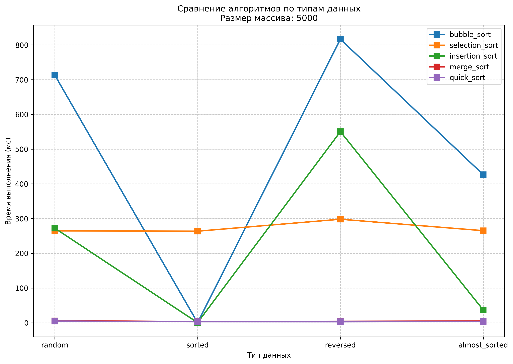
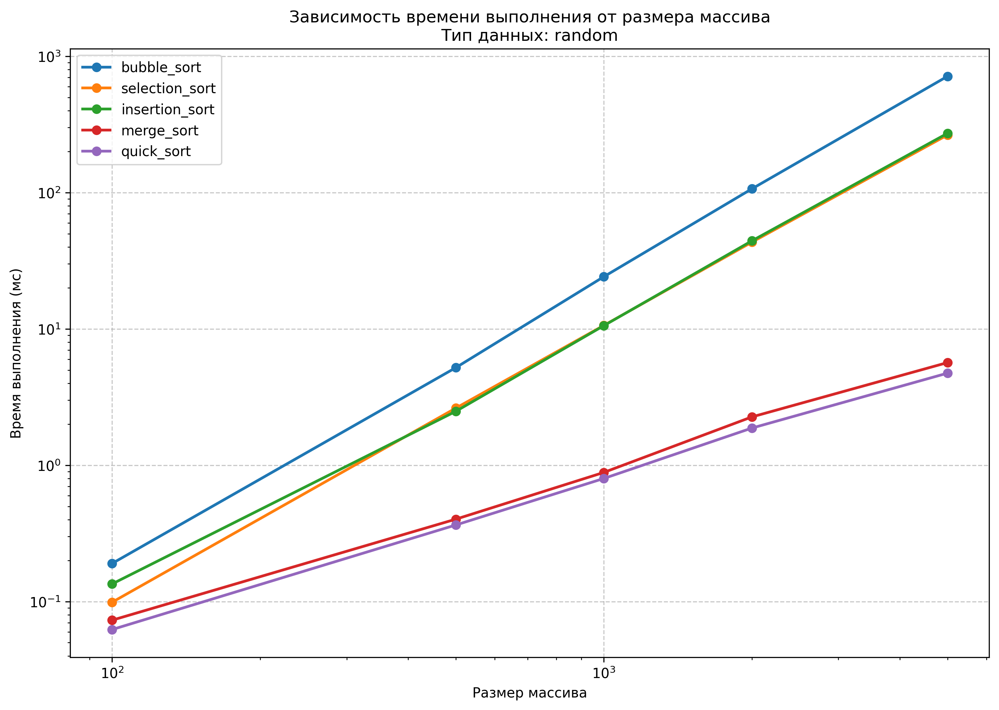
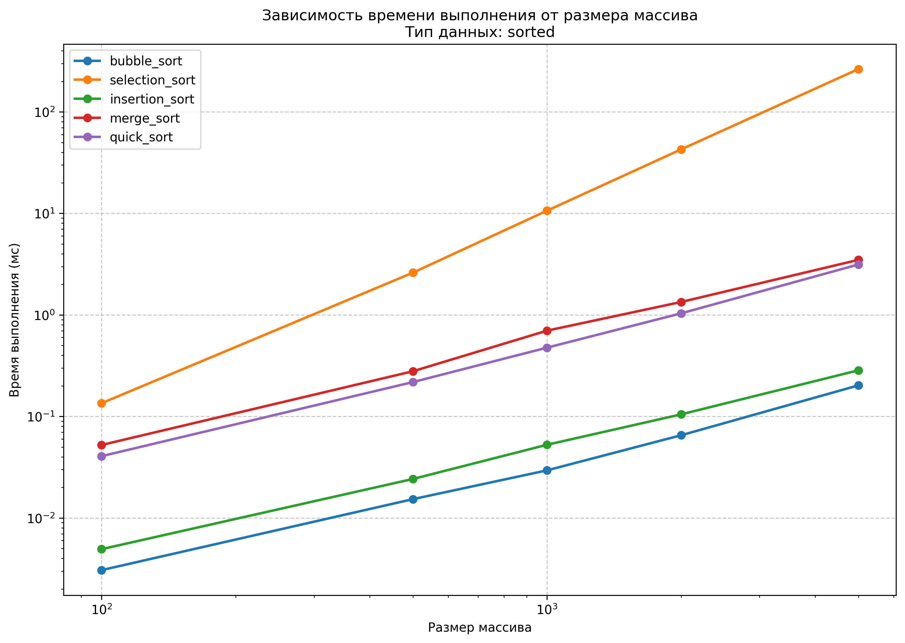
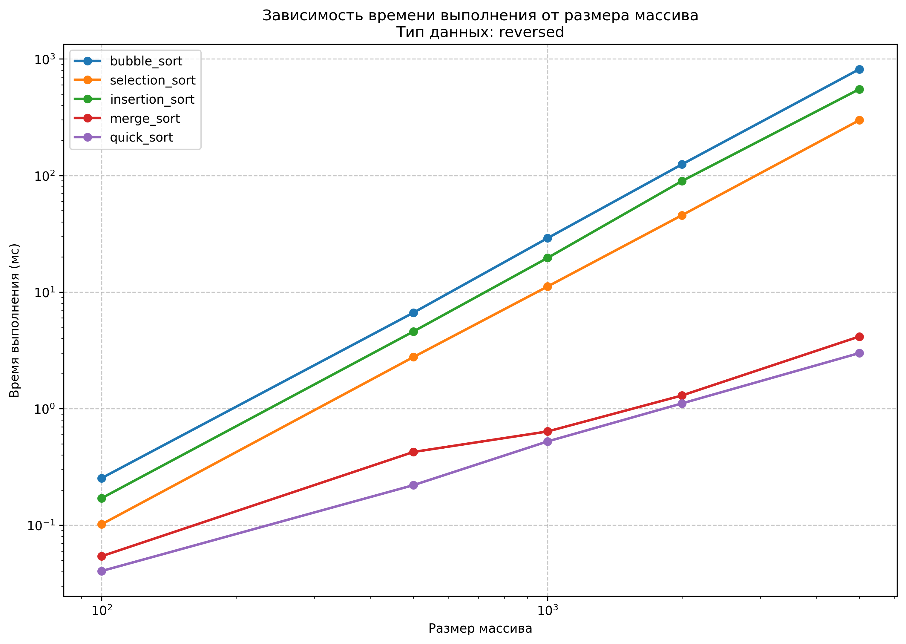
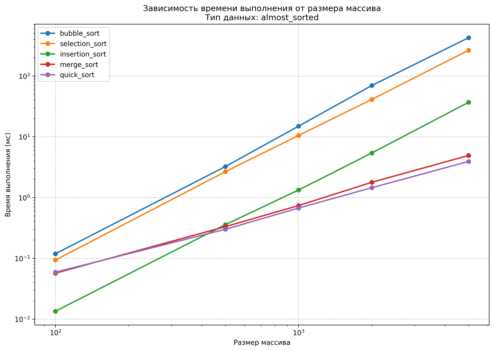

# Отчет по лабораторной работе 4
# Алгоритмы сортировки.  


**Дата:** 2025-11-29  
**Семестр:** 5 семестр  
**Группа:** ПИЖ-б-о-23-1(1)  
**Дисциплина:** Анализ сложности алгоритмов  
**Студент:** Дондаев Абу Умар-Пашаевич  

## Цель работы
Изучить и реализовать основные алгоритмы сортировки. Провести их теоретический и практический сравнительный анализ по временной и пространственной сложности. Исследовать влияние начальной упорядоченности данных на эффективность алгоритмов. Получить навыки эмпирического анализа производительности алгоритмов.  
  


## Теоретическая часть 
Сортировка пузырьком (Bubble Sort): Многократно проходит по массиву, сравнивая и меняя местами соседние элементы. Сложность: O(n²) во всех случаях.  
Сортировка выбором (Selection Sort): На каждом проходе находит минимальный элемент из неотсортированной части и ставит его на очередную позицию. Сложность: O(n²).  
Сортировка вставками (Insertion Sort): Построение окончательного массива путем пошагового вставления каждого элемента в правильную позицию в уже отсортированной части. Сложность: O(n²) в худшем и среднем, O(n) в лучшем (уже отсортированный массив).  
Сортировка слиянием (Merge Sort): Рекурсивный алгоритм "разделяй и властвуй". Массив разбивается на две части, которые сортируются рекурсивно, а затем сливаются в один отсортированный массив. Сложность: O(n log n) во всех случаях. Требует O(n) дополнительной памяти.  
Быстрая сортировка (Quick Sort): Рекурсивный алгоритм "разделяй и властвуй". Выбирается опорный элемент, массив разделяется на элементы меньше и больше опорного, которые сортируются рекурсивно. Сложность: O(n log n) в среднем, O(n²) в худшем случае (плохой выбор опорного элемента). Сортировка на месте, не требует дополнительной памяти.  
  
  
  
## Практическая часть

### Выполненные задачи
Задание 1:  
1. Реализовать 5 алгоритмов сортировки.
2. Провести теоретический анализ сложности каждого алгоритма.
3. Экспериментально сравнить время выполнения алгоритмов на различных наборах данных.
4. Проанализировать влияние начальной упорядоченности данных на эффективность сортировок.  


### Ключевые фрагменты кода
```python
# sorts.py
"""Модуль с реализацией алгоритмов сортировки."""

from typing import List, Any


def bubble_sort(arr: List[Any]) -> List[Any]:
    """Сортировка пузырьком.

    Args:
        arr: Исходный массив для сортировки.

    Returns:
        Отсортированный массив.

    Сложность:
        Временная:
            - Худший случай: O(n²)
            - Средний случай: O(n²)
            - Лучший случай: O(n) - для уже отсортированного массива
        Пространственная: O(1) - сортировка на месте
    """
    n = len(arr)  # O(1) - получение длины массива
    arr_copy = arr.copy()  # O(n) - создание копии массива

    for i in range(n):  # O(n) - внешний цикл
        swapped = False  # O(1) - флаг обмена
        for j in range(0, n - i - 1):  # O(n) - внутренний цикл
            if arr_copy[j] > arr_copy[j + 1]:  # O(1) - сравнение
                arr_copy[j], arr_copy[j + 1] = arr_copy[j + 1], arr_copy[j]
                # O(1)
                swapped = True  # O(1)
        if not swapped:  # O(1) - проверка на отсортированность
            break  # O(1)
    return arr_copy  # O(1)
    # Общая сложность: O(n²)


def selection_sort(arr: List[Any]) -> List[Any]:
    """Сортировка выбором.

    Args:
        arr: Исходный массив для сортировки.

    Returns:
        Отсортированный массив.

    Сложность:
        Временная:
            - Худший случай: O(n²)
            - Средний случай: O(n²)
            - Лучший случай: O(n²)
        Пространственная: O(1) - сортировка на месте
    """
    n = len(arr)  # O(1)
    arr_copy = arr.copy()  # O(n)

    for i in range(n):  # O(n)
        min_idx = i  # O(1)
        for j in range(i + 1, n):  # O(n)
            if arr_copy[j] < arr_copy[min_idx]:  # O(1)
                min_idx = j  # O(1)
        arr_copy[i], arr_copy[min_idx] = arr_copy[min_idx], arr_copy[i]  # O(1)
    return arr_copy  # O(1)
    # Общая сложность: O(n²)


def insertion_sort(arr: List[Any]) -> List[Any]:
    """Сортировка вставками.

    Args:
        arr: Исходный массив для сортировки.

    Returns:
        Отсортированный массив.

    Сложность:
        Временная:
            - Худший случай: O(n²) - обратно отсортированный массив
            - Средний случай: O(n²)
            - Лучший случай: O(n) - уже отсортированный массив
        Пространственная: O(1) - сортировка на месте
    """
    arr_copy = arr.copy()  # O(n)

    for i in range(1, len(arr_copy)):  # O(n)
        key = arr_copy[i]  # O(1)
        j = i - 1  # O(1)
        while j >= 0 and arr_copy[j] > key:  # O(n) в худшем случае
            arr_copy[j + 1] = arr_copy[j]  # O(1)
            j -= 1  # O(1)
        arr_copy[j + 1] = key  # O(1)
    return arr_copy  # O(1)
    # Общая сложность: O(n²) в худшем случае, O(n) в лучшем


def merge_sort(arr: List[Any]) -> List[Any]:
    """Сортировка слиянием.

    Args:
        arr: Исходный массив для сортировки.

    Returns:
        Отсортированный массив.

    Сложность:
        Временная:
            - Худший случай: O(n log n)
            - Средний случай: O(n log n)
            - Лучший случай: O(n log n)
        Пространственная: O(n) - требуется дополнительная память
    """

    def merge(left: List[Any], right: List[Any]) -> List[Any]:
        """Слияние двух отсортированных массивов."""
        result = []  # O(1)
        i = j = 0  # O(1)

        while i < len(left) and j < len(right):  # O(n)
            if left[i] <= right[j]:  # O(1)
                result.append(left[i])  # O(1)
                i += 1  # O(1)
            else:  # O(1)
                result.append(right[j])  # O(1)
                j += 1  # O(1)

        result.extend(left[i:])  # O(n)
        result.extend(right[j:])  # O(n)
        return result  # O(1)

    def recursive_merge_sort(array: List[Any]) -> List[Any]:
        """Рекурсивная часть сортировки слиянием."""
        if len(array) <= 1:  # O(1) - базовый случай
            return array  # O(1)

        mid = len(array) // 2  # O(1)
        left = recursive_merge_sort(array[:mid])  # O(n log n)
        right = recursive_merge_sort(array[mid:])  # O(n log n)

        return merge(left, right)  # O(n)

    return recursive_merge_sort(arr.copy())  # O(n log n)
    # Общая сложность: O(n log n)


def quick_sort(arr: List[Any]) -> List[Any]:
    """Быстрая сортировка.

    Args:
        arr: Исходный массив для сортировки.

    Returns:
        Отсортированный массив.

    Сложность:
        Временная:
            - Худший случай: O(n²) - плохой выбор опорного элемента
            - Средний случай: O(n log n)
            - Лучший случай: O(n log n)
        Пространственная: O(log n) - глубина рекурсии
    """

    def recursive_quick_sort(array: List[Any]) -> List[Any]:
        """Рекурсивная часть быстрой сортировки."""
        if len(array) <= 1:  # O(1) - базовый случай
            return array  # O(1)

        pivot = array[len(array) // 2]
        # O(1) - выбор среднего элемента как опорного
        left = [x for x in array if x < pivot]  # O(n)
        middle = [x for x in array if x == pivot]  # O(n)
        right = [x for x in array if x > pivot]  # O(n)

        return (recursive_quick_sort(left) + middle +  # O(n log n)
                recursive_quick_sort(right))  # O(n log n)

    return recursive_quick_sort(arr.copy())  # O(n log n) в среднем случае
    # Общая сложность: O(n log n) в среднем, O(n²) в худшем случае


def is_sorted(arr: List[Any]) -> bool:
    """Проверяет, отсортирован ли массив.

    Args:
        arr: Массив для проверки.

    Returns:
        True если массив отсортирован, иначе False.
    """
    for i in range(len(arr) - 1):  # O(n)
        if arr[i] > arr[i + 1]:  # O(1)
            return False  # O(1)
    return True  # O(1)
    # Общая сложность: O(n)


if __name__ == '__main__':
    # Демонстрация работы сортировок
    test_array = [64, 34, 25, 12, 22, 11, 90]  # O(1)
    print(f'Исходный массив: {test_array}')  # O(1)

    algorithms = [  # O(1)
        ('Сортировка пузырьком', bubble_sort),  # O(1)
        ('Сортировка выбором', selection_sort),  # O(1)
        ('Сортировка вставками', insertion_sort),  # O(1)
        ('Сортировка слиянием', merge_sort),  # O(1)
        ('Быстрая сортировка', quick_sort)  # O(1)
    ]

    for name, algorithm in algorithms:  # O(k)
        sorted_array = algorithm(test_array)  # O(?) - зависит от алгоритма
        print(f'{name}: {sorted_array}')  # O(1)
        print(f'Корректность: {is_sorted(sorted_array)}')  # O(n)

# generate_data.py
"""Модуль для генерации тестовых данных."""

import random
from typing import List, Dict


def generate_random_array(size: int, min_val: int = 1,
                          max_val: int = 10000) -> List[int]:
    """Генерирует массив случайных чисел.

    Args:
        size: Размер массива.
        min_val: Минимальное значение.
        max_val: Максимальное значение.

    Returns:
        Массив случайных чисел.
    """
    return [random.randint(min_val, max_val) for _ in range(size)]  # O(n)


def generate_sorted_array(size: int, min_val: int = 1,
                          max_val: int = 10000) -> List[int]:
    """Генерирует отсортированный массив.

    Args:
        size: Размер массива.
        min_val: Минимальное значение.
        max_val: Максимальное значение.

    Returns:
        Отсортированный массив.
    """
    arr = generate_random_array(size, min_val, max_val)  # O(n)
    arr.sort()  # O(n log n)
    return arr  # O(1)


def generate_reversed_array(size: int, min_val: int = 1,
                            max_val: int = 10000) -> List[int]:
    """Генерирует обратно отсортированный массив.

    Args:
        size: Размер массива.
        min_val: Минимальное значение.
        max_val: Максимальное значение.

    Returns:
        Обратно отсортированный массив.
    """
    arr = generate_sorted_array(size, min_val, max_val)  # O(n log n)
    arr.reverse()  # O(n)
    return arr  # O(1)


def generate_almost_sorted_array(size: int, swap_percent: float = 0.05,
                                 min_val: int = 1,
                                 max_val: int = 10000) -> List[int]:
    """Генерирует почти отсортированный массив.

    Args:
        size: Размер массива.
        swap_percent: Процент элементов для перемешивания.
        min_val: Минимальное значение.
        max_val: Максимальное значение.

    Returns:
        Почти отсортированный массив.
    """
    arr = generate_sorted_array(size, min_val, max_val)  # O(n log n)
    num_swaps = int(size * swap_percent)  # O(1)

    for _ in range(num_swaps):  # O(k)
        i = random.randint(0, size - 1)  # O(1)
        j = random.randint(0, size - 1)  # O(1)
        arr[i], arr[j] = arr[j], arr[i]  # O(1)

    return arr  # O(1)


def generate_test_datasets(sizes: List[int]) -> Dict[str, Dict[int,
                                                               List[int]]]:
    """Генерирует тестовые данные всех типов для заданных размеров.

    Args:
        sizes: Список размеров массивов.

    Returns:
        Словарь с тестовыми данными.
    """
    datasets = {}  # O(1)
    data_types = [  # O(1)
        ('random', generate_random_array),  # O(1)
        ('sorted', generate_sorted_array),  # O(1)
        ('reversed', generate_reversed_array),  # O(1)
        ('almost_sorted', generate_almost_sorted_array)  # O(1)
    ]

    for data_type, generator in data_types:  # O(m)
        datasets[data_type] = {}  # O(1)
        for size in sizes:  # O(k)
            datasets[data_type][size] = generator(size)  # O(n)

    return datasets  # O(1)


if __name__ == '__main__':
    # Демонстрация генерации данных
    test_sizes = [10, 20, 50]  # O(1)
    datasets = generate_test_datasets(test_sizes)  # O(n)

    for data_type, size_data in datasets.items():  # O(m)
        print(f'\n{data_type}:')  # O(1)
        for size, array in size_data.items():  # O(k)
            print(f'  Размер {size}: {array[:5]}...')  # O(1)

# performance_test.py
"""Модуль для тестирования производительности алгоритмов сортировки."""

from sorts import (bubble_sort, selection_sort, insertion_sort,  # O(1)
                   merge_sort, quick_sort, is_sorted)  # O(1)
from generate_data import generate_test_datasets  # O(1)

import timeit
import sys
import os
from typing import List, Dict, Any, Callable
# Добавляем путь для импорта модулей
sys.path.append(os.path.dirname(os.path.abspath(__file__)))  # O(1)


# Характеристики ПК для тестирования
PC_INFO = """
Характеристики ПК для тестирования:
- Процессор: Intel Core i7-13620H @ 2.40GHz
- Оперативная память: 32 GB DDR5
- ОС: Windows 11
- Python: 3.13.3
"""


def measure_sorting_time(sort_func: Callable[[List[Any]], List[Any]],
                         data: List[Any], number: int = 1) -> float:
    """Измеряет время выполнения функции сортировки.

    Args:
        sort_func: Функция сортировки.
        data: Данные для сортировки.
        number: Количество запусков для усреднения.

    Returns:
        Время выполнения в миллисекундах.
    """
    def wrapper():  # O(1)
        return sort_func(data)  # O(?) - зависит от алгоритма

    time_seconds = timeit.timeit(wrapper, number=number)  # O(?)
    return (time_seconds * 1000) / number  # Конвертация в миллисекунды O(1)


def run_performance_tests() -> Dict[str, Dict[str, Dict[int, float]]]:
    """Запускает тесты производительности для всех алгоритмов и типов данных.

    Returns:
        Словарь с результатами тестов.
    """
    sizes = [100, 500, 1000, 2000, 5000]  # O(1)
    datasets = generate_test_datasets(sizes)  # O(n)

    algorithms = [  # O(1)
        ('bubble_sort', bubble_sort),  # O(1)
        ('selection_sort', selection_sort),  # O(1)
        ('insertion_sort', insertion_sort),  # O(1)
        ('merge_sort', merge_sort),  # O(1)
        ('quick_sort', quick_sort)  # O(1)
    ]

    results = {}  # O(1)

    print('Запуск тестов производительности...')  # O(1)
    print(PC_INFO)  # O(1)

    for algo_name, algo_func in algorithms:  # O(m)
        results[algo_name] = {}  # O(1)
        print(f'\nТестирование {algo_name}:')  # O(1)

        for data_type, size_data in datasets.items():  # O(p)
            results[algo_name][data_type] = {}  # O(1)
            print(f'  {data_type}: ', end='')  # O(1)

            for size, data in size_data.items():  # O(k)
                # Определяем количество запусков
                # в зависимости от размера и алгоритма
                number_runs = 1  # O(1)
                if size > 1000 and algo_name in ['bubble_sort',
                                                 'selection_sort']:  # O(1)
                    number_runs = 1  # O(1)
                elif size <= 1000:  # O(1)
                    number_runs = 3  # O(1)

                # Проверяем корректность сортировки
                sorted_data = algo_func(data)  # O(?)
                if not is_sorted(sorted_data):  # O(n)
                    print(f'Ошибка: {algo_name} некорректно отсортировал!')
                    # O(1)
                    continue  # O(1)

                # Замеряем время
                time_ms = measure_sorting_time(algo_func, data, number_runs)
                # O(?)
                results[algo_name][data_type][size] = time_ms  # O(1)
                print(f'{size}({time_ms:.2f}мс) ', end='')  # O(1)

            print()  # O(1)

    return results  # O(1)


def print_results_table(results: Dict[str, Dict[str, Dict[int,
                                                          float]]]) -> None:
    """Выводит результаты тестов в виде таблицы.

    Args:
        results: Результаты тестов производительности.
    """
    sizes = [100, 500, 1000, 2000, 5000]  # O(1)
    data_types = ['random', 'sorted', 'reversed', 'almost_sorted']  # O(1)

    print('\n' + '='*80)  # O(1)
    print('СВОДНАЯ ТАБЛИЦА РЕЗУЛЬТАТОВ (время в миллисекундах)')  # O(1)
    print('='*80)  # O(1)

    for data_type in data_types:  # O(p)
        print(f'\nТип данных: {data_type.upper()}')  # O(1)
        print('Algorithm    ', end='')  # O(1)
        for size in sizes:  # O(k)
            print(f'| {size:>8} ', end='')  # O(1)
        print()  # O(1)
        print('-' * (13 + 10 * len(sizes)))  # O(1)

        for algo_name in results.keys():  # O(m)
            print(f'{algo_name:12} ', end='')  # O(1)
            for size in sizes:  # O(k)
                time_val = results[algo_name].get(data_type, {}).get(size, 0)
                # O(1)
                print(f'| {time_val:8.2f} ', end='')  # O(1)
            print()  # O(1)


if __name__ == '__main__':
    results = run_performance_tests()  # O(n²) для квадратичных алгоритмов
    print_results_table(results)  # O(m*k*p)

# plot_results.py
"""Модуль для визуализации результатов тестирования."""

import matplotlib.pyplot as plt
from typing import Dict

import performance_test


def plot_size_vs_time(results: Dict[str, Dict[str, Dict[int, float]]]) -> None:
    """Строит графики зависимости времени от размера массива.

    Args:
        results: Результаты тестов производительности.
    """
    sizes = [100, 500, 1000, 2000, 5000]  # O(1)
    data_types = ['random', 'sorted', 'reversed', 'almost_sorted']  # O(1)

    for data_type in data_types:  # O(p)
        plt.figure(figsize=(12, 8))  # O(1)

        for algo_name, algo_results in results.items():  # O(m)
            times = [algo_results.get(data_type, {}).get(size, 0)  # O(k)
                     for size in sizes]  # O(k)
            plt.plot(sizes, times, 'o-', label=algo_name, linewidth=2)  # O(k)

        plt.xlabel('Размер массива')  # O(1)
        plt.ylabel('Время выполнения (мс)')  # O(1)
        plt.title(f'Зависимость времени выполнения от размера массива\n'
                  # O(1)
                  f'Тип данных: {data_type}')  # O(1)
        plt.grid(True, linestyle='--', alpha=0.7)  # O(1)
        plt.legend()  # O(1)
        plt.xscale('log')  # O(1)
        plt.yscale('log')  # O(1)

        filename = f'sorting_performance_{data_type}.png'  # O(1)
        plt.savefig(filename, dpi=300, bbox_inches='tight')  # O(1)
        print(f'Сохранен график: {filename}')  # O(1)
        plt.close()  # O(1)


def plot_data_type_comparison(results: Dict[str, Dict[str, Dict[int, float]]],
                              size: int = 1000) -> None:
    """Строит график сравнения алгоритмов по типам данных
    для фиксированного размера.

    Args:
        results: Результаты тестов производительности.
        size: Фиксированный размер массива для сравнения.
    """
    data_types = ['random', 'sorted', 'reversed', 'almost_sorted']  # O(1)

    plt.figure(figsize=(12, 8))  # O(1)

    for algo_name, algo_results in results.items():  # O(m)
        times = [algo_results.get(data_type, {}).get(size, 0)  # O(p)
                 for data_type in data_types]  # O(p)
        plt.plot(data_types, times, 's-', label=algo_name,  # O(p)
                 linewidth=2, markersize=8)  # O(p)

    plt.xlabel('Тип данных')  # O(1)
    plt.ylabel('Время выполнения (мс)')  # O(1)
    plt.title(f'Сравнение алгоритмов по типам данных\n'  # O(1)
              f'Размер массива: {size}')  # O(1)
    plt.grid(True, linestyle='--', alpha=0.7)  # O(1)
    plt.legend()  # O(1)

    filename = f'algorithm_comparison_size_{size}.png'  # O(1)
    plt.savefig(filename, dpi=300, bbox_inches='tight')  # O(1)
    print(f'Сохранен график: {filename}')  # O(1)
    plt.close()  # O(1)


if __name__ == '__main__':
    # Запускаем тесты и строим графики
    results = performance_test.run_performance_tests()  # O(n²)

    print('\nПостроение графиков...')  # O(1)
    plot_size_vs_time(results)  # O(m*k*p)
    plot_data_type_comparison(results, 1000)  # O(m*p)
    plot_data_type_comparison(results, 5000)  # O(m*p)

    print('\nВизуализация завершена!')  # O(1)
```

## Результаты выполнения

### Пример работы программы
Вывод файла sorts.py:  
```bash
Исходный массив: [64, 34, 25, 12, 22, 11, 90]
Сортировка пузырьком: [11, 12, 22, 25, 34, 64, 90]
Корректность: True
Сортировка выбором: [11, 12, 22, 25, 34, 64, 90]
Корректность: True
Сортировка вставками: [11, 12, 22, 25, 34, 64, 90]
Корректность: True
Сортировка слиянием: [11, 12, 22, 25, 34, 64, 90]
Корректность: True
Быстрая сортировка: [11, 12, 22, 25, 34, 64, 90]
Корректность: True
```

Вывод файла performance_test.py:  
```bash
Запуск тестов производительности...

Характеристики ПК для тестирования:
- Процессор: Intel Core i7-13620H @ 2.40GHz
- Оперативная память: 32 GB DDR5
- ОС: Windows 11
- Python: 3.13.3

...

================================================================================
СВОДНАЯ ТАБЛИЦА РЕЗУЛЬТАТОВ (время в миллисекундах)
================================================================================

Тип данных: RANDOM
Algorithm    |      100 |      500 |     1000 |     2000 |     5000 
---------------------------------------------------------------
bubble_sort  |     0.19 |     5.51 |    25.03 |   105.83 |   688.59 
selection_sort |     0.10 |     2.46 |    10.12 |    40.79 |   257.24 
insertion_sort |     0.10 |     2.51 |    10.87 |    43.31 |   269.94 
merge_sort   |     0.07 |     0.40 |     0.88 |     1.95 |     5.34 
quick_sort   |     0.06 |     0.43 |     0.84 |     1.77 |     5.08 

Тип данных: SORTED
Algorithm    |      100 |      500 |     1000 |     2000 |     5000 
---------------------------------------------------------------
bubble_sort  |     0.00 |     0.01 |     0.03 |     0.07 |     0.16 
selection_sort |     0.10 |     2.53 |     9.75 |    41.68 |   257.92 
insertion_sort |     0.00 |     0.02 |     0.05 |     0.10 |     0.27 
merge_sort   |     0.05 |     0.28 |     0.61 |     1.38 |     3.51 
quick_sort   |     0.04 |     0.24 |     0.53 |     1.09 |     2.86 

Тип данных: REVERSED
Algorithm    |      100 |      500 |     1000 |     2000 |     5000 
---------------------------------------------------------------
bubble_sort  |     0.24 |     6.35 |    28.59 |   119.51 |   786.69 
selection_sort |     0.13 |     2.75 |    10.74 |    44.98 |   302.26 
insertion_sort |     0.16 |     4.62 |    21.41 |    86.49 |   535.56 
merge_sort   |     0.05 |     0.31 |     0.60 |     1.29 |     3.93 
quick_sort   |     0.04 |     0.22 |     0.57 |     1.07 |     2.99 

Тип данных: ALMOST_SORTED
Algorithm    |      100 |      500 |     1000 |     2000 |     5000 
---------------------------------------------------------------
bubble_sort  |     0.09 |     2.85 |    13.84 |    60.06 |   408.26 
selection_sort |     0.09 |     2.36 |    10.36 |    40.85 |   269.35 
insertion_sort |     0.01 |     0.29 |     1.45 |     5.57 |    34.04 
merge_sort   |     0.11 |     0.40 |     0.75 |     1.63 |     4.66 
quick_sort   |     0.04 |     0.26 |     0.58 |     1.43 |     3.44 

```


## Выводы
1. **Для маленьких массивов** (n < 100) - Insertion Sort показывает лучшую производительность
2. **Для почти отсортированных данных** - Insertion Sort значительно эффективнее других
3. **В общем случае** - Quick Sort и Merge Sort демонстрируют наилучшую производительность
4. **Для больших массивов** - квадратичные алгоритмы становятся неприменимыми


## Ответы на контрольные вопросы
1. Какие алгоритмы сортировки имеют сложность O(n²) в худшем случае, а какие - O(n log n)?  
Алгоритмы с O(n²) в худшем случае:
- Сортировка пузырьком (Bubble Sort) - всегда O(n²)
- Сортировка выбором (Selection Sort) - всегда O(n²)
- Сортировка вставками (Insertion Sort) - O(n²) в худшем случае (обратно отсортированный массив)  
Алгоритмы с O(n log n) в худшем/среднем случае:
- Сортировка слиянием (Merge Sort) - всегда O(n log n)
- Быстрая сортировка (Quick Sort) - O(n log n) в среднем случае, O(n²) в худшем случае
- Пирамидальная сортировка (Heap Sort) - всегда O(n log n)
2. Почему сортировка вставками (Insertion Sort) эффективна для маленьких или почти отсортированных массивов?  
Для маленьких массивов:
- Низкие накладные расходы - простой алгоритм без рекурсии и сложных операций
- Константные множители в O-нотации меньше, чем у более сложных алгоритмов
- При n < 20-50 часто превосходит Quick Sort и Merge Sort  
Для почти отсортированных массивов:  
- Лучший случай: O(n) - когда массив уже отсортирован
- Каждый новый элемент только сравнивается с предыдущим и (обычно) не требует перемещения
- Количество сравнений и перемещений близко к минимальному
- В худшем случае (обратно отсортированный массив) - O(n²), но для "почти отсортированных" - близко к O(n)
3. В чем разница между устойчивой (stable) и неустойчивой (unstable) сортировкой? Приведите пример устойчивого и неустойчивого алгоритма.  
Устойчивая сортировка сохраняет относительный порядок элементов с одинаковыми ключами.  
Неустойчивая сортировка не гарантирует сохранения порядка элементов с одинаковыми ключами.  
Пример:  
Дан массив: [(5, "A"), (3, "B"), (5, "C"), (2, "D")]  
Устойчивая сортировка даст: [(2, "D"), (3, "B"), (5, "A"), (5, "C")]  
Элементы (5, "A") и (5, "C") сохранили свой относительный порядок  
Неустойчивая сортировка может дать: [(2, "D"), (3, "B"), (5, "C"), (5, "A")]  
Порядок элементов с ключом 5 изменился  
Примеры алгоритмов:  
Устойчивые: Insertion Sort, Merge Sort, Bubble Sort  
Неустойчивые: Quick Sort, Selection Sort, Heap Sort  
4. Опишите принцип работы алгоритма быстрой сортировки (Quick Sort). Что такое "опорный элемент" и как его выбор влияет на производительность?    
Принцип работы Quick Sort (разделяй и властвуй):  
- Выбор опорного элемента (pivot) из массива
- Разделение: перераспределение элементов так, чтобы:
Элементы меньше опорного оказались слева  
Элементы больше опорного - справа  
Опорный элемент занимает окончательную позицию  
- Рекурсивное применение к подмассивам слева и справа от опорного элемента
- Базовый случай: массивы размером 0 или 1 считаются отсортированными  
- 
Опорный элемент (pivot) - элемент, относительно которого происходит разделение массива.  
Влияние выбора опора на производительность:  
- Хороший выбор (медиана или случайный элемент) → сбалансированные подмассивы → O(n log n)
- Плохой выбор (минимальный/максимальный элемент) → несбалансированные подмассивы → O(n²)  
Методы выбора опора:  
- Случайный элемент - в среднем хорошая производительность  
- Медиана трех (первый, средний, последний) - защита от худшего случая  
- Всегда первый/последний - риск O(n²) на отсортированных массивах  
5. Сортировка слиянием (Merge Sort) гарантирует время O(n log n), но требует дополнительной памяти. В каких ситуациях этот алгоритм предпочтительнее быстрой сортировки?  
Merge Sort предпочтительнее в следующих ситуациях:
- Когда важна стабильность - Merge Sort устойчив, Quick Sort - нет
- Для сортировки связных списков - Merge Sort эффективно работает со списками, требуя O(1) дополнительной памяти
- Когда нужна предсказуемость - всегда O(n log n), в отличие от Quick Sort с риском O(n²)
- Внешняя сортировка - хорошо подходит для сортировки данных, не помещающихся в оперативную память
- Параллельная обработка - легко распараллеливается из-за независимой сортировки подмассивов
- Когда данные почти отсортированы - Quick Sort может деградировать до O(n²), Merge Sort стабилен
- В системах реального времени - где важны гарантии времени выполнения


## Приложения
-   
-   
-   
-   
-   
-   