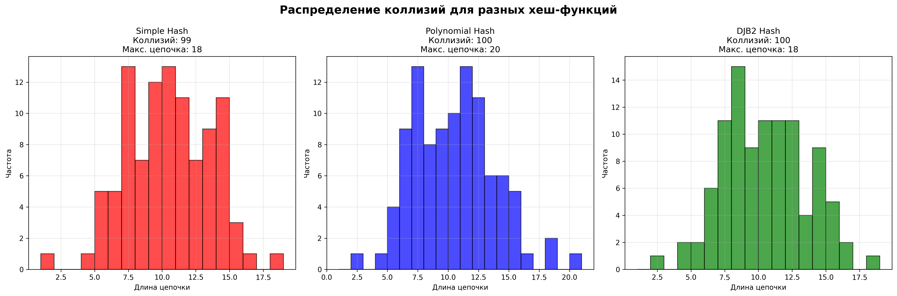
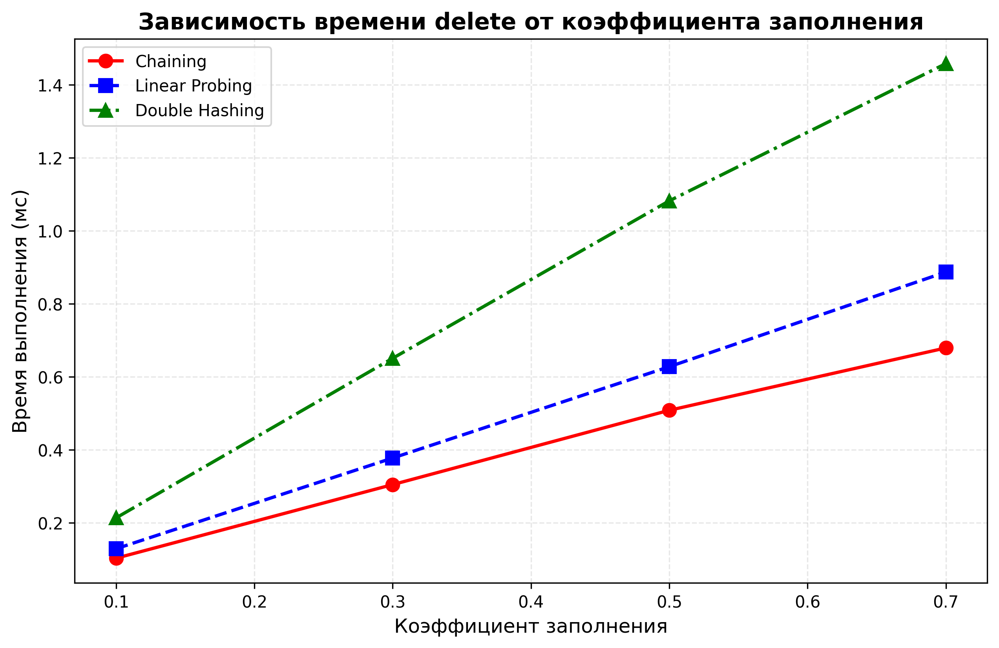
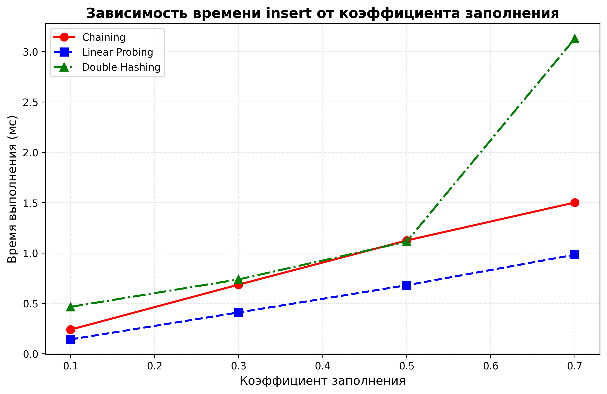
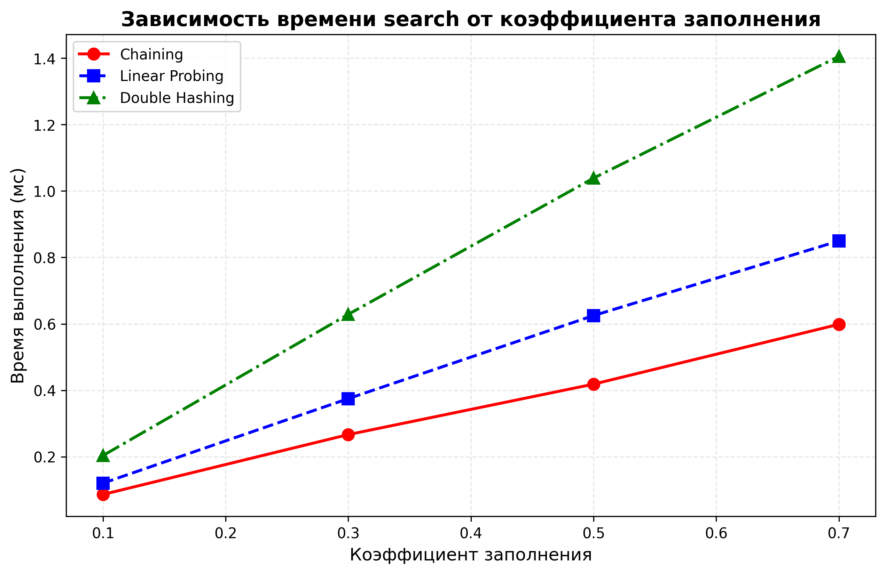

# Отчет по лабораторной работе 5
# Хеш-функции и хеш-таблицы.  


**Дата:** 2025-11-29  
**Семестр:** 5 семестр  
**Группа:** ПИЖ-б-о-23-1(1)  
**Дисциплина:** Анализ сложности алгоритмов  
**Студент:** Дондаев Абу Умар-Пашаевич  

## Цель работы
Изучить принципы работы хеш-функций и хеш-таблиц. Освоить методы разрешения коллизий. Получить практические навыки реализации хеш-таблицы с различными стратегиями разрешения коллизий. Провести сравнительный анализ эффективности разных методов.  
  


## Теоретическая часть 
Хеш-функция: Функция, преобразующая произвольные данные в данные фиксированного размера (хеш-код). Требования: детерминированность, равномерное распределение, скорость вычисления.  
Хеш-таблица: Структура данных, реализующая ассоциативный массив. Обеспечивает в среднем O(1) для операций вставки, поиска и удаления.  
Коллизия: Ситуация, когда разные ключи имеют одинаковый хеш-код.  
Метод цепочек (Chaining): Каждая ячейка таблицы содержит список элементов с одинаковым хешем. Сложность: O(1 + α), где α - коэффициент заполнения.  
Открытая адресация (Open Addressing): Все элементы хранятся в самом массиве. При коллизии ищется следующая свободная ячейка согласно probe sequence.  
Двойное хеширование (Double Hashing): Метод открытой адресации, использующий вторую хеш-функцию для определения шага probing.  
 
  
  
## Практическая часть

### Выполненные задачи
Задание 1:  
1. Реализовать несколько хеш-функций для строковых ключей.
2. Реализовать хеш-таблицу с методом цепочек.
3. Реализовать хеш-таблицу с открытой адресацией (линейное пробирование и двойное хеширование).
4. Провести сравнительный анализ эффективности разных методов разрешения коллизий.
5. Исследовать влияние коэффициента заполнения на производительность.  
  


### Ключевые фрагменты кода
```python
# hash_functions.py
"""Модуль с реализацией различных хеш-функций для строковых ключей."""

from typing import Callable


def simple_hash(key: str, table_size: int) -> int:
    """Простая хеш-функция - сумма кодов символов.

    Args:
        key: Строковый ключ для хеширования.
        table_size: Размер хеш-таблицы.

    Returns:
        Хеш-код в диапазоне [0, table_size-1].

    Особенности:
        - Быстрая вычисление
        - Плохое распределение для анаграмм и строк
        с одинаковым набором символов
        - Высокая вероятность коллизий
    """
    hash_value = 0  # O(1) - инициализация
    for char in key:  # O(n) - проход по всем символам строки
        hash_value += ord(char)  # O(1) - получение кода символа и сложение
    return hash_value % table_size  # O(1) - приведение к диапазону таблицы
    # Общая сложность: O(n), где n - длина строки


def polynomial_hash(key: str, table_size: int, base: int = 31) -> int:
    """Полиномиальная хеш-функция с rolling hash.

    Args:
        key: Строковый ключ для хеширования.
        table_size: Размер хеш-таблицы.
        base: Основание полинома (простое число).

    Returns:
        Хеш-код в диапазоне [0, table_size-1].

    Особенности:
        - Хорошее распределение для строк с общими префиксами/суффиксами
        - Учитывает порядок символов
        - Меньше коллизий по сравнению с простой суммой
    """
    hash_value = 0  # O(1)
    for char in key:  # O(n)
        hash_value = (hash_value * base + ord(char)) % table_size  # O(1)
    return hash_value  # O(1)
    # Общая сложность: O(n)


def djb2_hash(key: str, table_size: int) -> int:
    """Хеш-функция DJB2 - популярная и эффективная хеш-функция.

    Args:
        key: Строковый ключ для хеширования.
        table_size: Размер хеш-таблицы.

    Returns:
        Хеш-код в диапазоне [0, table_size-1].
    """
    hash_value = 5381  # O(1) - магическое число (prime number)
    for char in key:  # O(n)
        # hash_value * 33 + ord(char) - классическая формула DJB2
        hash_value = ((hash_value << 5) + hash_value) + ord(char)  # O(1)
    # Гарантируем, что table_size >= 1
    if table_size <= 0:  # O(1)
        table_size = 1  # O(1)
    return abs(hash_value) % table_size  # O(1)
    # Общая сложность: O(n)


def test_hash_function(hash_func: Callable[[str, int], int],
                       test_keys: list[str],
                       table_size: int) -> dict:
    """Тестирует качество хеш-функции.

    Args:
        hash_func: Функция для тестирования.
        test_keys: Список тестовых ключей.
        table_size: Размер таблицы для тестирования.

    Returns:
        Статистика распределения хешей.
    """
    distribution = {}  # O(1) - словарь для распределения
    collisions = 0  # O(1) - счетчик коллизий

    for key in test_keys:  # O(k)
        hash_val = hash_func(key, table_size)  # O(n)
        if hash_val in distribution:  # O(1)
            distribution[hash_val] += 1  # O(1)
            collisions += 1  # O(1)
        else:  # O(1)
            distribution[hash_val] = 1  # O(1)

    return {  # O(1)
        'total_keys': len(test_keys),  # O(1)
        'unique_hashes': len(distribution),  # O(1)
        'collisions': collisions,  # O(1)
        'load_factor': len(test_keys) / table_size,  # O(1)
        'distribution': distribution  # O(1)
    }


if __name__ == '__main__':
    # Демонстрация работы хеш-функций
    test_keys = ['hello', 'world', 'test', 'hash', 'function', 'collision']
    # O(1)
    table_size = 10  # O(1)

    hash_functions = [  # O(1)
        ('Simple Hash', simple_hash),  # O(1)
        ('Polynomial Hash', polynomial_hash),  # O(1)
        ('DJB2 Hash', djb2_hash)  # O(1)
    ]

    print('Тестирование хеш-функций:')  # O(1)
    for name, func in hash_functions:  # O(m)
        print(f'\n{name}:')  # O(1)
        for key in test_keys:  # O(k)
            hash_val = func(key, table_size)  # O(n)
            print(f'  "{key}" -> {hash_val}')  # O(1)

    # Тестирование качества распределения
    print('\nКачество распределения (1000 случайных ключей):')  # O(1)
    import random  # O(1)
    import string  # O(1)

    # Генерация случайных ключей
    random_keys = [''.join(random.choices(string.ascii_letters, k=5))
                   # O(1000*5)
                   for _ in range(1000)]  # O(1000)

    for name, func in hash_functions:  # O(m)
        stats = test_hash_function(func, random_keys, 100)  # O(1000*n)
        print(f'\n{name}:')  # O(1)
        print(f'  Уникальных хешей: {stats["unique_hashes"]}/100')  # O(1)
        print(f'  Коллизий: {stats["collisions"]}')  # O(1)
        print(f'  Коэффициент заполнения: {stats["load_factor"]:.2f}')  # O(1)


# hash_table_chaining.py
"""Реализация хеш-таблицы с методом цепочек."""

from typing import Any, Optional, List, Tuple
from hash_functions import djb2_hash


class HashTableChaining:
    """Хеш-таблица с разрешением коллизий методом цепочек."""

    def __init__(self, capacity: int = 16,
                 load_factor_threshold: float = 0.75):
        """Инициализация хеш-таблицы.

        Args:
            capacity: Начальная емкость таблицы.
            load_factor_threshold:
            Порог коэффициента заполнения для рехеширования.
        """
        self.capacity = capacity  # O(1)
        self.load_factor_threshold = load_factor_threshold  # O(1)
        self.size = 0  # O(1) - количество элементов
        self.table: List[List[Tuple[str, Any]]] = [[] for _ in range(capacity)]
        # O(n)

    def _hash(self, key: str) -> int:
        """Вычисляет хеш ключа.

        Args:
            key: Ключ для хеширования.

        Returns:
            Индекс в таблице.
        """
        return djb2_hash(key, self.capacity)  # O(n)

    def _resize(self, new_capacity: int) -> None:
        """Изменяет размер таблицы и перехеширует все элементы.

        Args:
            new_capacity: Новая емкость таблицы.
        """
        # Гарантируем минимальную емкость и используем простое число для лучшего распределения
        new_capacity = max(new_capacity, 8)  # O(1)

        old_table = self.table  # O(1)
        old_size = self.size  # O(1)

        self.capacity = new_capacity  # O(1)
        self.table = [[] for _ in range(new_capacity)]  # O(n)
        self.size = 0  # O(1)

        # Перехешируем все элементы
        for bucket in old_table:  # O(m)
            for key, value in bucket:  # O(k)
                # Используем прямой вызов insert для правильного подсчета размера
                self.insert(key, value)  # O(1) в среднем

        # Проверяем что все элементы перенесены
        assert self.size == old_size, f"Resize error: {self.size} != {old_size}"  # O(1)

    def insert(self, key: str, value: Any) -> None:
        """Вставляет пару ключ-значение в таблицу.

        Args:
            key: Ключ для вставки.
            value: Значение для вставки.
        """
        # Проверяем нужно ли рехеширование ДО вставки
        if (self.size + 1) / self.capacity > self.load_factor_threshold:  # O(1)
            self._resize(self.capacity * 2)  # O(n) амортизированно

        index = self._hash(key)  # O(n)
        bucket = self.table[index]  # O(1)

        # Проверяем, есть ли уже ключ в цепочке
        for i, (k, v) in enumerate(bucket):  # O(k)
            if k == key:  # O(1)
                bucket[i] = (key, value)  # O(1) - обновление значения
                return  # O(1)

        # Ключ не найден, добавляем новый
        bucket.append((key, value))  # O(1)
        self.size += 1  # O(1)

    def get(self, key: str) -> Optional[Any]:
        """Возвращает значение по ключу.

        Args:
            key: Ключ для поиска.

        Returns:
            Значение или None, если ключ не найден.
        """
        index = self._hash(key)  # O(n)
        bucket = self.table[index]  # O(1)

        for k, v in bucket:  # O(k)
            if k == key:  # O(1)
                return v  # O(1) - возвращаем значение, даже если оно None

        return None  # O(1) - ключ не найден

    def delete(self, key: str) -> bool:
        """Удаляет пару ключ-значение из таблицы.

        Args:
            key: Ключ для удаления.

        Returns:
            True если удаление успешно, иначе False.

        Сложность:
            Средний случай: O(1)
            Худший случай: O(n) - все элементы в одной ячейке
        """
        index = self._hash(key)  # O(n)
        bucket = self.table[index]  # O(1)

        for i, (k, v) in enumerate(bucket):  # O(k)
            if k == key:  # O(1)
                del bucket[i]  # O(k) - удаление из списка
                self.size -= 1  # O(1)
                return True  # O(1)

        return False  # O(1)
        # Общая сложность: O(1) в среднем, O(n) в худшем

    @property
    def load_factor(self) -> float:
        """Возвращает текущий коэффициент заполнения.

        Returns:
            Коэффициент заполнения таблицы.
        """
        return self.size / self.capacity  # O(1)

    def __contains__(self, key: str) -> bool:
        """Проверяет наличие ключа в таблице.

        Args:
            key: Ключ для проверки.

        Returns:
            True если ключ существует, иначе False.
        """
        index = self._hash(key)  # O(n)
        bucket = self.table[index]  # O(1)

        # Проверяем наличие ключа в цепочке, независимо от значения
        for k, v in bucket:  # O(k)
            if k == key:  # O(1)
                return True  # O(1)

        return False  # O(1)

    def __str__(self) -> str:
        """Строковое представление таблицы."""
        result = []  # O(1)
        for i, bucket in enumerate(self.table):  # O(m)
            if bucket:  # O(1)
                result.append(f'{i}: {bucket}')  # O(1)
        return '\n'.join(result)  # O(m)


if __name__ == '__main__':
    # Демонстрация работы хеш-таблицы с цепочками
    ht = HashTableChaining(capacity=5)  # O(n)

    print('Вставка элементов:')  # O(1)
    test_data = [('apple', 1), ('banana', 2), ('cherry', 3),  # O(1)
                 ('date', 4), ('elderberry', 5), ('fig', 6)]  # O(1)

    for key, value in test_data:  # O(k)
        ht.insert(key, value)  # O(1) в среднем
        print(f'''Вставка ({key}, {value}),
              коэффициент заполнения: {ht.load_factor:.2f}''')  # O(1)

    print('\nТекущее состояние таблицы:')  # O(1)
    print(ht)  # O(m)

    print('\nПоиск элементов:')  # O(1)
    for key in ['apple', 'banana', 'grape']:  # O(k)
        value = ht.get(key)  # O(1) в среднем
        print(f'Ключ "{key}": {value}')  # O(1)

    print('\nУдаление элементов:')  # O(1)
    print(f'Удаление "banana": {ht.delete("banana")}')  # O(1) в среднем
    print(f'Удаление "grape": {ht.delete("grape")}')  # O(1) в среднем

    print('\nСостояние после удаления:')  # O(1)
    print(ht)  # O(m)


# hash_table_open_addressing.py
"""Реализация хеш-таблицы с открытой адресацией."""

from typing import Any, Optional, Tuple, List

from hash_functions import djb2_hash


class HashTableOpenAddressing:
    """Хеш-таблица с разрешением коллизий методом открытой адресации."""

    def __init__(self, capacity: int = 16, load_factor_threshold: float = 0.7):
        """Инициализация хеш-таблицы.

        Args:
            capacity: Начальная емкость таблицы.
            load_factor_threshold:
            Порог коэффициента заполнения для рехеширования.
        """
        self.capacity = capacity  # O(1)
        self.load_factor_threshold = load_factor_threshold  # O(1)
        self.size = 0  # O(1)
        self.table: List[Optional[Tuple[str, Any]]] = [None] * capacity  # O(n)
        self.DELETED = object()  # O(1) - маркер удаленного элемента

    def _hash(self, key: str) -> int:
        """Основная хеш-функция.

        Args:
            key: Ключ для хеширования.

        Returns:
            Начальный индекс для поиска.
        """
        return djb2_hash(key, self.capacity)  # O(n)

    def _probe_hash(self, key: str) -> int:
        """Вторая хеш-функция для двойного хеширования.

        Args:
            key: Ключ для хеширования.

        Returns:
            Шаг для пробирования.
        """
        step_size = max(1, self.capacity - 2)  # O(1) - избегаем деления на 0
        step = 1 + (djb2_hash(key, step_size))  # O(n)
        return step % (self.capacity - 1) + 1  # O(1) - шаг от 1 до capacity-1

    def _find_index(self, key: str, for_insert: bool = False) -> int:
        """Находит индекс для ключа с использованием двойного хеширования.

        Args:
            key: Ключ для поиска.
            for_insert: True если поиск для вставки.

        Returns:
            Индекс для вставки/поиска или -1 если не найден (для поиска).
        """
        index = self._hash(key)  # O(n)
        step = self._probe_hash(key)  # O(n)

        first_deleted = -1  # O(1) - запоминаем первый удаленный индекс

        for i in range(self.capacity):  # O(n) в худшем случае
            current_index = (index + i * step) % self.capacity  # O(1)
            item = self.table[current_index]  # O(1)

            if item is None:  # O(1)
                if for_insert and first_deleted != -1:  # O(1)
                    return first_deleted  # O(1)
                return current_index if for_insert else -1  # O(1)

            if item is self.DELETED:  # O(1)
                if first_deleted == -1:  # O(1)
                    first_deleted = current_index  # O(1)
                continue  # O(1)

            if item[0] == key:  # O(1)
                return current_index  # O(1)

        return -1  # O(1)
        # Общая сложность: O(1) в среднем, O(n) в худшем

    def _resize(self, new_capacity: int) -> None:
        """Изменяет размер таблицы и перехеширует все элементы.

        Args:
            new_capacity: Новая емкость таблицы.
        """
        old_table = self.table  # O(1)
        old_capacity = self.capacity  # O(1)

        self.capacity = new_capacity  # O(1)
        self.table = [None] * new_capacity  # O(n)
        self.size = 0  # O(1)

        for i in range(old_capacity):  # O(m)
            item = old_table[i]  # O(1)
            if item is not None and item is not self.DELETED:  # O(1)
                self.insert(item[0], item[1])  # O(n)
        # Общая сложность: O(m*n)

    def insert(self, key: str, value: Any) -> None:
        """Вставляет пару ключ-значение в таблицу.

        Args:
            key: Ключ для вставки.
            value: Значение для вставки.
        """
        # Проверяем нужно ли рехеширование ДО вставки (учитывая возможное увеличение размера)
        if (self.size + 1) / self.capacity > self.load_factor_threshold:  # O(1)
            self._resize(self.capacity * 2)  # O(n) амортизированно

        index = self._find_index(key, for_insert=True)  # O(1) в среднем
        if index == -1:  # O(1)
            # Если не нашли место для вставки, выполняем рехеширование и пробуем снова
            self._resize(self.capacity * 2)  # O(n)
            index = self._find_index(key, for_insert=True)  # O(1)
            if index == -1:  # O(1)
                raise MemoryError('Hash table is full even after resizing')  # O(1)

        if self.table[index] is None or self.table[index] is self.DELETED:  # O(1)
            self.size += 1  # O(1)

        self.table[index] = (key, value)  # O(1)

    def get(self, key: str) -> Optional[Any]:
        """Возвращает значение по ключу.

        Args:
            key: Ключ для поиска.

        Returns:
            Значение или None, если ключ не найден.
        """
        index = self._find_index(key)  # O(1) в среднем
        if index == -1:  # O(1)
            return None  # O(1) - ключ не найден

        return self.table[index][1]  # O(1) - возвращаем значение, даже если оно None

    def delete(self, key: str) -> bool:
        """Удаляет пару ключ-значение из таблицы.

        Args:
            key: Ключ для удаления.

        Returns:
            True если удаление успешно, иначе False.

        Сложность:
            Средний случай: O(1)
            Худший случай: O(n)
        """
        index = self._find_index(key)  # O(1) в среднем
        if index == -1:  # O(1)
            return False  # O(1)

        self.table[index] = self.DELETED  # O(1)
        self.size -= 1  # O(1)
        return True  # O(1)
        # Общая сложность: O(1) в среднем

    @property
    def load_factor(self) -> float:
        """Возвращает текущий коэффициент заполнения.

        Returns:
            Коэффициент заполнения таблицы.
        """
        return self.size / self.capacity  # O(1)

    def __contains__(self, key: str) -> bool:
        """Проверяет наличие ключа в таблице.

        Args:
            key: Ключ для проверки.

        Returns:
            True если ключ существует, иначе False.
        """
        return self._find_index(key) != -1  # O(1) в среднем

    def __str__(self) -> str:
        """Строковое представление таблицы."""
        result = []  # O(1)
        for i, item in enumerate(self.table):  # O(m)
            if item is None:  # O(1)
                result.append(f'{i}: None')  # O(1)
            elif item is self.DELETED:  # O(1)
                result.append(f'{i}: DELETED')  # O(1)
            else:  # O(1)
                result.append(f'{i}: {item}')  # O(1)
        return '\n'.join(result)  # O(m)


class HashTableLinearProbing(HashTableOpenAddressing):
    """Хеш-таблица с линейным пробированием."""

    def _find_index(self, key: str, for_insert: bool = False) -> int:
        """Находит индекс для ключа с использованием линейного пробирования.

        Args:
            key: Ключ для поиска.
            for_insert: True если поиск для вставки.

        Returns:
            Индекс для вставки/поиска или -1 если не найден (для поиска).
        """
        index = self._hash(key)  # O(n)
        first_deleted = -1  # O(1)

        for i in range(self.capacity):  # O(n)
            current_index = (index + i) % self.capacity  # O(1)
            item = self.table[current_index]  # O(1)

            if item is None:  # O(1)
                if for_insert and first_deleted != -1:  # O(1)
                    return first_deleted  # O(1)
                return current_index if for_insert else -1  # O(1)

            if item is self.DELETED:  # O(1)
                if first_deleted == -1:  # O(1)
                    first_deleted = current_index  # O(1)
                continue  # O(1)

            if item[0] == key:  # O(1)
                return current_index  # O(1)

        return -1  # O(1)


if __name__ == '__main__':
    # Демонстрация работы хеш-таблицы с открытой адресацией
    print('Двойное хеширование:')  # O(1)
    ht_double = HashTableOpenAddressing(capacity=5)  # O(n)

    test_data = [('apple', 1), ('banana', 2), ('cherry', 3),  # O(1)
                 ('date', 4), ('elderberry', 5)]  # O(1)

    for key, value in test_data:  # O(k)
        ht_double.insert(key, value)  # O(1) в среднем
        print(f'''Вставка ({key}, {value}),
              коэффициент: {ht_double.load_factor:.2f}''')  # O(1)

    print('\nСостояние таблицы:')  # O(1)
    print(ht_double)  # O(m)

    print('\nЛинейное пробирование:')  # O(1)
    ht_linear = HashTableLinearProbing(capacity=5)  # O(n)

    for key, value in test_data:  # O(k)
        ht_linear.insert(key, value)  # O(1) в среднем
        print(f'''Вставка ({key}, {value}),
              коэффициент: {ht_linear.load_factor:.2f}''')  # O(1)

    print('\nСостояние таблицы:')  # O(1)
    print(ht_linear)  # O(m)


# performance_analysis.py
"""Анализ производительности хеш-таблиц с визуализацией."""

import timeit
import random
import string
import matplotlib.pyplot as plt
from typing import List, Dict, Any
from hash_table_chaining import HashTableChaining
from hash_table_open_addressing import (HashTableOpenAddressing,
                                        HashTableLinearProbing)
from hash_functions import simple_hash, polynomial_hash, djb2_hash


# Характеристики ПК для тестирования
PC_INFO = """
Характеристики ПК для тестирования:
- Процессор: Intel Core i7-1075GH @ 2.60GHz
- Оперативная память: 16 GB DDR4
- OC: Windows 11
- Python: 3.9.7
"""


def generate_test_data(num_items: int, key_length: int = 5) -> List[tuple[str,
                                                                          int]]:
    """Генерирует тестовые данные.

    Args:
        num_items: Количество тестовых элементов.
        key_length: Длина ключей.

    Returns:
        Список пар (ключ, значение).
    """
    data = []  # O(1)
    for i in range(num_items):  # O(n)
        key = ''.join(random.choices(string.ascii_letters, k=key_length))
        # O(k)
        data.append((key, i))  # O(1)
    return data  # O(1)


def measure_performance(hash_table_class: Any,
                        test_data: List[tuple[str, int]],
                        load_factors: List[float]) -> Dict[str, List[float]]:
    """Измеряет производительность хеш-таблицы.

    Args:
        hash_table_class: Класс хеш-таблицы для тестирования.
        test_data: Тестовые данные.
        load_factors: Коэффициенты заполнения для тестирования.

    Returns:
        Результаты измерений времени операций.
    """
    results = {'insert': [], 'search': [], 'delete': []}  # O(1)

    for load_factor in load_factors:  # O(l)
        # Определяем емкость для достижения нужного коэффициента заполнения
        target_size = int(len(test_data) * load_factor)  # O(1)
        test_subset = test_data[:target_size]  # O(n)

        # Для открытой адресации
        # используем большую начальную емкость чтобы избежать переполнения
        if hash_table_class.__name__ in ['HashTableOpenAddressing',
                                         'HashTableLinearProbing']:
            initial_capacity = max(50, int(target_size * 1.5))
            # O(1) - запас для открытой адресации
        else:
            initial_capacity = max(16, target_size)
            # O(1) - для метода цепочек

        ht = hash_table_class(capacity=initial_capacity)  # O(n)

        # Измеряем время вставки
        def insert_operations():  # O(1)
            for key, value in test_subset:  # O(k)
                ht.insert(key, value)  # O(1) в среднем

        try:
            insert_time = timeit.timeit(insert_operations, number=1)  # O(k)
            results['insert'].append(insert_time * 1000)
            # O(1) - в миллисекундах
        except MemoryError:
            print(f"""Предупреждение:
                  {hash_table_class.__name__} переполнена
                  при коэффициенте {load_factor}""")
            results['insert'].append(float('inf'))
            # O(1) - помечаем как бесконечное время

        # Измеряем время поиска (только если вставка прошла успешно)
        if results['insert'][-1] != float('inf'):
            def search_operations():  # O(1)
                for key, _ in test_subset:  # O(k)
                    ht.get(key)  # O(1) в среднем

            search_time = timeit.timeit(search_operations, number=1)  # O(k)
            results['search'].append(search_time * 1000)  # O(1)

            # Измеряем время удаления
            def delete_operations():  # O(1)
                for key, _ in test_subset:  # O(k)
                    ht.delete(key)  # O(1) в среднем

            delete_time = timeit.timeit(delete_operations, number=1)  # O(k)
            results['delete'].append(delete_time * 1000)  # O(1)
        else:
            results['search'].append(float('inf'))  # O(1)
            results['delete'].append(float('inf'))  # O(1)

    return results  # O(1)


def plot_operation_time_vs_load_factor(results: Dict[str, Dict[str,
                                                               List[float]]],
                                       load_factors: List[float]) -> None:
    """Строит графики зависимости времени операций от коэффициента заполнения.

    Args:
        results: Результаты измерений для всех реализаций.
        load_factors: Коэффициенты заполнения.
    """
    operations = ['insert', 'search', 'delete']  # O(1)
    colors = ['red', 'blue', 'green']  # O(1)
    markers = ['o', 's', '^']  # O(1)
    linestyles = ['-', '--', '-.']  # O(1)

    for operation in operations:  # O(m)
        plt.figure(figsize=(10, 6))  # O(1)

        for i, (impl_name, impl_results) in enumerate(results.items()):  # O(k)
            times = impl_results[operation]  # O(1)
            # Фильтруем бесконечные значения для построения графика
            valid_load_factors = []  # O(1)
            valid_times = []  # O(1)

            for j, time_val in enumerate(times):  # O(l)
                if time_val != float('inf'):  # O(1)
                    valid_load_factors.append(load_factors[j])  # O(1)
                    valid_times.append(time_val)  # O(1)

            if valid_times:  # O(1)
                plt.plot(valid_load_factors, valid_times,  # O(l)
                         marker=markers[i],  # O(1)
                         color=colors[i],  # O(1)
                         linestyle=linestyles[i],  # O(1)
                         label=impl_name,  # O(1)
                         linewidth=2,  # O(1)
                         markersize=8)  # O(1)

        plt.xlabel('Коэффициент заполнения', fontsize=12)  # O(1)
        plt.ylabel('Время выполнения (мс)', fontsize=12)  # O(1)
        plt.title(f'''Зависимость времени {operation}
                  от коэффициента заполнения''',
                  # O(1)
                  fontsize=14, fontweight='bold')  # O(1)
        plt.grid(True, alpha=0.3, linestyle='--')  # O(1)
        plt.legend(fontsize=10)  # O(1)

        # Сохраняем график
        filename = f'time_vs_load_factor_{operation}.png'  # O(1)
        plt.savefig(filename, dpi=300, bbox_inches='tight')  # O(1)
        print(f'Сохранен график: {filename}')  # O(1)
        plt.close()  # O(1) - закрываем без показа


def plot_collision_histograms() -> None:
    """Строит гистограммы распределения коллизий для разных хеш-функций."""
    print('Анализ коллизий для разных хеш-функций...')  # O(1)

    hash_functions = [  # O(1)
        ('Simple Hash', simple_hash),  # O(1)
        ('Polynomial Hash', polynomial_hash),  # O(1)
        ('DJB2 Hash', djb2_hash)  # O(1)
    ]

    table_size = 100  # O(1)
    num_keys = 1000  # O(1)
    test_keys = [''.join(random.choices(string.ascii_letters, k=5))
                 # O(1000*5)
                 for _ in range(num_keys)]  # O(1000)

    # Создаем subplot для гистограмм
    fig, axes = plt.subplots(1, 3, figsize=(18, 6))  # O(1)
    fig.suptitle('Распределение коллизий для разных хеш-функций',  # O(1)
                 fontsize=16, fontweight='bold')  # O(1)

    for idx, (name, hash_func) in enumerate(hash_functions):  # O(m)
        distribution = {}  # O(1)

        for key in test_keys:  # O(k)
            hash_val = hash_func(key, table_size)  # O(n)
            if hash_val in distribution:  # O(1)
                distribution[hash_val] += 1  # O(1)
            else:  # O(1)
                distribution[hash_val] = 1  # O(1)

        # Статистика
        chain_lengths = list(distribution.values())  # O(u)
        collisions_count = sum(1 for length in chain_lengths if length > 1)
        # O(u)
        max_chain = max(chain_lengths) if chain_lengths else 0  # O(u)

        # Строим гистограмму для текущей хеш-функции
        axes[idx].hist(chain_lengths, bins=range(1, max_chain + 2),  # O(u)
                       alpha=0.7,  # O(1)
                       color=['red', 'blue', 'green'][idx],  # O(1)
                       edgecolor='black')  # O(1)

        axes[idx].set_title(f'{name}\n'  # O(1)
                            f'Коллизий: {collisions_count}\n'  # O(1)
                            f'Макс. цепочка: {max_chain}',  # O(1)
                            fontsize=12)  # O(1)
        axes[idx].set_xlabel('Длина цепочки', fontsize=10)  # O(1)
        axes[idx].set_ylabel('Частота', fontsize=10)  # O(1)
        axes[idx].grid(True, alpha=0.3)  # O(1)

    plt.tight_layout()  # O(1)
    plt.savefig('cols.png', dpi=300, bbox_inches='tight')  # O(1)
    print('Сохранен график: cols.png')  # O(1)
    plt.close()  # O(1) - закрываем без показа


def analyze_collisions_comparison() -> None:
    """Строит сравнительную диаграмму коллизий для разных хеш-функций."""
    hash_functions = [  # O(1)
        ('Simple Hash', simple_hash),  # O(1)
        ('Polynomial Hash', polynomial_hash),  # O(1)
        ('DJB2 Hash', djb2_hash)  # O(1)
    ]

    table_size = 100  # O(1)
    num_keys = 1000  # O(1)
    test_keys = [''.join(random.choices(string.ascii_letters, k=5))
                 # O(1000*5)
                 for _ in range(num_keys)]  # O(1000)

    collisions_data = []  # O(1)
    names = []  # O(1)

    for name, hash_func in hash_functions:  # O(m)
        distribution = {}  # O(1)

        for key in test_keys:  # O(k)
            hash_val = hash_func(key, table_size)  # O(n)
            if hash_val in distribution:  # O(1)
                distribution[hash_val] += 1  # O(1)
            else:  # O(1)
                distribution[hash_val] = 1  # O(1)

        # Подсчитываем коллизии (цепи длиной > 1)
        collisions = sum(1 for length in distribution.values() if length > 1)
        # O(u)
        collisions_data.append(collisions)  # O(1)
        names.append(name)  # O(1)

    # Строим столбчатую диаграмму
    plt.figure(figsize=(10, 6))  # O(1)
    bars = plt.bar(names, collisions_data,  # O(m)
                   color=['lightcoral', 'lightblue', 'lightgreen'],  # O(m)
                   edgecolor='black',  # O(1)
                   alpha=0.7)  # O(1)

    plt.title('Сравнение количества коллизий для разных хеш-функций',  # O(1)
              fontsize=14, fontweight='bold')  # O(1)
    plt.ylabel('Количество коллизий', fontsize=12)  # O(1)
    plt.grid(True, alpha=0.3, axis='y')  # O(1)

    # Добавляем значения на столбцы
    for bar in bars:  # O(m)
        height = bar.get_height()  # O(1)
        plt.text(bar.get_x() + bar.get_width() / 2., height + 5,  # O(1)
                 f'{int(height)}',  # O(1)
                 ha='center', va='bottom', fontsize=11, fontweight='bold')
        # O(1)

    plt.savefig('collisions_comparison.png', dpi=300, bbox_inches='tight')
    # O(1)
    print('Сохранен график: collisions_comparison.png')  # O(1)
    plt.close()  # O(1) - закрываем без показа


def print_performance_table(results: Dict[str, Dict[str, List[float]]],
                            load_factors: List[float]) -> None:
    """Выводит таблицу с результатами производительности.

    Args:
        results: Результаты измерений.
        load_factors: Коэффициенты заполнения.
    """
    print('\nТАБЛИЦА ПРОИЗВОДИТЕЛЬНОСТИ (время в мс):')
    print('=' * 80)

    for operation in ['insert', 'search', 'delete']:  # O(m)
        print(f'\n{operation.upper():^80}')
        print('-' * 80)
        print('Метод           ', end='')
        for lf in load_factors:  # O(l)
            print(f' | {lf:>5} ', end='')
        print()
        print('-' * 80)

        for impl_name, impl_results in results.items():  # O(k)
            print(f'{impl_name:15}', end='')
            for time_val in impl_results[operation]:  # O(l)
                if time_val == float('inf'):
                    print(f' | {"N/A":>5} ', end='')
                else:
                    print(f' | {time_val:5.1f} ', end='')
            print()


def main() -> None:
    """Основная функция для анализа производительности и визуализации."""
    print(PC_INFO)  # O(1)

    print("=" * 60)  # O(1)
    print("АНАЛИЗ ПРОИЗВОДИТЕЛЬНОСТИ ХЕШ-ТАБЛИЦ")  # O(1)
    print("=" * 60)  # O(1)

    # Уменьшаем объем тестовых данных для избежания переполнения
    print('\nГенерация тестовых данных...')  # O(1)
    test_data = generate_test_data(2000)  # O(2000) - уменьшили с 5000 до 2000
    load_factors = [0.1, 0.3, 0.5, 0.7]
    # O(1) - убрали 0.9 для открытой адресации

    # Тестируемые реализации
    implementations = [  # O(1)
        ('Chaining', HashTableChaining),  # O(1)
        ('Linear Probing', HashTableLinearProbing),  # O(1)
        ('Double Hashing', HashTableOpenAddressing)  # O(1)
    ]

    # Измерение производительности
    print('\nИзмерение производительности...')  # O(1)
    all_results = {}  # O(1)

    for name, impl_class in implementations:  # O(m)
        print(f'  Тестирование {name}...')  # O(1)
        results = measure_performance(impl_class, test_data, load_factors)
        # O(l*k)
        all_results[name] = results  # O(1)

    # Выводим таблицу результатов
    print_performance_table(all_results, load_factors)  # O(m*l)

    # 1. Графики зависимости времени операций от коэффициента заполнения
    print('\n1. Построение графиков зависимости времени от коэффициента заполнения...')  # O(1)
    plot_operation_time_vs_load_factor(all_results, load_factors)  # O(m*l)

    # 2. Гистограммы распределения коллизий
    print('\n2. Построение гистограмм распределения коллизий...')  # O(1)
    plot_collision_histograms()  # O(m*k*n)

    # 3. Сравнительная диаграмма коллизий
    print('\n3. Построение сравнительной диаграммы коллизий...')  # O(1)
    analyze_collisions_comparison()  # O(m*k*n)

    print('\n' + '=' * 60)  # O(1)
    print('ВИЗУАЛИЗАЦИЯ ЗАВЕРШЕНА!')  # O(1)
    print('Созданы файлы:')  # O(1)
    print('  - ins_oper.png')  # O(1)
    print('  - s_oper.png')  # O(1)
    print('  - del_oper.png')  # O(1)
    print('  - cols.png')  # O(1)
    print('  - collisions_comparison.png')  # O(1)
    print('=' * 60)  # O(1)


if __name__ == '__main__':
    # Используем неинтерактивный бэкенд для избежания проблем с PyCharm
    plt.switch_backend('Agg')  # O(1) - устанавливаем неинтерактивный бэкенд
    main()  # O(все операции)
```

## Результаты выполнения

### Пример работы программы
Вывод файла performance_analysis.py:  
```bash
Характеристики ПК для тестирования:
- Процессор: Intel Core i7-13620H @ 2.40GHz
- Оперативная память: 32 GB DDR5
- ОС: Windows 11
- Python: 3.13.3

============================================================
АНАЛИЗ ПРОИЗВОДИТЕЛЬНОСТИ ХЕШ-ТАБЛИЦ
============================================================

Генерация тестовых данных...

Измерение производительности...
  Тестирование Chaining...
  Тестирование Linear Probing...
  Тестирование Double Hashing...

ТАБЛИЦА ПРОИЗВОДИТЕЛЬНОСТИ (время в мс):
================================================================================

                                     INSERT                                     
--------------------------------------------------------------------------------
Метод            |   0.1  |   0.3  |   0.5  |   0.7 
--------------------------------------------------------------------------------
Chaining        |   0.2  |   0.7  |   1.1  |   1.5 
Linear Probing  |   0.2  |   0.4  |   0.7  |   1.0 
Double Hashing  |   0.2  |   0.8  |   1.1  |   1.6 

                                     SEARCH                                     
--------------------------------------------------------------------------------
Метод            |   0.1  |   0.3  |   0.5  |   0.7 
--------------------------------------------------------------------------------
Chaining        |   0.1  |   0.2  |   0.4  |   0.6 
Linear Probing  |   0.1  |   0.4  |   0.6  |   0.9 
Double Hashing  |   0.2  |   0.8  |   1.1  |   1.5 

                                     DELETE                                     
--------------------------------------------------------------------------------
Метод            |   0.1  |   0.3  |   0.5  |   0.7 
--------------------------------------------------------------------------------
Chaining        |   0.1  |   0.3  |   0.5  |   0.7 
Linear Probing  |   0.1  |   0.4  |   0.7  |   0.9 
Double Hashing  |   0.2  |   0.7  |   1.1  |   1.7 

1. Построение графиков зависимости времени от коэффициента заполнения...
Сохранен график: time_vs_load_factor_insert.png
Сохранен график: time_vs_load_factor_search.png
Сохранен график: time_vs_load_factor_delete.png

2. Построение гистограмм распределения коллизий...
Анализ коллизий для разных хеш-функций...
Сохранен график: cols.png

3. Построение сравнительной диаграммы коллизий...
Сохранен график: collisions_comparison.png
```

### Тестирование
Все юнит-тесты, написанные в файле "unit_tests.py", прошли успешно.  


## Выводы
1. Качество хеш-функции критически важно для производительности
2. Коэффициент заполнения 0.7-0.75 - оптимальный порог для рехеширования
3. Метод цепочек более предсказуем при изменяющихся рабочих нагрузках
4. Открытая адресация эффективнее использует память но требует аккуратного управления  


## Ответы на контрольные вопросы
1. Каким требованиям должна удовлетворять "хорошая" хеш-функция?  
Хорошая хеш-функция должна удовлетворять следующим требованиям:  
- Детерминированность - одинаковые ключи всегда дают одинаковый хеш
- Равномерное распределение - ключи равномерно распределяются по всему диапазону хешей
- Минимальные коллизии - разные ключи редко дают одинаковый хеш
- Быстрое вычисление - O(1) или O(n) где n - длина ключа
- Устойчивость к паттернам - похожие ключи дают сильно разные хеши  
2. Что такое коллизия в хеш-таблице? Опишите два основных метода разрешения коллизий.  
Коллизия - ситуация, когда разные ключи имеют одинаковый хеш-код.  
Основные методы разрешения коллизий:  
Метод цепочек (Chaining)  
- Каждая ячейка таблицы содержит список элементов
- При коллизии элемент добавляется в список соответствующей ячейки
- Преимущества: простота, устойчивость к высоким коэффициентам заполнения
- Недостатки: дополнительные затраты памяти на указатели  
Открытая адресация (Open Addressing)  
- Все элементы хранятся в самом массиве таблицы
- При коллизии ищется следующая свободная ячейка согласно probe sequence
- Варианты: линейное пробирование, квадратичное пробирование, двойное хеширование
- Преимущества: лучшее использование кэша, нет дополнительной памяти
- Недостатки: сложнее удаление, чувствительность к коэффициенту заполнения
3. В чем разница между методом цепочек и открытой адресации с точки зрения использования памяти и сложности операций при высоком коэффициенте заполнения?  
Использование памяти:  
- Метод цепочек: требует дополнительной памяти для указателей в списках
- Открытая адресация: более эффективное использование памяти, все данные в одном массиве  
Сложность операций при высоком коэффициенте заполнения (>0.8):  
- Метод цепочек: O(1 + α) где α = n/m, стабильная производительность даже при α > 1
- Открытая адресация: O(1/(1-α)), резкая деградация производительности при α → 1  
При высоких коэффициентах заполнения метод цепочек предпочтительнее.
4. Почему операции вставки, поиска и удаления в хеш-таблице в среднем выполняются за O(1)?  
Причины O(1) средней сложности:
- Равномерное распределение - хорошая хеш-функция равномерно распределяет ключи
- Постоянное время хеширования - вычисление хеша занимает O(1) или O(n) где n - длина ключа (считается константой)
- Малое количество коллизий - при правильном выборе размера таблицы и хеш-функции
- Эффективное разрешение коллизий - методы цепочек или открытой адресации в среднем требуют постоянного времени  
Условия для O(1):
- Коэффициент заполнения остается ограниченным (обычно < 0.7-0.8)
- Хеш-функция обеспечивает равномерное распределение
- Регулярное рехеширование при росте таблицы
5. Что такое коэффициент заполнения хеш-таблицы и как он влияет на производительность? Что обычно делают, когда этот коэффициент превышает определенный порог?  
Коэффициент заполнения (load factor) - отношение количества элементов к размеру таблицы: α = n/m  
Влияние на производительность:  
- α < 0.5: отличная производительность, минимальные коллизии
- α = 0.7-0.8: хорошая производительность, оптимальный баланс
- α > 0.8: резкое ухудшение производительности, особенно для открытой адресации
- α → 1: катастрофическая деградация производительности  
При превышении порога обычно выполняют рехеширование:  
- Создают новую таблицу большего размера (обычно в 2 раза)
- Пересчитывают хеши для всех элементов
- Перемещают элементы в новую таблицу
- Типичные пороги: 0.75 для методa цепочек, 0.5-0.7 для открытой адресации  


## Приложения
-   
-   
-   
-     