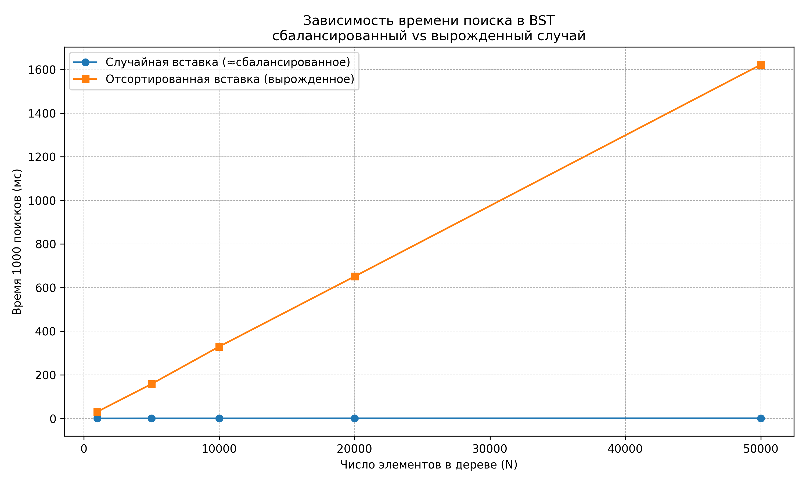
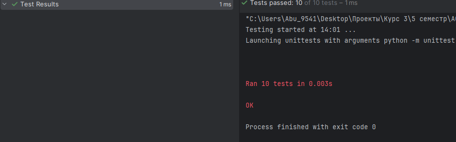

# Отчет по лабораторной работе 6
# Деревья. Бинарные деревья поиска.  


**Дата:** 2025-12-11  
**Семестр:** 5 семестр  
**Группа:** ПИЖ-б-о-23-1(1)  
**Дисциплина:** Анализ сложности алгоритмов  
**Студент:** Дондаев Абу Умар-Пашаевич  

## Цель работы
Изучить древовидные структуры данных, их свойства и применение. Освоить основные операции с бинарными деревьями поиска (BST). Получить практические навыки реализации BST на основе узлов (pointer-based), рекурсивных алгоритмов обхода и анализа их эффективности. Исследовать влияние сбалансированности дерева на производительность операций.   
  


## Теоретическая часть 
Дерево: Рекурсивная структура данных, состоящая из узлов, где каждый узел имеет значение и ссылки на дочерние узлы.  
Бинарное дерево поиска (BST): Дерево, для которого выполняются следующие условия:  
- Значение в левом поддереве любого узла меньше значения в самом узле.
- Значение в правом поддереве любого узла больше значения в самом узле.
- Оба поддерева являются бинарными деревьями поиска.  
Основные операции BST:  
- Вставка (Insert): Сложность: в среднем O(log n), в худшем (вырожденное дерево) O(n).
- Поиск (Search): Сложность: в среднем O(log n), в худшем O(n).
- Удаление (Delete): Сложность: в среднем O(log n), в худшем O(n). Имеет три случая: удаление листа, узла с одним потомком, узла с двумя потомками.
- Обход (Traversal):
- - In-order (левый-корень-правый): Посещает узлы в порядке возрастания. Сложность O(n).
- - Pre-order (корень-левый-правый): Полезен для копирования структуры дерева. Сложность O(n).
- - Post-order (левый-правый-корень): Полезен для удаления дерева. Сложность O(n).  

Сбалансированные деревья: Деревья с контролем высоты (например, AVL, Красно-черные), которые гарантируют время операций O(log n) даже в худшем случае.  

 
  
  
## Практическая часть

### Выполненные задачи
Задание 1:  
1. Реализовать бинарное дерево поиска на основе узлов с основными операциями.  
2. Реализовать различные методы обхода дерева (рекурсивные и итеративные).  
3. Реализовать дополнительные методы для работы с BST.   
4. Провести анализ сложности операций для сбалансированного и вырожденного деревьев.  
5. Визуализировать структуру дерева.  
  


### Ключевые фрагменты кода
```python
# binary_search_tree.py


from __future__ import annotations

from dataclasses import dataclass
from typing import Optional


@dataclass
class TreeNode:
    """Узел бинарного дерева поиска.

    Атрибуты:
        value: Значение, хранящееся в узле.
        left: Ссылка на левое поддерево.
        right: Ссылка на правое поддерево.
    """

    value: int  # O(1)
    left: Optional["TreeNode"] = None
    right: Optional["TreeNode"] = None


class BinarySearchTree:
    """Класс бинарного дерева поиска (BST)."""

    def __init__(self) -> None:
        """Создает пустое дерево.

        Время: O(1)
        Память: O(1)
        """
        self.root: Optional[TreeNode] = None  # O(1)

    def insert(self, value: int) -> None:
        """Вставка значения в дерево (итеративная реализация).

        Средняя сложность: O(log n).
        Худшая (вырожденное дерево): O(n).
        """
        # Если дерево пустое — создаем корень. O(1)
        if self.root is None:
            self.root = TreeNode(value)  # O(1)
            return  # O(1)

        current = self.root  # O(1)
        while True:  # O(h)
            if value < current.value:  # O(1)
                if current.left is None:  # O(1)
                    current.left = TreeNode(value)  # O(1)
                    return  # O(1)
                current = current.left  # O(1)
            elif value > current.value:  # O(1)
                if current.right is None:  # O(1)
                    current.right = TreeNode(value)  # O(1)
                    return  # O(1)
                current = current.right  # O(1)
            else:
                # Дубликаты не вставляем. O(1)
                return  # O(1)

    def search(self, value: int) -> Optional[TreeNode]:
        """Поиск узла со значением value (итеративная реализация).

        Средняя сложность: O(log n).
        Худшая: O(n).
        """
        current = self.root  # O(1)
        while current is not None:  # O(h)
            if value == current.value:  # O(1)
                return current  # O(1)
            if value < current.value:  # O(1)
                current = current.left  # O(1)
            else:
                current = current.right  # O(1)
        return None  # O(1)

    def delete(self, value: int) -> None:
        """Итеративное удаление узла со значением value.

        Сложность: O(h), где h — высота дерева (O(log n) в среднем,
        O(n) в худшем).
        """
        parent: Optional[TreeNode] = None  # Родитель текущего узла. O(1)
        current: Optional[TreeNode] = self.root  # Текущий узел. O(1)

        while current is not None and current.value != value:  # O(h)
            parent = current  # O(1)
            if value < current.value:  # O(1)
                current = current.left  # O(1)
            else:
                current = current.right  # O(1)

        if current is None:
            return  # O(1)

        def replace_child(
            parent_node: Optional[TreeNode],
            old_child: Optional[TreeNode],
            new_child: Optional[TreeNode],
        ) -> None:
            if parent_node is None:
                self.root = new_child  # O(1)
            elif parent_node.left is old_child:
                parent_node.left = new_child  # O(1)
            else:
                parent_node.right = new_child  # O(1)

        if current.left is None and current.right is None:
            replace_child(parent, current, None)  # O(1)
            return  # O(1)

        if current.left is None or current.right is None:
            child = current.left if current.left is not None else current.right
            # O(1)
            replace_child(parent, current, child)  # O(1)
            return  # O(1)

        succ_parent = current  # O(1)
        succ = current.right  # O(1)
        while succ.left is not None:  # O(h)
            succ_parent = succ  # O(1)
            succ = succ.left  # O(1)

        current.value = succ.value  # O(1)

        succ_child = succ.right  # O(1)

        if succ_parent.left is succ:
            succ_parent.left = succ_child  # O(1)
        else:
            succ_parent.right = succ_child  # O(1)

    def find_min(self, node: Optional[TreeNode]) -> Optional[TreeNode]:
        """Поиск минимального значения в поддереве.

        Сложность: O(h).
        """
        current = node  # O(1)
        while current is not None and current.left is not None:  # O(h)
            current = current.left  # O(1)
        return current  # O(1)

    def find_max(self, node: Optional[TreeNode]) -> Optional[TreeNode]:
        """Поиск максимального значения в поддереве.

        Сложность: O(h).
        """
        current = node  # O(1)
        while current is not None and current.right is not None:  # O(h)
            current = current.right  # O(1)
        return current  # O(1)

    def height(self, node: Optional[TreeNode] = None) -> int:
        """Вычисление высоты дерева (итеративно).

        Высота пустого дерева = 0.
        Сложность: O(n) по времени, O(h) по памяти.
        """
        # Если явно передан узел — считаем высоту поддерева с этим корнем.
        root = node if node is not None else self.root  # O(1)
        if root is None:  # O(1)
            return 0  # O(1)

        max_height = 0  # O(1)
        stack: list[tuple[TreeNode, int]] = [(root, 1)]  # O(1)

        while stack:  # O(n)
            current, h = stack.pop()  # O(1)
            if h > max_height:  # O(1)
                max_height = h  # O(1)
            if current.left is not None:  # O(1)
                stack.append((current.left, h + 1))  # O(1)
            if current.right is not None:  # O(1)
                stack.append((current.right, h + 1))  # O(1)

        return max_height  # O(1)

    def is_valid_bst(self) -> bool:
        """Проверка, что дерево удовлетворяет свойству BST.

        Сложность: O(n), каждый узел посещается один раз.
        """

        def _validate(
            node: Optional[TreeNode],
            min_value: Optional[int],
            max_value: Optional[int],
        ) -> bool:
            if node is None:  # O(1)
                return True  # O(1)

            # Проверяем границы:
            # левый потомок строго меньше, правый строго больше. O(1)
            if (min_value is not None and node.value <= min_value) or (
                max_value is not None and node.value >= max_value
            ):
                return False  # O(1)

            # Рекурсивно проверяем левое и правое поддеревья. O(n)
            left_ok = _validate(node.left, min_value, node.value)  # O(n_left)
            right_ok = _validate(node.right, node.value, max_value)
            # O(n_right)
            return left_ok and right_ok  # O(1)

        return _validate(self.root, None, None)  # O(n)

    def visualize(self) -> None:
        """Печатает дерево в виде "ёлочки" в консоль.

        Использует отступы и псевдографику для отображения структуры.

        Сложность: O(n), каждый узел выводится один раз.
        """

        def _visualize(
            node: Optional[TreeNode],
            prefix: str,
            is_left: bool,
        ) -> None:
            if node is None:  # O(1)
                return  # O(1)

            # Определяем символ ветки. O(1)
            branch = "├── " if is_left else "└── "  # O(1)
            print(prefix + branch + str(node.value))  # O(1)

            # Префикс для потомков. O(1)
            child_prefix = prefix + ("│   " if is_left else "    ")  # O(1)

            # Рекурсивно выводим левое и правое поддерево. O(n)
            if node.left is not None or node.right is not None:  # O(1)
                _visualize(node.left, child_prefix, True)  # O(n_left)
                _visualize(node.right, child_prefix, False)  # O(n_right)

        if self.root is None:  # O(1)
            print("<пустое дерево>")  # O(1)
            return  # O(1)

        _visualize(self.root, "", True)  # O(n)


def build_bst_from_iterable(values: list[int]) -> BinarySearchTree:
    """Вспомогательная функция для построения BST из списка значений.

    Каждый элемент поочередно вставляется в дерево.

    Средняя сложность: O(n log n).
    Худшая (вырожденный случай): O(n²).
    """
    tree = BinarySearchTree()  # O(1)
    for value in values:  # O(n)
        tree.insert(value)  # O(h)
    return tree  # O(1)


# tree_traversal.py


from __future__ import annotations

from typing import List, Optional

from binary_search_tree import TreeNode


def inorder_print(node: Optional[TreeNode]) -> None:
    """Рекурсивный in-order обход (лево-корень-право) с печатью.

    Сложность: O(n).
    """
    if node is None:  # O(1)
        return  # O(1)

    inorder_print(node.left)  # O(n_left)
    print(node.value, end=" ")  # O(1)
    inorder_print(node.right)  # O(n_right)


def preorder_print(node: Optional[TreeNode]) -> None:
    """Рекурсивный pre-order обход (корень-лево-право) с печатью.

    Сложность: O(n).
    """
    if node is None:  # O(1)
        return  # O(1)

    print(node.value, end=" ")  # O(1)
    preorder_print(node.left)  # O(n_left)
    preorder_print(node.right)  # O(n_right)


def postorder_print(node: Optional[TreeNode]) -> None:
    """Рекурсивный post-order обход (лево-право-корень) с печатью.

    Сложность: O(n).
    """
    if node is None:  # O(1)
        return  # O(1)

    postorder_print(node.left)  # O(n_left)
    postorder_print(node.right)  # O(n_right)
    print(node.value, end=" ")  # O(1)


def inorder_list(node: Optional[TreeNode]) -> List[int]:
    """Рекурсивный in-order обход, возвращающий список значений.

    Сложность: O(n).
    """
    if node is None:  # O(1)
        return []  # O(1)

    # Формируем результат из левого поддерева,
    # текущего узла и правого поддерева. O(n)
    left = inorder_list(node.left)  # O(n_left)
    right = inorder_list(node.right)  # O(n_right)
    return left + [node.value] + right  # O(n)


def preorder_list(node: Optional[TreeNode]) -> List[int]:
    """Рекурсивный pre-order обход, возвращающий список значений. O(n)."""
    if node is None:  # O(1)
        return []  # O(1)
    return [node.value] + preorder_list(node.left) + preorder_list(node.right)
    # O(n)


def postorder_list(node: Optional[TreeNode]) -> List[int]:
    """Рекурсивный post-order обход, возвращающий список значений. O(n)."""
    if node is None:  # O(1)
        return []  # O(1)
    return (postorder_list(node.left)
            + postorder_list(node.right)
            + [node.value])
    # O(n)


def inorder_iterative(node: Optional[TreeNode]) -> List[int]:
    """Итеративный in-order обход с использованием стека.

    Возвращает список значений в порядке возрастания.

    Сложность: O(n) по времени, O(h) по памяти, где h — высота дерева.
    """
    result: List[int] = []  # O(1)
    stack: List[TreeNode] = []  # O(1)
    current = node  # O(1)

    # Пока есть узлы для обработки. O(n)
    while stack or current is not None:  # O(n)
        # Спускаемся как можно левее. O(h за каждую цепочку)
        while current is not None:  # O(h)
            stack.append(current)  # O(1)
            current = current.left  # O(1)

        # Берём следующий узел из стека. O(1)
        current = stack.pop()  # O(1)
        result.append(current.value)  # O(1)
        # Переходим в правое поддерево. O(1)
        current = current.right  # O(1)

    return result  # O(1)


# analysis.py


from __future__ import annotations

import random
import timeit
from typing import List

import matplotlib.pyplot as plt
from binary_search_tree import (
    BinarySearchTree,
    build_bst_from_iterable,
)
from tree_traversal import inorder_iterative

# Характеристики ПК.
PC_INFO = """
Характеристики ПК для тестирования:
- Процессор: Intel Core i7-13620H @ 2.40GHz
- Оперативная память: 32 GB DDR5
- ОС: Windows 11
- Python: 3.13.3
"""


def generate_random_values(size: int) -> List[int]:
    """Генерирует список уникальных случайных значений.

    Используем диапазон шире size для гарантии уникальности.

    Сложность: O(n).
    """
    # random.sample создаёт список из size уникальных чисел.
    return random.sample(range(size * 10), size)


def generate_sorted_values(size: int) -> List[int]:
    """Генерирует возрастающую последовательность из size уникальных значений.

    Такая последовательность при вставке в BST создаёт вырожденное дерево
    (цепочку).

    Сложность: O(n).
    """
    # Для наглядности используем просто range.
    return list(range(size))


def build_balanced_like_tree(size: int) -> BinarySearchTree:
    """Строит дерево с "примерно сбалансированной" структурой.

    Вставка элементов в случайном порядке → в среднем высота O(log n).

    Сложность: в среднем O(n log n).
    """
    values = generate_random_values(size)
    tree = build_bst_from_iterable(values)
    return tree


def build_degenerate_tree(size: int) -> BinarySearchTree:
    """Строит вырожденное дерево (почти линейный список).

    Вставка отсортированных значений приводит к высоте ~ n.

    Сложность: O(n²) в худшем случае.
    """
    values = generate_sorted_values(size)
    tree = build_bst_from_iterable(values)
    return tree


def measure_search_time(
    tree: BinarySearchTree,
    targets: List[int],
    repeat: int = 5,
) -> float:
    """Замеряет время выполнения поиска всех целей в дереве.

    Замер выполняется repeat раз и усредняется.
    Возвращает время в миллисекундах.

    Пусть k = len(targets), h — высота дерева.
    Сложность одного прогона: O(k * h).
    """
    def run() -> None:
        for value in targets:  # O(k)
            _ = tree.search(value)  # O(h)

    # timeit.timeit запускает функцию run repeat раз. O(repeat * k * h)
    total = timeit.timeit(run, number=repeat)  # O(repeat * k * h)
    avg_seconds = total / repeat  # O(1)
    return avg_seconds * 1000.0  # O(1)


def run_experiments() -> None:
    """Основная функция для проведения экспериментов.

    - Строит деревья разных размеров;
    - измеряет время поиска;
    - вычисляет высоты деревьев;
    - строит графики и выводит краткий анализ.

    Сложность доминируется построением деревьев и замерами:
    примерно O(sum_n (n log n + k * h)).
    """
    print(PC_INFO)

    # Размеры деревьев для эксперимента.
    sizes = [1000, 5000, 10000, 20000, 50000]

    times_balanced: List[float] = []
    times_degenerate: List[float] = []
    heights_balanced: List[int] = []
    heights_degenerate: List[int] = []

    print("Замеры времени поиска в BST (1000 успешных поисков):")
    header = "{:>10} {:>15} {:>15} {:>10} {:>10}".format(
        "N",
        "T_bal (мс)",
        "T_deg (мс)",
        "h_bal",
        "h_deg",
    )
    print(header)

    for size in sizes:
        # Строим почти сбалансированное дерево.
        balanced_tree = build_balanced_like_tree(size)

        # Строим вырожденное дерево.
        degenerate_tree = build_degenerate_tree(size)

        # Для справедливости замеров берём значения
        # из сбалансированного дерева.
        all_values = inorder_iterative(balanced_tree.root)
        # 1000 случайных целей для поиска.
        targets = random.choices(all_values, k=1000)

        # Замер времени поиска.
        t_bal = measure_search_time(balanced_tree, targets, repeat=5)
        t_deg = measure_search_time(degenerate_tree, targets, repeat=5)

        times_balanced.append(t_bal)
        times_degenerate.append(t_deg)

        # Замер высоты деревьев.
        h_bal = balanced_tree.height()
        h_deg = degenerate_tree.height()
        heights_balanced.append(h_bal)
        heights_degenerate.append(h_deg)

        row = "{:>10} {:>15.3f} {:>15.3f} {:>10} {:>10}".format(
            size,
            t_bal,
            t_deg,
            h_bal,
            h_deg,
        )
        print(row)

    # Построение графика времени поиска

    plt.figure(figsize=(10, 6))
    plt.plot(
        sizes,
        times_balanced,
        "o-",
        label="Случайная вставка (≈сбалансированное)",
    )
    plt.plot(
        sizes,
        times_degenerate,
        "s-",
        label="Отсортированная вставка (вырожденное)",
    )
    plt.xlabel("Число элементов в дереве (N)")
    plt.ylabel("Время 1000 поисков (мс)")
    plt.title(
        "Зависимость времени поиска в BST\n"
        "сбалансированный vs вырожденный случай",
    )
    plt.grid(True, which="both", linestyle="--", linewidth=0.5)
    plt.legend()
    plt.tight_layout()
    plt.savefig("search.png", dpi=300)
    # plt.show()  # Раскомментируйте при запуске локально

    # График высоты деревьев

    plt.figure(figsize=(10, 6))
    plt.plot(
        sizes,
        heights_balanced,
        "o-",
        label="Высота (случайная вставка)",
    )
    plt.plot(
        sizes,
        heights_degenerate,
        "s-",
        label="Высота (отсортированная вставка)",
    )
    plt.xlabel("Число элементов в дереве (N)")
    plt.ylabel("Высота дерева h")
    plt.title("Рост высоты BST в сбалансированном и вырожденном случае")
    plt.grid(True, which="both", linestyle="--", linewidth=0.5)
    plt.legend()
    plt.tight_layout()
    plt.savefig("bst_heights.png", dpi=300)
    # plt.show()  # Раскомментируйте при запуске локально

    # Краткая текстовая визуализация для небольшого дерева

    print("\nПример текстовой визуализации дерева (N = 15):")
    small_tree = build_balanced_like_tree(15)
    small_tree.visualize()

    # Анализ результатов

    print("\nАнализ результатов:")
    print(
        """- В сбалансированном (случайном) BST
        высота растет примерно как O(log N), """
        "а время поиска — почти линейно от log N.",
    )
    print(
        "- В вырожденном BST высота приблизительно равна N, "
        "а время поиска растет почти линейно от N.",
    )
    print(
        "- Сравнение высот и времен показывает важность балансировки дерева: "
        "вырождение BST превращает все операции из условно O(log N) в O(N).",
    )


if __name__ == "__main__":
    run_experiments()

```

## Результаты выполнения

### Пример работы программы
Вывод файла performance_analysis.py:  
```bash
Характеристики ПК для тестирования:
- Процессор: Intel Core i7-13620H @ 2.40GHz
- Оперативная память: 32 GB DDR5
- ОС: Windows 11
- Python: 3.13.3

Замеры времени поиска в BST (1000 успешных поисков):
         N      T_bal (мс)      T_deg (мс)      h_bal      h_deg
      1000           0.489          31.054         20       1000
      5000           0.744         158.090         32       5000
     10000           0.752         329.552         31      10000
     20000           0.884         651.240         38      20000
     50000           1.056        1621.958         37      50000

Пример текстовой визуализации дерева (N = 15):
├── 61
│   ├── 55
│   │   ├── 30
│   │   │   ├── 7
│   │   │   │   └── 26
│   │   │   │       ├── 24
│   │   │   └── 31
│   └── 127
│       ├── 126
│       │   ├── 82
│       │   │   ├── 66
│       │   │   │   ├── 63
│       │   │   └── 88
│       └── 142
│           ├── 139

Анализ результатов:
- В сбалансированном (случайном) BST
        высота растет примерно как O(log N), а время поиска — почти линейно от log N.
- В вырожденном BST высота приблизительно равна N, а время поиска растет почти линейно от N.
- Сравнение высот и времен показывает важность балансировки дерева: вырождение BST превращает все операции из условно O(log N) в O(N).
```  

### Тестирование
Все юнит-тесты, написанные в файле "tests.py", прошли успешно. Смотреть в приложении ниже.


## Выводы
В сбалансированном (случайном) BST высота растет примерно как O(log N), а время поиска — почти линейно от log N.  
В вырожденном BST высота приблизительно равна N, а время поиска растет почти линейно от N.  
Сравнение высот и времен показывает важность балансировки дерева: вырождение BST превращает все операции из условно O(log N) в O(N).  
 

## Ответы на контрольные вопросы
1. Сформулируйте основное свойство бинарного дерева поиска (BST).  
В бинарном дереве поиска для каждого узла выполняется:  
- все значения в левом поддереве строго меньше значения в этом узле;
- все значения в правом поддереве строго больше значения в этом узле;
- левое и правое поддеревья сами являются бинарными деревьями поиска.  
2. Опишите алгоритм вставки нового элемента в BST. Какова сложность этой операции в сбалансированном и вырожденном дереве?  
Алгоритм вставки значения x:  
Если дерево пусто — создаём корень с этим значением.  
Иначе начинаем с корня и повторяем:  
- если x < v (значение в текущем узле v) — переходим в левое поддерево;
- если x > v — переходим в правое поддерево;
- если x == v — по договорённости либо игнорируем, либо обрабатываем дубликат отдельно (в нашей реализации — игнорируем дубликаты).  
Как только дошли до None (пустого указателя слева или справа) — вставляем туда новый узел.  
Сложность:  
В сбалансированном BST высота дерева h = O(log n), поэтому вставка работает в среднем за O(log n).  
В вырожденном BST (цепочка, например при вставке отсортированных данных) высота h ≈ n, поэтому вставка вырождается в O(n).  
3. Чем отличается обход дерева в глубину (DFS) от обхода в ширину (BFS)? Назовите виды DFSобходов и их особенности.  
DFS (Depth-First Search, обход в глубину):  
- использует стек (явный или стек вызовов при рекурсии);
- идёт как можно глубже по одному пути, затем «откатывается» и идёт по следующей ветке.  
Для деревьев выделяют три стандартных вида DFS-обходов:
- Pre-order: корень → левое поддерево → правое поддерево. Используется, когда важно сначала обработать узел, затем его потомков (например, при сериализации структуры дерева).
- In-order: левое поддерево → корень → правое поддерево. Для BST даёт отсортированную по возрастанию последовательность значений.
- Post-order: левое поддерево → правое поддерево → корень. Удобен, когда нужно сначала обработать/удалить потомков, а затем родителя (например, при удалении дерева из памяти). 
BFS (Breadth-First Search, обход в ширину):  
- использует очередь;
- посещает узлы «по уровням»: сначала уровень корня, затем следующий уровень и т.д.;
- полезен, когда важен минимальный путь по числу рёбер/уровней (например, поиск кратчайшего пути в невзвешенных графах).   
4. Почему в вырожденном BST (например, когда элементы добавляются в отсортированном порядке) сложность операций поиска и вставки становится O(n)?  
Если вставлять элементы в отсортированном порядке, обычный BST перестаёт быть «деревом»:  
- каждый новый элемент попадает всё время либо только вправо, либо только влево;
- структура превращается почти в односвязный список;
- высота дерева h становится близка к n;
- чтобы найти или вставить элемент, в худшем случае приходится пройти почти все n узлов.  
Отсюда:  
- поиск: O(h) ≈ O(n),
- вставка: O(h) ≈ O(n).
5. Что такое сбалансированное дерево (например, AVL-дерево) и как оно решает проблему вырождения BST?  
Сбалансированное дерево — это дерево, в котором высота поддеревьев контролируется.  
На примере AVL-дерева:  
- для каждого узла разность высот левого и правого поддеревьев не превышает 1;
- после каждой вставки/удаления выполняются повороты (локальные перестройки) для восстановления баланса.  
В результате:  
- высота AVL-дерева всегда O(log n) даже в худшем случае;
- операции поиска, вставки и удаления гарантированно работают за O(log n);
- дерево не вырождается в длинную цепочку.  


## Приложения
-   
-   
   