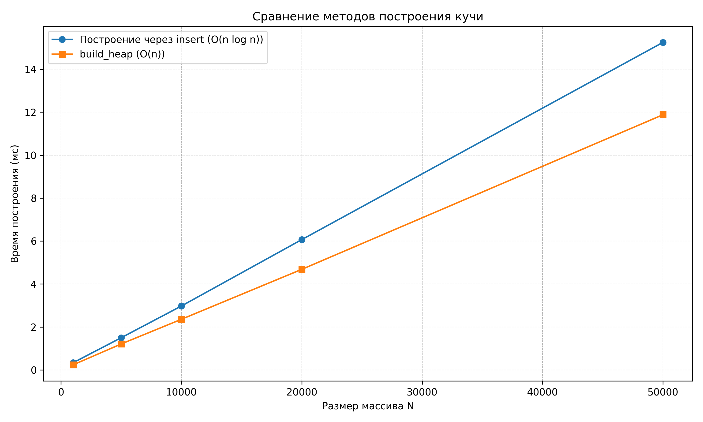
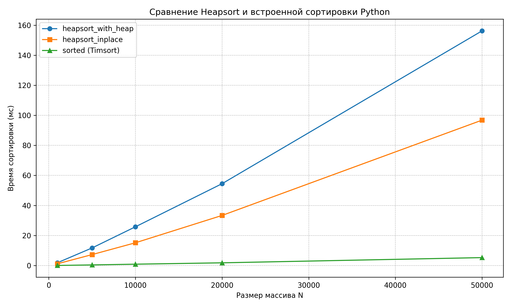
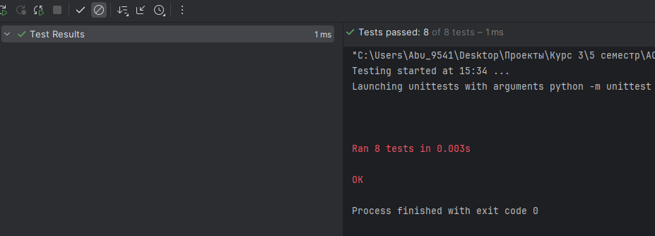

# Отчет по лабораторной работе 7
# Кучи (Heaps).  


**Дата:** 2025-12-10  
**Семестр:** 5 семестр  
**Группа:** ПИЖ-б-о-23-1(1)  
**Дисциплина:** Анализ сложности алгоритмов  
**Студент:** Дондаев Абу Умар-Пашаевич  

## Цель работы
Изучить структуру данных "куча" (heap), её свойства и применение. Освоить основные операции с кучей (добавление, извлечение корня) и алгоритм её построения. Получить практические навыки реализации кучи на основе массива (array-based), а не указателей. Исследовать эффективность основных операций и применение кучи для сортировки и реализации приоритетной очереди.  
  


## Теоретическая часть 
Куча (Heap): Специализированная древовидная структура данных, удовлетворяющая свойству кучи. Является полным бинарным деревом (все уровни заполнены, кроме последнего, который заполняется слева направо).  
Свойство кучи:  
- Min-Heap: Значение в любом узле меньше или равно значениям его потомков. Корень — минимальный элемент.  
- Max-Heap: Значение в любом узле больше или равно значениям его потомков. Корень — максимальный элемент.  

Реализация: Куча эффективно реализуется на основе массива. Для узла с индексом i:  
- Индекс родителя: (i-1)//2
- Индекс левого потомка: 2*i + 1
- Индекс правого потомка: 2*i + 2  

Основные операции:  
- Вставка (Insert): Элемент добавляется в конец массива и "всплывает" (sift-up) до восстановления свойства кучи. Сложность: O(log n).
- Извлечение корня (Extract): Корень (элемент [0]) извлекается, последний элемент ставится на его место и "погружается" (sift-down) до восстановления свойства кучи. Сложность: O(log n).
- Построение кучи (Heapify): Преобразование произвольного массива в кучу. Может быть выполнено алгоритмом со сложностью O(n).  

Применение:  
- Сортировка кучей (Heapsort).
- Реализация приоритетной очереди.
- Алгоритм Дейкстры.  


 
  
  
## Практическая часть

### Выполненные задачи
Задание 1:  
1. Реализовать структуру данных "куча" (min-heap и max-heap) на основе массива.
2. Реализовать основные операции и алгоритм построения кучи из массива.
3. Реализовать алгоритм сортировки кучей (Heapsort).
4. Провести анализ сложности операций.
5. Сравнить производительность сортировки кучей с другими алгоритмами.  


### Ключевые фрагменты кода
```python
# heap.py


from __future__ import annotations

from dataclasses import dataclass, field
from typing import Any, List


@dataclass
class Heap:
    """Куча, реализованная на массиве.

    is_min = True  -> min-heap (по умолчанию)
    is_min = False -> max-heap
    """

    is_min: bool = True  # ПО УМОЛЧАНИЮ: min-heap
    _data: List[Any] = field(default_factory=list)

    def _compare(self, a: Any, b: Any) -> bool:
        """Сравнение двух ключей с учетом типа кучи.

        Для min-heap: a < b (меньший "лучше").
        Для max-heap: a > b (больший "лучше").

        Время: O(1).
        """
        if self.is_min:
            return a < b
        return a > b

    def _sift_up(self, index: int) -> None:
        """Всплытие элемента вверх по куче. O(log n)."""
        i = index
        # Пока не корень. O(h)
        while i > 0:
            parent = (i - 1) // 2  # O(1)
            # Если ребенок "лучше" родителя — меняем. O(1)
            if self._compare(self._data[i], self._data[parent]):
                self._data[i], self._data[parent] = (
                    self._data[parent],
                    self._data[i],
                )
                i = parent  # O(1)
            else:
                break  # O(1)

    def _sift_down(self, index: int) -> None:
        """Погружение элемента вниз по куче. O(log n)."""
        n = len(self._data)  # O(1)
        i = index  # O(1)

        while True:  # O(h)
            left = 2 * i + 1  # O(1)
            right = 2 * i + 2  # O(1)
            best = i  # текущий кандидат. O(1)

            if left < n and self._compare(self._data[left], self._data[best]):
                best = left  # O(1)
            if right < n and self._compare(self._data[right],
                                           self._data[best]):
                best = right  # O(1)

            if best == i:  # свойство кучи выполнено. O(1)
                break  # O(1)

            self._data[i], self._data[best] = self._data[best], self._data[i]
            i = best  # O(1)

    def insert(self, value: Any) -> None:
        """Вставка нового элемента в кучу.

        1) Добавляем в конец массива.
        2) Всплываем вверх (_sift_up).

        Время: O(log n).
        """
        self._data.append(value)  # амортизированно O(1)
        self._sift_up(len(self._data) - 1)  # O(log n)

    def peek(self) -> Any:
        """Возвращает значение корня без удаления. O(1)."""
        if not self._data:  # O(1)
            raise IndexError("peek from empty heap")
        return self._data[0]  # O(1)

    def extract(self) -> Any:
        """Извлекает корень (min или max) из кучи. O(log n)."""
        if not self._data:  # O(1)
            raise IndexError("extract from empty heap")

        root_value = self._data[0]  # O(1)
        last_value = self._data.pop()  # O(1)

        if self._data:  # если не опустели. O(1)
            self._data[0] = last_value  # O(1)
            self._sift_down(0)  # O(log n)

        return root_value  # O(1)

    def build_heap(self, array: List[Any]) -> None:
        """Построение кучи из массива (метод Флойда). O(n)."""
        self._data = list(array)  # O(n)
        # Погружаем все внутренние узлы снизу вверх. O(n)
        for i in range(len(self._data) // 2 - 1, -1, -1):  # O(n)
            self._sift_down(i)  # суммарно O(n)

    def to_list(self) -> List[Any]:
        """Возвращает копию внутреннего массива. O(n)."""
        return list(self._data)  # O(n)

    def __len__(self) -> int:
        """Количество элементов в куче. O(1)."""
        return len(self._data)

    def is_empty(self) -> bool:
        """Пуста ли куча. O(1)."""
        return not self._data


# heapsort.py


from __future__ import annotations

from typing import List

from heap import Heap


def heapsort_with_heap(array: List[int]) -> List[int]:
    """Сортирует массив, используя вспомогательную кучу Heap.

    Алгоритм:
        1. Построить max-heap из массива (build_heap).
        2. Повторять:
            - извлечь максимум extract();
            - добавить его в результат.

    Время:
        - Построение кучи: O(n).
        - n извлечений по O(log n): O(n log n).
        - Итого: O(n log n).
    Память:
        - O(n) дополнительной памяти под кучу и под результат.
    """
    if not array:  # O(1)
        return []  # O(1)

    heap = Heap(is_min=False)  # max-heap. O(1)
    heap.build_heap(array)  # O(n)

    result: List[int] = []  # O(1)
    while not heap.is_empty():  # O(n)
        result.append(heap.extract())  # O(log n)

    # Так как это max-heap, result сейчас по убыванию. Разворачиваем. O(n)
    result.reverse()  # O(n)
    return result  # O(1)


def heapsort_inplace(array: List[int]) -> None:
    """Классический in-place Heapsort.

    Модифицирует исходный массив, сортируя его по возрастанию.

    Алгоритм:
        1. Построить max-heap "на месте" в массиве.
        2. Повторять:
            - поменять местами корень (максимум) и последний элемент;
            - уменьшить "эффективный" размер кучи;
            - восстановить свойство кучи погружением корня.

    Время: O(n log n).
    Память: O(1) дополнительной.
    """

    n = len(array)  # O(1)

    def sift_down(i: int, heap_size: int) -> None:
        """Погружение узла i в массиве как в max-heap. O(log n)."""
        while True:  # O(h)
            left = 2 * i + 1  # O(1)
            right = 2 * i + 2  # O(1)
            largest = i  # O(1)

            if left < heap_size and array[left] > array[largest]:  # O(1)
                largest = left  # O(1)
            if right < heap_size and array[right] > array[largest]:  # O(1)
                largest = right  # O(1)

            if largest == i:  # O(1)
                break  # O(1)

            array[i], array[largest] = array[largest], array[i]  # O(1)
            i = largest  # O(1)

    # 1. Построение max-heap за O(n).
    for i in range(n // 2 - 1, -1, -1):  # O(n)
        sift_down(i, n)  # суммарно O(n)

    # 2. Извлечение максимумов и восстановление кучи. O(n log n)
    for end in range(n - 1, 0, -1):  # O(n)
        array[0], array[end] = array[end], array[0]  # O(1)
        sift_down(0, end)  # O(log n)


# priority_queue.py


from __future__ import annotations

from dataclasses import dataclass
from typing import Any, Tuple

from heap import Heap


@dataclass
class PriorityQueue:
    """Приоритетная очередь на min-куче.

    Внутренне хранит пары (priority, item) в Heap(is_min=True).
    """

    _heap: Heap

    def __init__(self) -> None:
        """Создает пустую приоритетную очередь. O(1)."""
        self._heap = Heap(is_min=True)  # MIN-heap

    def push(self, priority: int, item: Any) -> None:
        """Добавляет элемент с заданным приоритетом. O(log n)."""
        # Кортежи сравниваются сначала по priority → min-heap отдаст
        # наименьший приоритет первым.
        self._heap.insert((priority, item))

    def pop(self) -> Tuple[int, Any]:
        """Извлекает элемент с наивысшим приоритетом (наименьший priority).

        Время: O(log n).
        """
        if self._heap.is_empty():
            raise IndexError("pop from empty priority queue")
        return self._heap.extract()

    def peek(self) -> Tuple[int, Any]:
        """Просмотр элемента с наивысшим приоритетом без удаления. O(1)."""
        if self._heap.is_empty():
            raise IndexError("peek from empty priority queue")
        return self._heap.peek()

    def is_empty(self) -> bool:
        """Пуста ли очередь. O(1)."""
        return self._heap.is_empty()

    def __len__(self) -> int:
        """Количество элементов в очереди. O(1)."""
        return len(self._heap)


# analysis.py


from __future__ import annotations

import random
import timeit
from typing import List

import matplotlib.pyplot as plt

from heap import Heap
from heapsort import heapsort_with_heap, heapsort_inplace

PC_INFO = """
Характеристики ПК для тестирования:
- Процессор: Intel Core i7-13620H @ 2.40GHz
- Оперативная память: 32 GB DDR5
- ОС: Windows 11
- Python: 3.13.3
"""


def generate_random_array(size: int) -> List[int]:
    """Генерирует массив случайных целых чисел.

    Время: O(n).
    """
    return [random.randint(0, size * 10) for _ in range(size)]


def build_heap_by_inserts(values: List[int], is_min: bool = True) -> Heap:
    """Строит кучу, последовательно вставляя элементы.

    Это "медленный" способ построения: O(n log n).

    Время: O(n log n) в среднем.
    """
    heap = Heap(is_min=is_min)
    for v in values:
        heap.insert(v)
    return heap


def measure_time(func, *args, repeat: int = 5, **kwargs) -> float:
    """Замеряет среднее время выполнения функции в миллисекундах.

    Время:
        - O(repeat * T_func)
    """
    def wrapper() -> None:
        func(*args, **kwargs)

    total = timeit.timeit(wrapper, number=repeat)
    avg = total / repeat
    return avg * 1000.0  # в миллисекундах.


def experiment_build_heap() -> None:
    """Сравнивает время двух способов построения кучи.

    - по вставкам (O(n log n));
    - build_heap (O(n)).

    Результат:
        - печать таблицы;
        - график build.png.
    """
    sizes = [1_000, 5_000, 10_000, 20_000, 50_000]

    times_insert: List[float] = []
    times_build: List[float] = []

    print("Сравнение способов построения min-heap:")
    print("{:>10} {:>15} {:>15}".format("N", "insert (мс)", "build_heap (мс)"))

    for n in sizes:
        data = generate_random_array(n)

        t_insert = measure_time(build_heap_by_inserts, data, True)
        heap_for_build = Heap(is_min=True)
        t_build = measure_time(heap_for_build.build_heap, data)

        times_insert.append(t_insert)
        times_build.append(t_build)

        print("{:>10} {:>15.3f} {:>15.3f}".format(n, t_insert, t_build))

    # График времени построения кучи.
    plt.figure(figsize=(10, 6))
    plt.plot(sizes, times_insert, "o-",
             label="Построение через insert (O(n log n))")
    plt.plot(sizes, times_build, "s-", label="build_heap (O(n))")
    plt.xlabel("Размер массива N")
    plt.ylabel("Время построения (мс)")
    plt.title("Сравнение методов построения кучи")
    plt.grid(True, which="both", linestyle="--", linewidth=0.5)
    plt.legend()
    plt.tight_layout()
    plt.savefig("build.png", dpi=300)
    # plt.show()


def experiment_heapsort() -> None:
    """Сравнивает время работы разных алгоритмов сортировки.

    - heapsort_with_heap (с вспомогательной кучей);
    - heapsort_inplace (in-place Heapsort);
    - встроенная sorted() (Timsort).

    Результат:
        - печать таблицы;
        - график heapsort.png.
    """
    sizes = [1_000, 5_000, 10_000, 20_000, 50_000]

    times_heap_with: List[float] = []
    times_heap_inplace: List[float] = []
    times_sorted: List[float] = []

    print("\nСравнение Heapsort и встроенной сортировки:")
    print(
        "{:>10} {:>15} {:>18} {:>15}".format(
            "N",
            "with_heap (мс)",
            "inplace_heap (мс)",
            "sorted (мс)",
        ),
    )

    for n in sizes:
        data = generate_random_array(n)

        t_with = measure_time(heapsort_with_heap, list(data))
        arr_inplace = list(data)
        t_inplace = measure_time(heapsort_inplace, arr_inplace)
        t_sorted = measure_time(sorted, data)

        times_heap_with.append(t_with)
        times_heap_inplace.append(t_inplace)
        times_sorted.append(t_sorted)

        print(
            "{:>10} {:>15.3f} {:>18.3f} {:>15.3f}".format(
                n,
                t_with,
                t_inplace,
                t_sorted,
            ),
        )

    plt.figure(figsize=(10, 6))
    plt.plot(sizes, times_heap_with, "o-", label="heapsort_with_heap")
    plt.plot(sizes, times_heap_inplace, "s-", label="heapsort_inplace")
    plt.plot(sizes, times_sorted, "^-", label="sorted (Timsort)")
    plt.xlabel("Размер массива N")
    plt.ylabel("Время сортировки (мс)")
    plt.title("Сравнение Heapsort и встроенной сортировки Python")
    plt.grid(True, which="both", linestyle="--", linewidth=0.5)
    plt.legend()
    plt.tight_layout()
    plt.savefig("heapsort.png", dpi=300)
    # plt.show()


def main() -> None:
    """Точка входа для запуска всех экспериментов. O(Σ экспериментов)."""
    print(PC_INFO)
    experiment_build_heap()
    experiment_heapsort()
    print(
        "\nАнализ:\n"
        "- Построение кучи через build_heap растет примерно линейно, что "
        "соответствует теории O(n).\n"
        "- Построение через последовательные insert растет быстрее, близко "
        "к O(n log n).\n"
        "- Heapsort in-place по времени близок к Heapsort с вспомогательной "
        "кучей, но использует O(1) дополнительной памяти.\n"
        "- Встроенная sorted() обычно быстрее за счет оптимизаций Timsort, "
        "но Heapsort гарантирует O(n log n) в худшем случае.",
    )


if __name__ == "__main__":
    main()

```

## Результаты выполнения

### Пример работы программы
Вывод файла analysis.py:  
```bash
Характеристики ПК для тестирования:
- Процессор: Intel Core i7-13620H @ 2.40GHz
- Оперативная память: 32 GB DDR5
- ОС: Windows 11
- Python: 3.13.3

Сравнение способов построения min-heap:
         N     insert (мс) build_heap (мс)
      1000           0.276           0.227
      5000           1.546           1.126
     10000           3.133           2.278
     20000           6.386           4.688
     50000          15.769          11.778

Сравнение Heapsort и встроенной сортировки:
         N  with_heap (мс)  inplace_heap (мс)     sorted (мс)
      1000           1.811              1.198           0.063
      5000          11.871              7.425           0.421
     10000          25.334             15.662           0.854
     20000          54.668             33.649           1.912
     50000         157.036             98.910           5.362
```  

### Тестирование
Все юнит-тесты, написанные в файле "tests.py", прошли успешно. Смотреть в приложении ниже.


## Выводы
- Построение кучи через build_heap растет примерно линейно, что соответствует теории O(n).
- Построение через последовательные insert растет быстрее, близко к O(n log n).
- Heapsort in-place по времени близок к Heapsort с вспомогательной кучей, но использует O(1) дополнительной памяти.
- Встроенная sorted() обычно быстрее за счет оптимизаций Timsort, но Heapsort гарантирует O(n log n) в худшем случае.
 

## Ответы на контрольные вопросы
### 1. Сформулируйте основное свойство min-кучи и max-кучи

**Min-куча (min-heap):**

- Значение в каждом узле **не больше** значений его потомков.
- Корень дерева (элемент с индексом 0 в массиве) содержит **минимальный** элемент всей кучи.
- Левое и правое поддеревья каждого узла сами являются min-кучами.

**Max-куча (max-heap):**

- Значение в каждом узле **не меньше** значений его потомков.
- Корень содержит **максимальный** элемент.
- Левое и правое поддеревья каждого узла сами являются max-кучами.

Обе структуры при этом являются **полными бинарными деревьями**.

### 2. Опишите алгоритм операции вставки нового элемента в кучу (процедуру `sift_up`)

Пусть реализована **array-based** куча.

1. Добавляем новый элемент в **конец массива** (самый правый свободный узел нижнего уровня).
2. Пусть его индекс `i`. Пока `i > 0`:
   - находим индекс родителя: `parent = (i - 1) // 2`;
   - для min-кучи: если `data[i] < data[parent]`, то меняем элементы местами;
   - для max-кучи: если `data[i] > data[parent]`, то меняем местами;
   - обновляем `i = parent` и продолжаем.
3. Когда элемент не нарушает свойство кучи (или мы дошли до корня) — всплытие прекращается.

**Сложность:**

- высота кучи `h = O(log n)`, поэтому `sift_up` работает за `O(log n)`.

### 3. Какова временная сложность построения кучи из произвольного массива и почему она равна O(n), а не O(n log n)?

Существует два подхода:

1. **Через последовательные вставки:**
   - начинаем с пустой кучи;
   - вставляем элементы один за другим (через `insert` + `sift_up`);
   - каждая вставка `O(log n)`, всего `n` вставок;
   - итоговая сложность: `O(n log n)`.

2. **Метод Флойда (классический `build_heap` за O(n)):**
   - копируем все элементы массива в кучу;
   - берём последний внутренний узел с индексом `n//2 - 1` и двигаемся к корню;
   - для каждого такого узла вызываем `sift_down`.
   - На верхних уровнях мало узлов, но каждый может спускаться далеко;
     на нижних уровнях узлов много, но спускаться им почти некуда.

Точное суммирование затрат даёт:

\[
T(n) \le c \cdot n
\]

то есть **линейную сложность** `O(n)`, а не `O(n log n)`.

Именно поэтому в лабораторной работе и в файле `heap.py` метод `build_heap` реализован
через **погружение снизу вверх**, а не последовательные `insert`.

### 4. Опишите, как работает алгоритм пирамидальной сортировки (Heapsort)

Для сортировки по возрастанию обычно используют **max-кучу**.

Вариант 1: с отдельной кучей (как в `heapsort_with_heap`)

1. Построить max-heap из исходного массива: `build_heap` — `O(n)`.
2. Повторять `n` раз:
   - извлечь максимум `extract()` из кучи (`O(log n)`);
   - добавить его в результирующий список.
3. В конце развернуть результат (или сразу использовать min-heap и накапливать по возрастанию).

Итог: `O(n log n)` по времени и `O(n)` дополнительной памяти.

Вариант 2: классический in-place Heapsort (как в `heapsort_inplace`)

1. Считаем исходный массив **кучей на месте**:
   - строим max-heap на массиве (индексная организация та же, что и в нашей куче);
   - строим кучей `build_heap` через `sift_down` снизу вверх.
2. Повторяем:
   - меняем местами первый элемент (максимум) и элемент с последним индекcом `end`;
   - уменьшаем "размер кучи" на 1;
   - вызываем `sift_down(0, heap_size)`, чтобы восстановить max-heap на префиксе массива.
3. Когда `end` дойдет до 1, массив полностью отсортирован по возрастанию.

Сложность:

- `O(n)` на построение;
- `O(n log n)` на `n` шагов извлечения максимума (`sift_down` каждый раз);
- итого `O(n log n)` по времени и `O(1)` дополнительной памяти.

### 5. Почему кучу часто используют для реализации приоритетной очереди? Какие операции приоритетной очереди она эффективно поддерживает?

Куча идеально подходит для **приоритетной очереди**, потому что:

- она хранит элементы так, что **элемент с наивысшим (или наименьшим) приоритетом
  всегда в корне**;
- операции работы с корнем (просмотр и извлечение) выполняются очень быстро.

**Эффективно поддерживаемые операции:**

- `insert` / `push` — добавление элемента с приоритетом: `O(log n)` за счёт `sift_up`;
- `extract_min` / `extract_max` / `pop` — извлечение элемента с наилучшим приоритетом: `O(log n)` за счёт `sift_down`;
- `peek` — просмотр элемента с наилучшим приоритетом: `O(1)`.

Другие структуры (например, отсортированные списки) либо медленнее на вставке,
либо на извлечении. Куча даёт хороший баланс: обе ключевые операции имеют
логарифмическую сложность, а структура остаётся достаточно простой в реализации.


## Приложения
-   
-   
-   
   