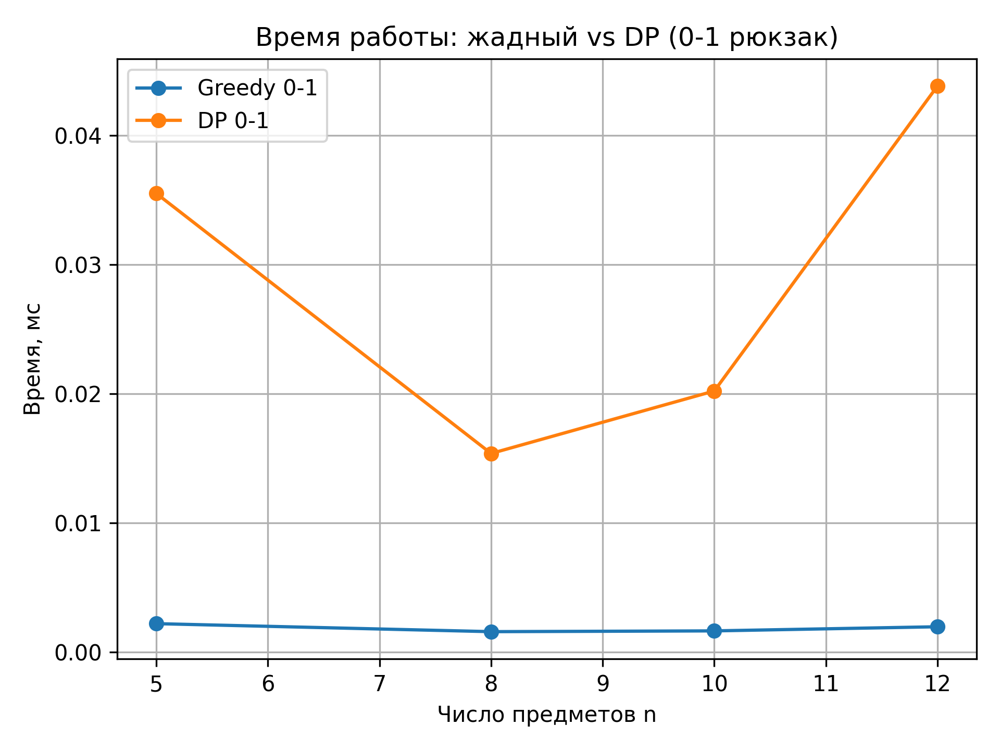

# Отчет по лабораторной работе 8
# Жадные алгоритмы.  


**Дата:** 2025-12-11  
**Семестр:** 5 семестр  
**Группа:** ПИЖ-б-о-23-1(1)  
**Дисциплина:** Анализ сложности алгоритмов  
**Студент:** Дондаев Абу Умар-Пашаевич  

## Цель работы
Изучить метод проектирования алгоритмов, известный как "жадный алгоритм". Освоить принцип принятия локально оптимальных решений на каждом шаге и понять условия, при которых этот подход приводит к глобально оптимальному решению. Получить практические навыки реализации жадных алгоритмов для решения классических задач, анализа их корректности и оценки эффективности.  
  
  


## Теоретическая часть 
Жадный алгоритм: Алгоритм, который на каждом шаге принимает локально оптимальное решение в надежде, что итоговое решение будет глобально оптимальным.  
Ключевые характеристики:  
- Жадный выбор: На каждом шаге выбирается лучший из доступных вариантов в данный момент, без учета последствий для будущих шагов.
- Оптимальная подструктура: Оптимальное решение задачи содержит в себе оптимальные решения её подзадач.  

Области применения: Жадные алгоритмы эффективны для задач, где выбор, сделанный на каждом шаге, не ухудшает возможности достижения глобального оптимума. Они часто работают быстро (полиномиальное время), но не всегда приводят к оптимальному решению.  
Классические задачи:  
- Задача о выборе заявок (Interval Scheduling): Выбор максимального количества непересекающихся интервалов.
- Задача о рюкзаке (Непрерывная/Дробная): Выбор предметов с максимальной суммарной стоимостью, если можно брать части предметов.
- Алгоритм Хаффмана: Оптимальное префиксное кодирование для сжатия данных.
- Построение минимального остовного дерева (Алгоритмы Прима и Краскала): (Хотя это и графовый алгоритм, он является классическим примером жадного подхода).  


 
  
  
## Практическая часть

### Выполненные задачи
Задание 1:  
1. Реализовать классические жадные алгоритмы.
2. Проанализировать их корректность (доказать или объяснить, почему жадный выбор приводит к оптимальному решению).
3. Провести сравнительный анализ эффективности жадного подхода и других методов (например, полного перебора для маленьких входных данных).
4. Решить практические задачи с применением жадного подхода.  
  


### Ключевые фрагменты кода
```python
# greedy_algorithms.py


from __future__ import annotations

from dataclasses import dataclass
from heapq import heappop, heappush
from typing import Dict, Iterable, List, Optional, Tuple


@dataclass(frozen=True)
class Interval:
    """
    Отрезок времени [start, end).

    Атрибуты
    ----------
    start : int | float
        Время начала интервала.
    end : int | float
        Время окончания интервала (не входит).
    """
    start: float
    end: float


@dataclass(frozen=True)
class Item:
    """
    Предмет для задачи о рюкзаке.

    Атрибуты
    ----------
    weight : float
        Вес предмета ( > 0 ).
    value : float
        Стоимость (полезность) предмета ( >= 0 ).
    name : str | None
        Необязательное имя для удобства интерпретации результата.
    """
    weight: float
    value: float
    name: Optional[str] = None

    @property
    def value_density(self) -> float:
        """
        Отношение ценности к весу (value / weight).

        Сложность
        ----------
        O(1)
        """
        if self.weight <= 0:
            raise ValueError("Weight must be positive.")
        return self.value / self.weight


@dataclass
class HuffmanNode:
    """
    Узел дерева Хаффмана.

    Атрибуты
    ----------
    freq : int
        Частота символа (или суммарная частота поддерева).
    symbol : str | None
        Символ (для листа) или None (для внутреннего узла).
    left : HuffmanNode | None
        Левый потомок.
    right : HuffmanNode | None
        Правый потомок.
    """
    freq: int
    symbol: Optional[str] = None
    left: Optional["HuffmanNode"] = None
    right: Optional["HuffmanNode"] = None

    def is_leaf(self) -> bool:
        """
        Проверка, что узел — лист.

        Сложность
        ----------
        O(1)
        """
        return self.left is None and self.right is None


# 1. Задача о выборе заявок (IS)


def select_intervals_greedy(intervals: Iterable[Interval]) -> List[Interval]:
    """
    Жадный алгоритм выбора максимального количества
    непересекающихся интервалов.

    Параметры
    ----------
    intervals : Iterable[Interval]
        Коллекция интервалов [start, end).

    Returns
    -------
    List[Interval]
        Список выбранных интервалов, образующих решение максимального размера.

    Сложность
    ----------
    Время: O(n log n) на сортировку + O(n) на один проход = O(n log n).
    Память: O(n) для хранения отсортированных интервалов и ответа.
    """
    intervals_list = sorted(intervals, key=lambda x: x.end)  # O(n log n)

    result: List[Interval] = []
    current_end: float = float("-inf")

    for interval in intervals_list:  # O(n)
        if interval.start >= current_end:  # O(1)
            result.append(interval)        # O(1) (амортизированно)
            current_end = interval.end     # O(1)

    return result


# 2. Непрерывная (дробная) задача рюкзака


def fractional_knapsack(
    items: Iterable[Item],
    capacity: float,
) -> Tuple[float, List[Tuple[Item, float]]]:
    """
    Жадный алгоритм для непрерывной (дробной) задачи о рюкзаке.

    Можно брать дробные части предметов. Цель — максимизировать суммарную
    стоимость при ограничении по суммарному весу.

    Параметры
    ----------
    items : Iterable[Item]
        Предметы с полями weight > 0 и value >= 0.
    capacity : float
        Вместимость рюкзака ( capacity >= 0 ).

    Returns
    -------
    total_value : float
        Максимально достигнутая суммарная стоимость.
    taken : list[tuple[Item, float]]
        Список пар (предмет, доля_0_1), отражающий стратегию набора.

    Сложность
    ----------
    Время: O(n log n) (сортировка по плотности) + O(n) обход = O(n log n).
    Память: O(n) для отсортированного списка и результата.
    """
    if capacity < 0:
        raise ValueError("Capacity must be non-negative.")

    items_sorted = sorted(
        items,
        key=lambda x: x.value_density,
        reverse=True,
    )  # O(n log n)

    remaining_capacity = capacity
    total_value = 0.0
    taken: List[Tuple[Item, float]] = []

    for item in items_sorted:  # O(n)
        if remaining_capacity <= 0:
            break

        if item.weight <= remaining_capacity:
            # Берём предмет целиком.
            taken.append((item, 1.0))  # O(1)
            remaining_capacity -= item.weight
            total_value += item.value
        else:
            # Берём лишь часть предмета.
            fraction = remaining_capacity / item.weight  # O(1)
            taken.append((item, fraction))
            total_value += item.value * fraction
            remaining_capacity = 0.0

    return total_value, taken


# 3. Алгоритм Хаффмана (Huffman coding)


def build_huffman_tree(frequencies: Dict[str, int]) -> Optional[HuffmanNode]:
    """
    Построение дерева Хаффмана по заданным частотам символов.

    Параметры
    ----------
    frequencies : dict[str, int]
        Словарь вида {символ: частота}, частоты > 0.

    Returns
    -------
    HuffmanNode | None
        Корень дерева Хаффмана или None, если частоты пусты.

    Сложность
    ----------
    Пусть k — число различных символов.
    Время: O(k log k) — k извлечений и вставок в мин-кучу.
    Память: O(k) — для хранения дерева.
    """
    if not frequencies:
        return None

    # Инициализация мин-кучи
    # Элемент кучи: (частота, порядковый_номер, узел)
    # Порядковый номер нужен, чтобы избежать сравнения узлов при равных freq.
    heap: List[Tuple[int, int, HuffmanNode]] = []
    counter = 0

    for symbol, freq in frequencies.items():  # O(k)
        node = HuffmanNode(freq=freq, symbol=symbol)
        heappush(heap, (freq, counter, node))  # O(log k)
        counter += 1

    # Особый случай: единственный символ
    if len(heap) == 1:
        return heap[0][2]

    # Итеративно объединяем два наименее частотных узла
    while len(heap) > 1:  # O(k)
        freq1, _, node1 = heappop(heap)  # O(log k)
        freq2, _, node2 = heappop(heap)  # O(log k)
        merged = HuffmanNode(
            freq=freq1 + freq2,
            left=node1,
            right=node2,
        )
        heappush(heap, (merged.freq, counter, merged))  # O(log k)
        counter += 1

    return heap[0][2]


def build_huffman_codes(frequencies: Dict[str, int]) -> Dict[str, str]:
    """
    Построение оптимального префиксного кода Хаффмана.

    Параметры
    ----------
    frequencies : dict[str, int]
        Частоты символов.

    Returns
    -------
    dict[str, str]
        Словарь {символ: битовая_строка}.

    Сложность
    ----------
    Время: O(k log k + k), где k — число символов.
    Память: O(k).
    """
    root = build_huffman_tree(frequencies)  # O(k log k)

    if root is None:
        return {}

    codes: Dict[str, str] = {}

    # Обход дерева в глубину для назначения кодов.
    def dfs(node: HuffmanNode, prefix: str) -> None:
        """
        Рекурсивно обходит дерево и заполняет словарь codes.

        Сложность
        ----------
        Время: O(k), каждый узел посещается один раз.
        Память: O(h) для стека, где h — высота дерева.
        """
        if node.is_leaf():
            # Особый случай: один символ в алфавите — ему даём код '0'.
            codes[node.symbol if node.symbol is not None else ""] = (
                prefix or "0"
            )
            return

        if node.left is not None:
            dfs(node.left, prefix + "0")
        if node.right is not None:
            dfs(node.right, prefix + "1")

    dfs(root, "")

    return codes


def huffman_encode(text: str, codes: Dict[str, str]) -> str:
    """
    Кодирует строку `text` с помощью словаря кодов Хаффмана.

    Параметры
    ----------
    text : str
        Исходная строка.
    codes : dict[str, str]
        Словарь {символ: код}.

    Returns
    -------
    str
        Битовая строка ('0' и '1').

    Сложность
    ----------
    Время: O(len(text)).
    Память: O(len(text)).
    """
    return "".join(codes[ch] for ch in text)


def huffman_decode(encoded: str, codes: Dict[str, str]) -> str:
    """
    Декодирует битовую строку, используя словарь кодов Хаффмана.

    Параметры
    ----------
    encoded : str
        Битовая строка.
    codes : dict[str, str]
        Словарь {символ: код}.

    Returns
    -------
    str
        Восстановленная строка.

    Сложность
    ----------
    Время: O(len(encoded)).
    Память: O(len(encoded)).
    """
    # Строим обратный словарь для декодирования.
    reverse_codes: Dict[str, str] = {v: k for k, v in codes.items()}  # O(k)

    decoded_chars: List[str] = []
    current = ""

    for bit in encoded:  # O(L)
        current += bit
        if current in reverse_codes:
            decoded_chars.append(reverse_codes[current])
            current = ""

    return "".join(decoded_chars)


def pretty_print_huffman_tree(
    root: Optional[HuffmanNode],
    indent: str = "",
    edge_label: str = "",
) -> None:
    """
    Напечатать дерево Хаффмана в текстовом виде (для отчёта/отладки).

    Узлы выводятся в виде:

        [freq] 'symbol' (edge_label)

    где edge_label — метка ребра от родителя: '0' или '1'.

    Параметры
    ----------
    root : HuffmanNode | None
        Корень дерева Хаффмана.
    indent : str
        Левый отступ для текущего уровня (используется рекурсивно).
    edge_label : str
        Метка ребра ('0' или '1'), ведущего к этому узлу.

    Сложность
    ----------
    Время: O(k), где k — число узлов дерева.
    Память: O(h) для стека рекурсии, h — высота дерева.
    """
    if root is None:
        print("<empty tree>")
        return

    # Печатаем текущий узел
    label = f" ({edge_label})" if edge_label else ""
    if root.symbol is None:
        node_repr = f"[{root.freq}]{label}"
    else:
        node_repr = f"[{root.freq}] '{root.symbol}'{label}"

    print(indent + node_repr)

    # Рекурсивно печатаем детей, если они есть
    if root.left is not None:
        pretty_print_huffman_tree(
            root.left,
            indent=indent + "  ",
            edge_label="0",
        )
    if root.right is not None:
        pretty_print_huffman_tree(
            root.right,
            indent=indent + "  ",
            edge_label="1",
        )

# 4. Минимальное остовное дерево (алгоритм Краскала)


class DisjointSetUnion:
    """
    Структура «Система непересекающихся множеств» (DSU / Union-Find).

    Используется для алгоритма Краскала.

    Сложность
    ----------
    Для m операций объединения/поиска на n элементах
    амортизированная сложность почти O(1):
    O(m * α(n)), где α — обратная функция Аккермана.
    """

    def __init__(self, size: int) -> None:
        if size <= 0:
            raise ValueError("Size must be positive.")
        self.parent: List[int] = list(range(size))
        self.rank: List[int] = [0] * size

    def find(self, x: int) -> int:
        """
        Поиск представителя множества с сжатием пути.

        Сложность
        ----------
        Амортизированно почти O(1).
        """
        if self.parent[x] != x:
            self.parent[x] = self.find(self.parent[x])  # path compression
        return self.parent[x]

    def union(self, a: int, b: int) -> bool:
        """
        Объединение двух множеств.

        Параметры
        ----------
        a, b : int
            Индексы элементов (вершин графа).

        Returns
        -------
        bool
            True, если множества были разными и произошёл union,
            False, если a и b уже в одном множестве.

        Сложность
        ----------
        Амортизированно почти O(1).
        """
        root_a = self.find(a)
        root_b = self.find(b)
        if root_a == root_b:
            return False

        # Union by rank
        if self.rank[root_a] < self.rank[root_b]:
            root_a, root_b = root_b, root_a
        self.parent[root_b] = root_a
        if self.rank[root_a] == self.rank[root_b]:
            self.rank[root_a] += 1

        return True


def kruskal_mst(
    num_vertices: int,
    edges: Iterable[Tuple[int, int, float]],
) -> Tuple[float, List[Tuple[int, int, float]]]:
    """
    Алгоритм Краскала для построения минимального остовного дерева (MST).

    Параметры
    ----------
    num_vertices : int
        Количество вершин в графе (нумеруются 0..num_vertices-1).
    edges : Iterable[tuple[int, int, float]]
        Рёбра в форме (u, v, weight). Предполагается, что граф связен
        или рассматривается MST каждой компоненты.

    Return
    -------
    total_weight : float
        Общий вес остовного дерева.
    mst_edges : list[tuple[int, int, float]]
        Список рёбер MST.

    Сложность
    ----------
    Пусть m — число рёбер, n — число вершин.
    Время: O(m log m + m * α(n)) ≈ O(m log m) из-за сортировки.
    Память: O(m + n).
    """
    if num_vertices <= 0:
        raise ValueError("Number of vertices must be positive.")

    edges_list = list(edges)
    # Сортировка рёбер по весу
    edges_list.sort(key=lambda e: e[2])  # O(m log m)

    dsu = DisjointSetUnion(num_vertices)
    mst_edges: List[Tuple[int, int, float]] = []
    total_weight = 0.0

    for u, v, w in edges_list:  # O(m * α(n))
        if dsu.union(u, v):
            mst_edges.append((u, v, w))
            total_weight += w
            if len(mst_edges) == num_vertices - 1:
                break

    return total_weight, mst_edges

# 5. Задача о размене монет (минимум монет)


def greedy_change(
    denominations: Iterable[int],
    amount: int,
) -> Tuple[int, List[Tuple[int, int]]]:
    """
    Жадный алгоритм размена суммы на минимальное число монет.

    Предполагается, что набор номиналов *канонический* (как в рублях):
    жадный выбор даёт оптимальное решение (например, 1, 2, 5, 10, 50).

    Параметры
    ----------
    denominations : Iterable[int]
        Доступные номиналы монет (положительные целые числа).
    amount : int
        Сумма, которую нужно выдать (неотрицательное целое число).

    Return
    -------
    total_coins : int
        Общее количество выданных монет.
    result : list[tuple[int, int]]
        Список пар (номинал, количество монет с этим номиналом) в порядке
        убывания номиналов.

    Сложность
    ----------
    Пусть k = число различных номиналов.
    Время: O(k log k) на сортировку + O(k) проход = O(k log k).
    Память: O(k).
    """
    if amount < 0:
        raise ValueError("Amount must be non-negative.")

    coins = sorted(set(denominations), reverse=True)  # O(k log k)
    if not coins:
        if amount == 0:
            return 0, []
        raise ValueError("No denominations provided.")

    remaining = amount
    result: List[Tuple[int, int]] = []
    total_coins = 0

    for coin in coins:  # O(k)
        if coin <= 0:
            raise ValueError("Coin denominations must be positive.")

        count = remaining // coin  # O(1)
        if count > 0:
            result.append((coin, count))
            total_coins += count
            remaining -= coin * count

        if remaining == 0:
            break

    if remaining != 0:
        # Для данной системы номиналов и суммы размена нет
        raise ValueError(
            f"Cannot make change for {amount} "
            f"with given denominations {coins}",
        )

    return total_coins, result


# analysis.py

from __future__ import annotations

import random
import timeit
from typing import Callable,  List, Tuple

import matplotlib.pyplot as plt  # type: ignore
from greedy_algorithms import (  # noqa: WPS235
    Interval,
    Item,
)


def measure_time(func: Callable, *args, repeats: int = 5, **kwargs) -> float:
    """
    Замерить среднее время работы функции в миллисекундах.
    """
    def wrapped() -> None:
        func(*args, **kwargs)

    timer = timeit.Timer(wrapped)
    total_seconds = timer.timeit(number=repeats)
    return (total_seconds / repeats) * 1000.0


PC_INFO = """
Характеристики ПК для тестирования:
- Процессор: Intel Core i7-13620H @ 2.40GHz
- Оперативная память: 32 GB DDR5
- ОС: Windows 11
- Python: 3.13.3
"""


def generate_random_intervals(
    n: int,
    max_time: int = 10_000,
    max_length: int = 1_000,
) -> List[Interval]:
    """
    Сгенерировать список случайных интервалов.
    """
    intervals: List[Interval] = []
    for _ in range(n):  # O(n)
        start = random.randint(0, max_time)
        end = start + random.randint(1, max_length)
        intervals.append(Interval(start=start, end=end))
    return intervals


def generate_random_items(
    n: int,
    max_weight: int = 100,
    max_value: int = 100,
) -> List[Item]:
    """
    Генерация случайных предметов для задачи о рюкзаке.
    """
    items: List[Item] = []
    for i in range(n):  # O(n)
        weight = random.randint(1, max_weight)
        value = random.randint(0, max_value)
        items.append(Item(weight=weight, value=value, name=f"item_{i}"))
    return items


def generate_random_graph(
    num_vertices: int,
    edge_probability: float = 0.3,
    max_weight: int = 100,
) -> List[Tuple[int, int, float]]:
    """
    Генерация случайного неориентированного взвешенного графа.
    """
    edges: List[Tuple[int, int, float]] = []
    for u in range(num_vertices):  # O(n^2)
        for v in range(u + 1, num_vertices):
            if random.random() < edge_probability:
                weight = random.randint(1, max_weight)
                edges.append((u, v, float(weight)))
    return edges


# Точный 0-1 рюкзак и жадный 0-1 рюкзак


def knapsack_01_dp(items: List[Item], capacity: int) -> float:
    """
    Точный алгоритм 0-1 рюкзака (динамическое программирование, bottom-up).
    """
    n = len(items)
    if capacity < 0:
        raise ValueError("Capacity must be non-negative.")

    # dp[i][w] — максимальная стоимость, используя первые i предметов
    # при вместимости w.
    dp: List[List[float]] = [
        [0.0] * (capacity + 1) for _ in range(n + 1)
    ]  # O(n * capacity)

    for i in range(1, n + 1):  # O(n)
        item = items[i - 1]
        w_i = int(item.weight)
        v_i = item.value
        for w in range(capacity + 1):  # O(capacity)
            if w_i <= w:
                dp[i][w] = max(
                    dp[i - 1][w],               # не берём предмет
                    dp[i - 1][w - w_i] + v_i,   # берём предмет
                )
            else:
                dp[i][w] = dp[i - 1][w]

    return dp[n][capacity]


def greedy_knapsack_01(items: List[Item], capacity: int) -> float:
    """
    Жадный 0-1 алгоритм рюкзака (НЕ оптимальный в общем случае).
    """
    items_sorted = sorted(
        items,
        key=lambda it: it.value_density,
        reverse=True,
    )  # O(n log n)

    remaining = capacity
    total_value = 0.0

    for item in items_sorted:  # O(n)
        w_i = int(item.weight)
        if w_i <= remaining:
            total_value += item.value
            remaining -= w_i

    return total_value


# Сравнение жадного и точного подходов (рюкзак)


def compare_knapsack_greedy_vs_dp() -> None:
    """
    Сравнить жадный 0-1 рюкзак и динамическое программирование.
    """
    random.seed(42)

    n_list = [5, 8, 10, 12]
    capacity_factor = 5

    sizes: List[int] = []
    times_greedy: List[float] = []
    times_dp: List[float] = []
    quality_ratios: List[float] = []

    print("Сравнение жадного и DP-подхода для 0-1 рюкзака:")
    print("{:>6} {:>10} {:>10} {:>12} {:>10}".format(
        "n",
        "Greedy",
        "DP",
        "Ratio(G/DP)",
        "Time(ms)",
    ))

    for n in n_list:
        items = generate_random_items(n)
        capacity = capacity_factor * n

        value_greedy = greedy_knapsack_01(items, capacity)
        value_dp = knapsack_01_dp(items, capacity)

        t_greedy = measure_time(greedy_knapsack_01, items, capacity)
        t_dp = measure_time(knapsack_01_dp, items, capacity)

        ratio = (value_greedy / value_dp) if value_dp > 0 else 1.0

        sizes.append(n)
        times_greedy.append(t_greedy)
        times_dp.append(t_dp)
        quality_ratios.append(ratio)

        print("{:>6} {:>10.2f} {:>10.2f} {:>12.3f} {:>10.3f}".format(
            n,
            value_greedy,
            value_dp,
            ratio,
            t_dp,
        ))

    # График времени
    plt.figure()
    plt.plot(sizes, times_greedy, marker="o", label="Greedy 0-1")
    plt.plot(sizes, times_dp, marker="o", label="DP 0-1")
    plt.xlabel("Число предметов n")
    plt.ylabel("Время, мс")
    plt.title("Время работы: жадный vs DP (0-1 рюкзак)")
    plt.grid(True)
    plt.legend()
    plt.tight_layout()
    plt.savefig("greedy.png", dpi=300)

    # График качества решения
    plt.figure()
    plt.plot(sizes, quality_ratios, marker="o")
    plt.xlabel("Число предметов n")
    plt.ylabel("Отношение value_greedy / value_dp")
    plt.title("Качество жадного решения (0-1 рюкзак)")
    plt.grid(True)
    plt.tight_layout()
    plt.ylim(0, 1.05)
    plt.savefig("knapsack_quality_ratio.png", dpi=300)


def main() -> None:
    """
    Точка входа для ручного запуска экспериментов.

    Запускает:
    * вывод информации о ПК,
    * сравнение жадного и DP-подхода для 0-1 рюкзака,
    * примерные бенчмарки интервалов и MST.
    """
    print(PC_INFO)

    compare_knapsack_greedy_vs_dp()


if __name__ == "__main__":
    main()

```

## Результаты выполнения

### Пример работы программы
Вывод файла analysis.py:  
```bash
Характеристики ПК для тестирования:
- Процессор: Intel Core i7-13620H @ 2.40GHz
- Оперативная память: 32 GB DDR5
- ОС: Windows 11
- Python: 3.13.3

Сравнение жадного и DP-подхода для 0-1 рюкзака:
     n     Greedy         DP  Ratio(G/DP)   Time(ms)
     5      94.00      94.00        1.000      0.007
     8      30.00      67.00        0.448      0.016
    10      27.00      35.00        0.771      0.020
    12     222.00     243.00        0.914      0.045
```   

Вывод файла greedy_demo.py:  
```bash
------------------------------------------------------------
Демонстрация: выбор заявок (Interval Scheduling)
------------------------------------------------------------
Исходные интервалы (start, end):
  [1, 4)
  [3, 5)
  [0, 6)
  [5, 7)
  [3, 9)
  [5, 9)
  [6, 10)
  [8, 11)
  [8, 12)
  [2, 13)
  [12, 14)

Выбранные интервалы жадным алгоритмом:
  [1, 4)
  [5, 7)
  [8, 11)
  [12, 14)

Общее количество выбранных интервалов: 4

------------------------------------------------------------
Демонстрация: непрерывная задача о рюкзаке
------------------------------------------------------------
Вместимость рюкзака: 50
Предметы (name, weight, value, value/weight):
    gold_bar  w= 10, v= 60, v/w=6.00
  silver_bar  w= 20, v=100, v/w=5.00
  bronze_bar  w= 30, v=120, v/w=4.00

Результат жадного алгоритма:
  Взято 100.00% предмета gold_bar (w=10, v=60)
  Взято 100.00% предмета silver_bar (w=20, v=100)
  Взято  66.67% предмета bronze_bar (w=30, v=120)

Итоговая стоимость: 240.00

------------------------------------------------------------
Демонстрация: алгоритм Хаффмана
------------------------------------------------------------
Частоты символов:
  'a': 5
  'b': 9
  'c': 12
  'd': 13
  'e': 16
  'f': 45

Коды Хаффмана для символов:
  'a': 1100
  'b': 1101
  'c': 100
  'd': 101
  'e': 111
  'f': 0

Дерево Хаффмана (частоты и символы):
[100]
  [45] 'f' (0)
  [55] (1)
    [25] (0)
      [12] 'c' (0)
      [13] 'd' (1)
    [30] (1)
      [14] (0)
        [5] 'a' (0)
        [9] 'b' (1)
      [16] 'e' (1)

------------------------------------------------------------
Демонстрация: минимальное остовное дерево (Краскал)
------------------------------------------------------------
Количество вершин: 6
Рёбра графа (u, v, weight):
  (0, 1, 4.0)
  (0, 2, 4.0)
  (1, 2, 2.0)
  (1, 0, 4.0)
  (2, 0, 4.0)
  (2, 1, 2.0)
  (2, 3, 3.0)
  (2, 5, 2.0)
  (2, 4, 4.0)
  (3, 2, 3.0)
  (3, 4, 3.0)
  (4, 2, 4.0)
  (4, 3, 3.0)
  (5, 2, 2.0)
  (5, 4, 3.0)

Рёбра минимального остовного дерева:
  (1, 2, 2.0)
  (2, 5, 2.0)
  (2, 3, 3.0)
  (3, 4, 3.0)
  (0, 1, 4.0)

Суммарный вес MST: 14.0

------------------------------------------------------------
Демонстрация: задача о размене монет
------------------------------------------------------------
Номиналы монет: [1, 2, 5, 10]
Сумма для размена: 28

Размен суммы жадным алгоритмом:
  номинал 10: 2 шт.
  номинал 5: 1 шт.
  номинал 2: 1 шт.
  номинал 1: 1 шт.

Всего монет: 5
```   


## Выводы
1. Жадные алгоритмы предоставляют мощный инструмент для быстрого решения задач с полиномиальной сложностью и часто простой реализацией.
2. Для задач, удовлетворяющих свойствам «оптимальной подструктуры» и корректного жадного выбора, решения жадных алгоритмов совпадают с оптимальными (Interval Scheduling, дробный рюкзак, Хаффман, MST).
3. На примере 0–1 рюкзака показано, что жадный выбор по `value/weight` может проигрывать точному решению по стоимости, хотя выигрывает по времени.
4. При проектировании алгоритма важно не только реализовать жадную стратегию, но и аргументировать её корректность, а также экспериментально сравнить с альтернативными подходами.  

 

## Ответы на контрольные вопросы
### 1. В чем заключается основная идея жадных алгоритмов?
Жадный алгоритм строит решение по шагам, на каждом шаге **выбирая локально наилучший доступный вариант** по заранее заданному критерию (жадному правилу), **не откатываясь назад** и не пересматривая сделанный выбор. Предполагается, что такая последовательность локально оптимальных решений приводит к глобальному (или достаточно хорошему) решению задачи.

### 2. Для задачи о выборе заявок (Interval Scheduling) жадный алгоритм, выбирающий интервалы с наименьшим временем окончания, является оптимальным. Объясните, почему эта жадная стратегия работает.
Ключевая идея:

1. Рассмотрим жадное решение, которое первым выбирает интервал с минимальным временем окончания, и некоторое оптимальное решение.
2. В любом оптимальном решении первый интервал можно заменить на интервал, заканчивающийся не позже, не уменьшая количества интервалов в решении. Если первый интервал оптимального решения заканчивается позже, чем жадный, замена только «освободит» больше времени для последующих интервалов.
3. Таким образом, существует оптимальное решение, начинающееся с того же интервала, что и жадное.
4. Дальше можно рассматривать остаточную задачу на интервалах, начинающихся после окончания выбранного интервала, и повторить рассуждение.

По индукции получаем, что жадное решение, которое **всегда выбирает интервал с минимальным временем окончания, совместимый с уже выбранными**, даёт максимальное количество интервалов.

### 3. Приведите пример задачи, для которой жадный алгоритм дает оптимальное решение, и задачи, для которой он не дает.
**Жадный алгоритм даёт оптимальное решение:**

- Задача о выборе заявок (Interval Scheduling) — выбор максимального числа непересекающихся интервалов с жадным правилом: «всегда выбирать следующий интервал с минимальным временем окончания».
- Непрерывная (дробная) задача о рюкзаке — жадный выбор по убыванию `value / weight` (плотности стоимости) оптимален, так как можно брать дробные части предметов.

**Жадный алгоритм не даёт оптимального решения:**

- Дискретная задача о рюкзаке 0–1 (каждый предмет можно брать только целиком или не брать). Жадный алгоритм, сортирующий предметы по `value / weight` и берущий их в этом порядке целиком, в общем случае **не гарантирует** оптимум.
  - Простой пример: два предмета  
    - A: weight = 10, value = 60 (плотность = 6)  
    - B: weight = 9, value = 51 (плотность = 5.67)  
    При capacity = 10 жадный алгоритм возьмёт A (value = 60), а оптимальное решение — взять B (value = 51) и ещё один маленький предмет, если он есть; или в других примерах жадный выбор может пропускать комбинации предметов с большим суммарным значением.

### 4. В чем разница между непрерывной (дробной) и дискретной (0–1) задачами о рюкзаке? Для какой из них жадный алгоритм оптимален?
**Разница:**

- В **непрерывной (дробной)** задаче о рюкзаке предмет можно брать **частично**: например, половину слитка золота.
- В **дискретной (0–1)** задаче о рюкзаке каждый предмет можно либо взять **целиком**, либо **не брать вообще**; делить предмет нельзя.

**Жадный алгоритм по плотности стоимости (`value / weight`) оптимален только для:**

- **Непрерывной (дробной)** задачи о рюкзаке — можно доказать, что при возможности дробить предметы оптимальное решение получается именно при выборе предметов по убыванию плотности и, возможно, частичном взятии последнего предмета.

Для дискретной (0–1) задачи тот же жадный подход в общем случае **не оптимален**.

### 5. Опишите жадный алгоритм построения кода Хаффмана. В чем его оптимальность?
**Алгоритм Хаффмана:**

1. Для каждого символа с известной частотой создать одноузловое дерево и поместить его в мин-кучу (приоритетную очередь) по частоте.
2. Пока в куче больше одного узла:
   - Извлечь два дерева с наименьшими частотами `f1` и `f2`.
   - Создать новый узел с частотой `f1 + f2`, сделать два извлечённых дерева его левым и правым потомками.
   - Поместить новый узел обратно в кучу.
3. Оставшееся дерево — дерево Хаффмана. Присвоить левой ветви кодовый бит `0`, правой — `1`; коды символов — строки битов от корня до соответствующего листа.

**В чем оптимальность жадного алгоритма:**

- Доказано, что в **любом** оптимальном префиксном коде два символа с наименьшими частотами будут находиться на максимальной глубине и иметь общего родителя (их пути отличаются только последним битом).
- Алгоритм Хаффмана на каждом шаге **жадно** объединяет два наименее частотных символа/поддерева, создавая для них общего родителя на максимальной доступной глубине.
- С помощью обменных аргументов показывается, что если код не построен по правилу Хаффмана, то можно локально перестроить дерево, не увеличивая (а иногда уменьшая) среднюю длину кода, приводя его к структуре, эквивалентной результату алгоритма Хаффмана.

Поэтому алгоритм Хаффмана строит **оптимальный по средней длине** префиксный код для заданных частот символов.


## Приложения
-   
  