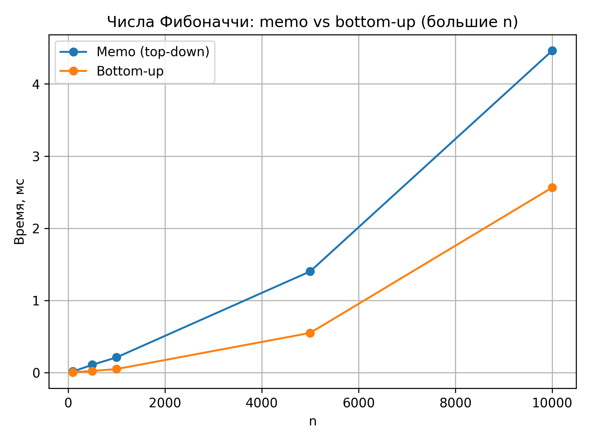
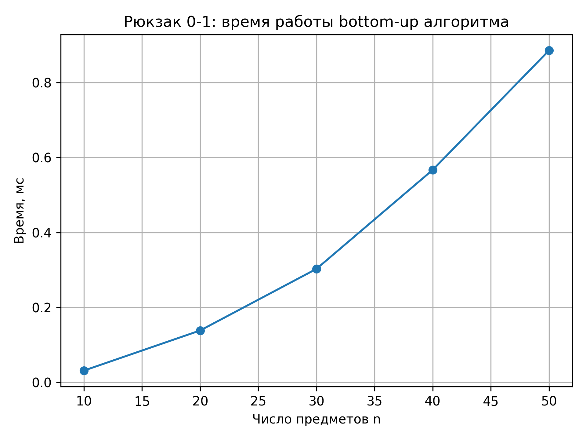

# Отчет по лабораторной работе 9
# Динамическое программирование.  


**Дата:** 2025-12-12  
**Семестр:** 5 семестр  
**Группа:** ПИЖ-б-о-23-1(1)  
**Дисциплина:** Анализ сложности алгоритмов  
**Студент:** Дондаев Абу Умар-Пашаевич  

## Цель работы
Изучить метод динамического программирования (ДП) как мощный инструмент для решения сложных задач путём их разбиения на перекрывающиеся подзадачи. Освоить два основных подхода к реализации ДП: нисходящий (с мемоизацией) и восходящий (с заполнением таблицы). Получить практические навыки выявления оптимальной подструктуры задач, построения таблиц ДП и анализа временной и пространственной сложности алгоритмов.  
  
  

## Теоретическая часть 
Динамическое программирование (ДП): Метод решения задач, в которых оптимальное решение всей задачи зависит от оптимальных решений её перекрывающихся подзадач.  
Ключевые принципы:  
- Оптимальная подструктура: Оптимальное решение задачи может быть построено из оптимальных решений её подзадач.
- Перекрывающиеся подзадачи: Подзадачи, решения которых используются многократно, а не один раз.  

Подходы к реализации:  
- Нисходящее ДП (Top-Down, с мемоизацией): Рекурсивное решение с сохранением (кэшированием) результатов решения подзадач для повторных вычислений.
- Восходящее ДП (Bottom-Up, табличное): Итеративное решение, при котором подзадачи решаются от простейших к сложным, а их результаты заносятся в таблицу (массив).  

Области применения: Задачи оптимизации, подсчёта количества способов, нахождения наиболее вероятной последовательности.  
Классические задачи:  
- Числа Фибоначчи: Классический пример перекрывающихся подзадач.
- Задача о рюкзаке (0-1 Knapsack): Выбор предметов с максимальной суммарной стоимостью без дробления.
- Наибольшая общая подпоследовательность (LCS): Поиск самой длинной последовательности символов, которая является подпоследовательностью двух строк.
- Расстояние Левенштейна (Редакционное расстояние): Минимальное количество операций вставки, удаления и замены символа, необходимых для превращения одной строки в другую.  
 
  
  
## Практическая часть

### Выполненные задачи
Задание 1:  
1. Реализовать классические алгоритмы динамического программирования.
2. Реализовать оба подхода (нисходящий и восходящий) для решения задач.
3. Провести сравнительный анализ эффективности двух подходов.
4. Проанализировать временную и пространственную сложность алгоритмов.
5. Решить практические задачи с применением ДП.  
  


### Ключевые фрагменты кода
```python
# dynamic_programming.py


from __future__ import annotations

import sys
from dataclasses import dataclass
from typing import Dict, Iterable, List, Optional, Sequence, Tuple


sys.setrecursionlimit(20000)


@dataclass(frozen=True)
class KnapsackItem:
    """
    Описание предмета для задачи о рюкзаке.
    """
    weight: int
    value: int
    name: Optional[str] = None


# Визуализация таблиц ДП


def print_dp_table_2d(
    dp: Sequence[Sequence[int]],
    row_labels: Optional[Sequence[str]] = None,
    col_labels: Optional[Sequence[str]] = None,
) -> None:
    """
    Напечатать двумерную таблицу ДП в удобном текстовом виде.
    """
    rows = len(dp)
    cols = len(dp[0]) if rows > 0 else 0

    # Заголовок таблицы
    if col_labels is not None:
        header = "      "
        for label in col_labels:
            header += f"{label:>5}"
        print(header)

    for i in range(rows):
        row_str = ""
        if row_labels is not None and i < len(row_labels):
            row_str += f"{row_labels[i]:>4} "
        else:
            row_str += f"{i:>4} "

        for j in range(cols):
            row_str += f"{dp[i][j]:>5}"
        print(row_str)


def print_dp_table_1d(
    dp: Sequence[int],
    index_labels: Optional[Sequence[str]] = None,
) -> None:
    """
    Напечатать одномерную таблицу ДП.
    """
    n = len(dp)
    if index_labels is not None:
        label_line = "Index: "
        for label in index_labels:
            label_line += f"{label:>5}"
        print(label_line)

    value_line = "Value: "
    for value in dp:
        value_line += f"{value:>5}"
    print(value_line)


# 1. Числа Фибоначчи


def fibonacci_naive(n: int) -> int:
    """
    Наивный рекурсивный алгоритм вычисления n-го числа Фибоначчи.
    """
    if n < 0:
        raise ValueError("n must be non-negative.")

    if n <= 1:
        return n

    return fibonacci_naive(n - 1) + fibonacci_naive(n - 2)


def fibonacci_memo(n: int, memo: Optional[Dict[int, int]] = None) -> int:
    """
    Нисходящее ДП (top-down) с мемоизацией для чисел Фибоначчи.
    """
    if n < 0:
        raise ValueError("n must be non-negative.")

    if memo is None:
        memo = {}

    if n in memo:
        return memo[n]

    if n <= 1:
        memo[n] = n
    else:
        memo[n] = fibonacci_memo(n - 1, memo) + fibonacci_memo(
            n - 2,
            memo,
        )

    return memo[n]


def fibonacci_bottom_up(n: int) -> int:
    """
    Восходящее ДП (bottom-up) для чисел Фибоначчи.
    """
    if n < 0:
        raise ValueError("n must be non-negative.")

    if n <= 1:
        return n

    dp: List[int] = [0] * (n + 1)
    dp[0] = 0
    dp[1] = 1

    for i in range(2, n + 1):
        dp[i] = dp[i - 1] + dp[i - 2]

    return dp[n]


# 2. Задача о рюкзаке 0-1 (DP)


def knapsack_01_bottom_up(
    items: Sequence[KnapsackItem],
    capacity: int,
) -> Tuple[int, List[int]]:
    """
    Восходящее ДП для задачи о рюкзаке 0-1.
    """
    if capacity < 0:
        raise ValueError("Capacity must be non-negative.")

    n = len(items)
    dp: List[List[int]] = [
        [0] * (capacity + 1) for _ in range(n + 1)
    ]

    # Заполнение таблицы
    for i in range(1, n + 1):
        item = items[i - 1]
        for w in range(capacity + 1):
            if item.weight <= w:
                dp[i][w] = max(
                    dp[i - 1][w],
                    dp[i - 1][w - item.weight] + item.value,
                )
            else:
                dp[i][w] = dp[i - 1][w]

    max_value = dp[n][capacity]

    # Восстановление решения (множество предметов)
    chosen_indices: List[int] = []
    w = capacity
    i = n
    while i > 0 and w >= 0:
        if dp[i][w] != dp[i - 1][w]:
            chosen_indices.append(i - 1)
            w -= items[i - 1].weight
        i -= 1

    chosen_indices.reverse()
    return max_value, chosen_indices


def print_knapsack_table(
    items: Sequence[KnapsackItem],
    capacity: int,
) -> None:
    """
    Построить и вывести таблицу ДП для задачи рюкзака 0-1.
    """
    n = len(items)
    dp: List[List[int]] = [
        [0] * (capacity + 1) for _ in range(n + 1)
    ]

    for i in range(1, n + 1):
        item = items[i - 1]
        for w in range(capacity + 1):
            if item.weight <= w:
                dp[i][w] = max(
                    dp[i - 1][w],
                    dp[i - 1][w - item.weight] + item.value,
                )
            else:
                dp[i][w] = dp[i - 1][w]

    row_labels = ["0"] + [f"i={i}" for i in range(1, n + 1)]
    col_labels = [f"w={w}" for w in range(capacity + 1)]
    print_dp_table_2d(dp, row_labels=row_labels, col_labels=col_labels)


# 3. Наибольшая общая подпоследовательность LCS


def lcs_bottom_up(
    s1: str,
    s2: str,
) -> Tuple[int, str]:
    """
    Восходящее ДП для поиска LCS (наибольшей общей подпоследовательности).
    """
    n = len(s1)
    m = len(s2)

    dp: List[List[int]] = [[0] * (m + 1) for _ in range(n + 1)]

    for i in range(1, n + 1):
        for j in range(1, m + 1):
            if s1[i - 1] == s2[j - 1]:
                dp[i][j] = dp[i - 1][j - 1] + 1
            else:
                dp[i][j] = max(
                    dp[i - 1][j],
                    dp[i][j - 1],
                )

    # Восстановление LCS
    i, j = n, m
    result_chars: List[str] = []
    while i > 0 and j > 0:
        if s1[i - 1] == s2[j - 1]:
            result_chars.append(s1[i - 1])
            i -= 1
            j -= 1
        elif dp[i - 1][j] >= dp[i][j - 1]:
            i -= 1
        else:
            j -= 1

    result_chars.reverse()
    return dp[n][m], "".join(result_chars)


def print_lcs_table(s1: str, s2: str) -> None:
    """
    Вывести таблицу ДП для задачи LCS.
    """
    n = len(s1)
    m = len(s2)
    dp: List[List[int]] = [[0] * (m + 1) for _ in range(n + 1)]

    for i in range(1, n + 1):
        for j in range(1, m + 1):
            if s1[i - 1] == s2[j - 1]:
                dp[i][j] = dp[i - 1][j - 1] + 1
            else:
                dp[i][j] = max(
                    dp[i - 1][j],
                    dp[i][j - 1],
                )

    row_labels = [" "] + list(s1)
    col_labels = [" "] + list(s2)
    print_dp_table_2d(dp, row_labels=row_labels, col_labels=col_labels)


# 4. Расстояние Левенштейна


def levenshtein_distance(s1: str, s2: str) -> int:
    """
    Восходящее ДП для расстояния Левенштейна между строками s1 и s2.
    """
    n = len(s1)
    m = len(s2)

    # dp имеет размер (n+1) x (m+1)
    dp: List[List[int]] = [[0] * (m + 1) for _ in range(n + 1)]

    # База: превращение пустой строки в префикс s2 и наоборот
    for i in range(1, n + 1):
        dp[i][0] = i  # удалить i символов из s1
    for j in range(1, m + 1):
        dp[0][j] = j  # вставить j символов в s1

    for i in range(1, n + 1):
        for j in range(1, m + 1):
            cost_replace = 0 if s1[i - 1] == s2[j - 1] else 1

            dp[i][j] = min(
                dp[i - 1][j] + 1,          # удаление символа из s1
                dp[i][j - 1] + 1,          # вставка символа в s1
                dp[i - 1][j - 1] + cost_replace,  # замена / совпадение
            )

    return dp[n][m]


def print_levenshtein_table(s1: str, s2: str) -> None:
    """
    Построить и вывести таблицу ДП для расстояния Левенштейна.
    """
    n = len(s1)
    m = len(s2)
    dp: List[List[int]] = [[0] * (m + 1) for _ in range(n + 1)]

    for i in range(1, n + 1):
        dp[i][0] = i
    for j in range(1, m + 1):
        dp[0][j] = j

    for i in range(1, n + 1):
        for j in range(1, m + 1):
            cost_replace = 0 if s1[i - 1] == s2[j - 1] else 1
            dp[i][j] = min(
                dp[i - 1][j] + 1,
                dp[i][j - 1] + 1,
                dp[i - 1][j - 1] + cost_replace,
            )

    # Метки — пустой символ + сами строки
    row_labels = [" "] + list(s1)
    col_labels = [" "] + list(s2)
    print_dp_table_2d(dp, row_labels=row_labels, col_labels=col_labels)


# 5. Размен монет (минимум монет, DP)


def coin_change_min_coins(
    amount: int,
    coins: Iterable[int],
) -> Tuple[int, List[int]]:
    """
    ДП-решение задачи размена монет: минимум монет для заданной суммы.
    """
    if amount < 0:
        raise ValueError("Amount must be non-negative.")

    coin_list = sorted(set(coins))
    if amount == 0:
        return 0, []

    if not coin_list:
        raise ValueError("No coins provided.")

    if any(c <= 0 for c in coin_list):
        raise ValueError("Coin denominations must be positive.")

    # Инициализация
    INF = amount + 1
    dp: List[int] = [INF] * (amount + 1)
    prev_coin: List[int] = [-1] * (amount + 1)
    dp[0] = 0

    for x in range(1, amount + 1):
        for coin in coin_list:
            if coin <= x and dp[x - coin] + 1 < dp[x]:
                dp[x] = dp[x - coin] + 1
                prev_coin[x] = coin

    if dp[amount] == INF:
        raise ValueError(
            f"Cannot make amount {amount} with coins {coin_list}",
        )

    # Восстановление размена
    result: List[int] = []
    current = amount
    while current > 0:
        coin = prev_coin[current]
        if coin == -1:
            break
        result.append(coin)
        current -= coin

    return dp[amount], result


def print_coin_change_table(amount: int, coins: Iterable[int]) -> None:
    """
    Построить и вывести таблицу dp для задачи размена монет.
    """
    coin_list = sorted(set(coins))
    INF = amount + 1
    dp: List[int] = [INF] * (amount + 1)
    dp[0] = 0

    for x in range(1, amount + 1):
        for coin in coin_list:
            if coin <= x and dp[x - coin] + 1 < dp[x]:
                dp[x] = dp[x - coin] + 1

    index_labels = [str(x) for x in range(amount + 1)]
    print_dp_table_1d(dp, index_labels=index_labels)


# 6. Наибольшая возрастающая подпоследовательность (LIS)


def lis_dp(sequence: Sequence[int]) -> Tuple[int, List[int]]:
    """
    ДП-решение задачи о наибольшей возрастающей подпоследовательности (LIS).
    """
    n = len(sequence)
    if n == 0:
        return 0, []

    dp: List[int] = [1] * n
    prev: List[int] = [-1] * n

    for i in range(n):
        for j in range(i):
            if (
                sequence[j] < sequence[i]
                and dp[j] + 1 > dp[i]
            ):
                dp[i] = dp[j] + 1
                prev[i] = j

    max_len = max(dp)
    max_index = dp.index(max_len)

    # Восстановление LIS
    lis_indices: List[int] = []
    k = max_index
    while k != -1:
        lis_indices.append(k)
        k = prev[k]
    lis_indices.reverse()

    subsequence = [sequence[i] for i in lis_indices]
    return max_len, subsequence


def print_lis_table(sequence: Sequence[int]) -> None:
    """
    Вывести массив dp для задачи LIS (наглядность).
    """
    n = len(sequence)
    if n == 0:
        print("Пустая последовательность.")
        return

    dp: List[int] = [1] * n

    for i in range(n):
        for j in range(i):
            if sequence[j] < sequence[i] and dp[j] + 1 > dp[i]:
                dp[i] = dp[j] + 1

    index_labels = [str(i) for i in range(n)]
    print("Последовательность:", sequence)
    print_dp_table_1d(dp, index_labels=index_labels)


# Примеры использования (для ручного тестирования)


def main() -> None:
    """
    Пример ручного запуска модуля.
    Включает демонстрацию работы основных функций ДП.
    """
    print("=== Fibonacci ===")
    n = 10
    print(f"F_naive({n}) = {fibonacci_naive(n)}")
    print(f"F_memo({n}) = {fibonacci_memo(n)}")
    print(f"F_bottom_up({n}) = {fibonacci_bottom_up(n)}")

    print("\n=== Knapsack 0-1 ===")
    items = [
        KnapsackItem(2, 3, "item1"),
        KnapsackItem(3, 4, "item2"),
        KnapsackItem(4, 5, "item3"),
        KnapsackItem(5, 8, "item4"),
    ]
    capacity = 5
    max_value, chosen = knapsack_01_bottom_up(items, capacity)
    print(f"Max value = {max_value}")
    print("Chosen items:", [items[i].name for i in chosen])
    print_knapsack_table(items, capacity)

    print("\n=== LCS ===")
    s1, s2 = "ABCBDAB", "BDCAB"
    length, lcs_str = lcs_bottom_up(s1, s2)
    print(f"LCS length = {length}, LCS = '{lcs_str}'")
    print_lcs_table(s1, s2)

    print("\n=== Levenshtein distance ===")
    s1_lev, s2_lev = "kitten", "sitting"
    dist = levenshtein_distance(s1_lev, s2_lev)
    print(f"Levenshtein('{s1_lev}', '{s2_lev}') = {dist}")
    print_levenshtein_table(s1_lev, s2_lev)

    print("\n=== Coin change (DP) ===")
    amount = 11
    coins = [1, 2, 5]
    min_coins, decomp = coin_change_min_coins(amount, coins)
    print(f"Amount {amount}, min coins = {min_coins}")
    print("Decomposition:", decomp)
    print_coin_change_table(amount, coins)

    print("\n=== LIS ===")
    seq = [10, 9, 2, 5, 3, 7, 101, 18]
    length, subseq = lis_dp(seq)
    print(f"LIS length = {length}, subsequence = {subseq}")
    print_lis_table(seq)


if __name__ == "__main__":
    main()

```

## Результаты выполнения

### Пример работы программы
Вывод файла comparison.py:  
```bash
Характеристики ПК для тестирования:
- Процессор: Intel Core i7-13620H @ 2.40GHz
- Оперативная память: 32 GB DDR5
- ОС: Windows 11
- Python: 3.13.3

=== Сравнение алгоритмов Фибоначчи ===

Наивный vs memo vs bottom-up (малые n):
     n   Naive (ms)    Memo (ms)  Bottom (ms)
     5        0.001        0.002        0.001
    10        0.006        0.002        0.001
    20        0.715        0.003        0.001
    25        7.863        0.004        0.001
    30       89.478        0.006        0.002

Memo vs bottom-up (большие n):
     n    Memo (ms)  Bottom (ms)
   100        0.015        0.004
   500        0.106        0.022
  1000        0.210        0.048
  5000        1.375        0.536
 10000        4.143        2.468

=== Масштабируемость рюкзака 0-1 (bottom-up) ===
     n    Time (ms)
    10        0.032
    20        0.130
    30        0.337
    40        0.551
    50        0.929

=== Визуализация таблиц ДП ===

-- Рюкзак 0-1 --
        w=0  w=1  w=2  w=3  w=4  w=5
   0     0    0    0    0    0    0
 i=1     0    0    3    3    3    3
 i=2     0    0    3    4    4    7
 i=3     0    0    3    4    5    7

-- LCS --
               B    D    C    A    B
         0    0    0    0    0    0
   A     0    0    0    0    1    1
   B     0    1    1    1    1    2
   C     0    1    1    2    2    2
   B     0    1    1    2    2    3
   D     0    1    2    2    2    3
   A     0    1    2    2    3    3
   B     0    1    2    2    3    4

-- Levenshtein distance --
Расстояние Левенштейна между 'kitten' и 'sitting': 3
               s    i    t    t    i    n    g
         0    1    2    3    4    5    6    7
   k     1    1    2    3    4    5    6    7
   i     2    2    1    2    3    4    5    6
   t     3    3    2    1    2    3    4    5
   t     4    4    3    2    1    2    3    4
   e     5    5    4    3    2    2    3    4
   n     6    6    5    4    3    3    2    3

-- Размен монет --
Index:     0    1    2    3    4    5    6    7    8    9   10   11
Value:     0    1    1    2    2    1    2    2    3    3    2    3

-- LIS --
Последовательность: [3, 10, 2, 1, 20]
Index:     0    1    2    3    4
Value:     1    2    1    1    3

=== Примеры работы других задач ДП ===

Размен монет (DP):
Amount = 27, min coins = 5
Decomposition: [1, 1, 5, 10, 10]

Наибольшая возрастающая подпоследовательность (LIS):
Sequence: [10, 9, 2, 5, 3, 7, 101, 18]
LIS length = 4, subsequence = [2, 5, 7, 101]

LCS для строк:
s1 = 'XMJYAUZ', s2 = 'MZJAWXU'
LCS length = 4, LCS = 'MJAU'

Расстояние Левенштейна (ещё раз, без таблицы):
'algorithm' -> 'altruistic', distance = 6
```    


## Выводы
1. Динамическое программирование — мощный и универсальный метод решения задач оптимизации и подсчёта числа решений.
2. Нисходящий (top-down) и восходящий (bottom-up) подходы дают схожую асимптотику, но отличаются по реализации и управлению памятью.
3. На примере чисел Фибоначчи показано, как переход от наивной рекурсии к ДП снижает сложность с экспоненциальной до линейной.
4. На задачах рюкзака, LCS, размена монет и LIS продемонстрирована оптимальная подструктура и перекрывающиеся подзадачи.
5. Важно уметь не только реализовать ДП, но и:
- выявить структуру подзадач,
- построить правильную таблицу,
- восстановить ответ,
- оценить влияние размеров задачи на время и память.  

 

## Ответы на контрольные вопросы
1. **Какие два основных свойства задачи указывают на то, что для ее решения можно применить
динамическое программирование?**   

Две ключевые характеристики задачи, которые указывают на возможность применения динамического программирования:

* Перекрывающиеся подзадачи (Overlapping Subproblems). Это означает, что одна и та же подзадача решается многократно при 
вычислении решения для большей задачи. Динамическое программирование эффективно, так как оно сохраняет (кеширует) результаты 
решения подзадач и повторно использует их вместо того, чтобы вычислять заново.
* Оптимальная подструктура (Optimal Substructure). Это свойство означает, что оптимальное решение всей задачи может быть 
построено из оптимальных решений ее подзадач. Если мы найдем оптимальные решения для всех подзадач, то сможем объединить их, 
чтобы получить оптимальное решение для исходной задачи.
---
2. **В чем разница между нисходящим (top-down) и восходящим (bottom-up) подходами в
динамическом программировании?**   

Разница заключается в порядке решения подзадач:

Нисходящий подход (с мемоизацией):
Начинаем с исходной, самой большой задачи, рекурсивно разбиваем ее на меньшие подзадачи. Если подзадача уже была решена, 
берем результат из кеша. Если нет, вычисляем ее, сохраняем результат в кеше и возвращаем.

Восходящий подход:
Начинаем с самых маленьких, тривиальных подзадач, последовательно вычисляем решения для подзадач, используя уже найденные 
решения для меньших подзадач, результаты сохраняются в таблице, двигаемся "вверх" к решению исходной задачи.   

---
3. **Как задача о рюкзаке 0-1 демонстрирует свойство оптимальной подструктуры?**   

Задача демонстрирует оптимальную подструктуру, потому что оптимальное решение для рюкзака вместимостью W с n предметами 
содержит в себе оптимальные решения для подзадач с меньшим количеством предметов и меньшей вместимостью. 
Например:
Если мы не взяли последний предмет, то оптимальное решение — это оптимальное решение для первых n-1 предметов и той же 
вместимости W.   
Если мы взяли последний предмет, то оптимальное решение — это стоимость этого предмета плюс оптимальное решение для 
первых n-1 предметов и вместимости W - вес предмета.

---
4. **Опишите, как строится и заполняется таблица для решения задачи о наибольшей общей
подпоследовательности (LCS).**    

Строится таблица dp размером (len(X)+1) x (len(Y)+1). Строки соответствуют символам первой последовательности X, 
столбцы — второй Y. Нулевая строка и столбец инициализируются нулями (это "пустые" подпоследовательности).

Заполнение таблицы происходит по строкам по следующему правилу:

* Если X[i-1] == Y[j-1] (символы совпали), то: dp[i][j] = dp[i-1][j-1] + 1
* Иначе (символы не совпали), то: dp[i][j] = max(dp[i-1][j], dp[i][j-1])

В ячейке dp[i][j] хранится длина LCS для префиксов X[0..i-1] и Y[0..j-1]. Ответ на задачу будет находиться в правом 
нижнем углу таблицы dp[len(X)][len(Y)].   

---
5. **Как с помощью динамического программирования можно уменьшить сложность вычисления
чисел Фибоначчи с экспоненциальной до линейной или даже до O(log n)?**  

Экспоненциальная сложность возникает при наивной рекурсии из-за многократного вычисления одних и тех же значений.
Снижение до линейной сложности возможно с помощью мемоизации - рекурсии с кешированием результатов. Перед вычислением проверяется,
не решена ли данная подзадача. Также применим восходящий подход (табличный) - создается массив dp, где dp[0]=0, dp[1]=1, 
и заполняется по порядку до n: dp[i] = dp[i-1] + dp[i-2].

Снижение до логарифмической сложности возможно при использовании возведения матрицы в степень. Числа Фибоначчи можно получить, 
возводя матрицу [[1,1],[1,0]] в n-1 степень. Возведение в степень выполняется за O(log n) операций с помощью алгоритма быстрого 
возведения в степень.


## Приложения
-   
-   
-   