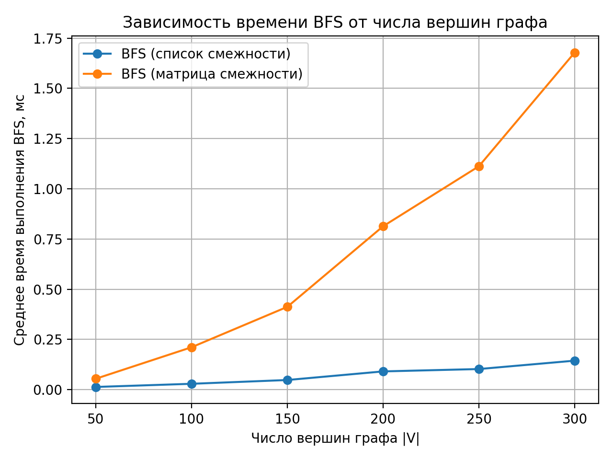
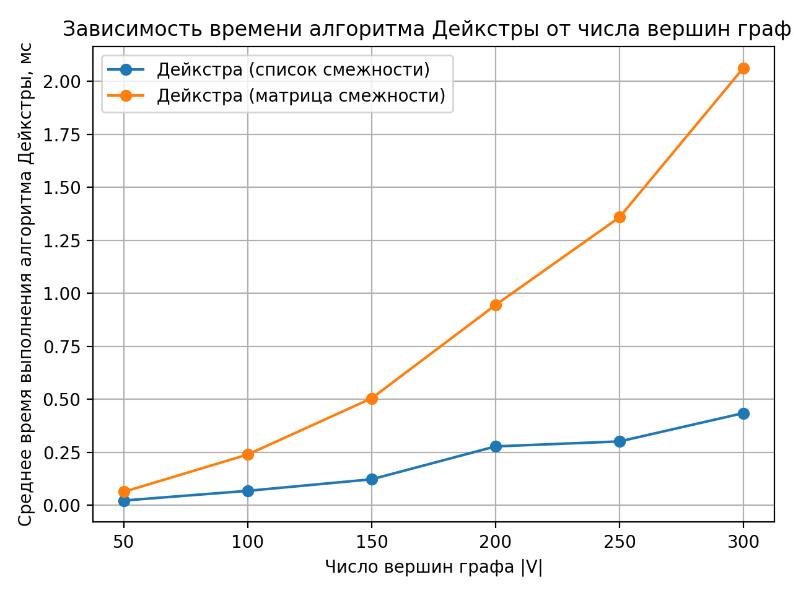
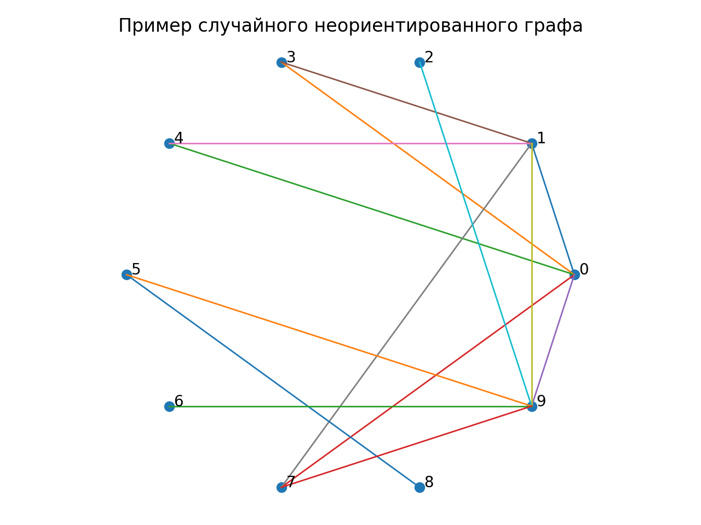
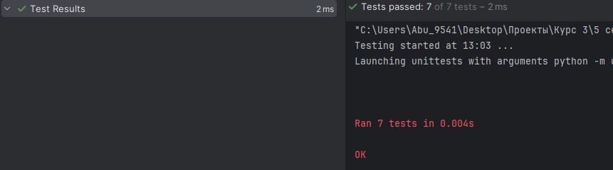

# Отчет по лабораторной работе 10
# Графы.  


**Дата:** 2025-12-13  
**Семестр:** 5 семестр  
**Группа:** ПИЖ-б-о-23-1(1)  
**Дисциплина:** Анализ сложности алгоритмов  
**Студент:** Дондаев Абу Умар-Пашаевич  

## Цель работы
Изучить основные понятия теории графов и алгоритмы работы с ними. Освоить представления графов в памяти и основные алгоритмы обхода. Получить практические навыки реализации алгоритмов на графах и анализа их сложности.  
  
  

## Теоретическая часть 
Граф: Множество вершин (узлов) и рёбер (связей) между ними. Виды: ориентированные/неориентированные, взвешенные/невзвешенные.  
Представление графов:  
- Матрица смежности: O(V²) памяти, быстрая проверка ребра
- Список смежности: O(V + E) памяти, эффективный обход соседей  
Обход графов:  
- Поиск в ширину (BFS): находит кратчайшие пути в невзвешенном графе, сложность O(V + E)
- Поиск в глубину (DFS): обход с возвратом, сложность O(V + E)  
Алгоритмы на графах:  
- Топологическая сортировка: для ориентированных ациклических графов (DAG)
- Поиск компонент связности
- Алгоритм Дейкстры: кратчайшие пути во взвешенном графе с неотрицательными весами  
 
  
  
## Практическая часть

### Выполненные задачи
Задание 1:  
1. Реализовать различные представления графов (матрица смежности, список смежности).
2. Реализовать алгоритмы обхода графов (BFS, DFS).
3. Реализовать алгоритмы поиска кратчайших путей и компонент связности.
4. Провести сравнительный анализ эффективности разных представлений графов.
5. Решить практические задачи на графах.  
  


### Ключевые фрагменты кода
```python
# graph_representation.py


from __future__ import annotations

from dataclasses import dataclass
from typing import Iterable, List, Optional, Tuple

Weight = float


@dataclass(frozen=True)
class Edge:
    """
    Ребро графа.
    """
    u: int
    v: int
    w: Weight = 1.0


class GraphAdjMatrix:
    """
    Граф на матрице смежности.
    """

    def __init__(self, num_vertices: int, directed: bool = False) -> None:
        if num_vertices <= 0:
            raise ValueError("num_vertices must be positive.")
        self._directed = directed
        self._n = num_vertices
        self._m: List[List[Optional[Weight]]] = [
            [None for _ in range(self._n)] for _ in range(self._n)
        ]

    @property
    def directed(self) -> bool:
        """True, если граф ориентированный. O(1)."""
        return self._directed

    @property
    def num_vertices(self) -> int:
        """Количество вершин. O(1)."""
        return self._n

    def _check_vertex(self, v: int) -> None:
        if v < 0 or v >= self._n:
            raise IndexError(f"Vertex {v} is out of range 0..{self._n - 1}.")

    def add_edge(self, u: int, v: int, w: Weight = 1.0) -> None:
        """
        Добавить ребро u->v (и v->u для неориентированного).
        """
        self._check_vertex(u)
        self._check_vertex(v)
        self._m[u][v] = float(w)
        if not self._directed:
            self._m[v][u] = float(w)

    def remove_edge(self, u: int, v: int) -> None:
        """
        Удалить ребро u->v (и v->u для неориентированного).
        """
        self._check_vertex(u)
        self._check_vertex(v)
        self._m[u][v] = None
        if not self._directed:
            self._m[v][u] = None

    def has_edge(self, u: int, v: int) -> bool:
        """
        Проверка наличия ребра u->v.
        """
        self._check_vertex(u)
        self._check_vertex(v)
        return self._m[u][v] is not None

    def weight(self, u: int, v: int) -> Optional[Weight]:
        """
        Вес ребра u->v или None, если ребра нет.
        """
        self._check_vertex(u)
        self._check_vertex(v)
        return self._m[u][v]

    def neighbors(self, u: int) -> List[Tuple[int, Weight]]:
        """
        Соседи вершины u: список (v, w) по всем v, где есть ребро u->v.
        """
        self._check_vertex(u)
        result: List[Tuple[int, Weight]] = []
        for v, w in enumerate(self._m[u]):
            if w is not None:
                result.append((v, w))
        return result

    def edges(self) -> List[Edge]:
        """
        Список всех рёбер.
        """
        result: List[Edge] = []
        for u in range(self._n):
            for v in range(self._n):
                w = self._m[u][v]
                if w is not None:
                    if self._directed or u <= v:
                        result.append(Edge(u, v, w))
        return result

    def add_vertex(self) -> int:
        """
        Добавить новую вершину, вернуть её индекс.
        """
        self._n += 1
        for row in self._m:
            row.append(None)
        self._m.append([None for _ in range(self._n)])
        return self._n - 1

    def remove_vertex(self, v: int) -> None:
        """
        Удалить вершину v (с переиндексацией).
        """
        self._check_vertex(v)
        self._m.pop(v)
        for row in self._m:
            row.pop(v)
        self._n -= 1


class GraphAdjList:
    """
    Граф на списках смежности.
    """

    def __init__(self, num_vertices: int, directed: bool = False) -> None:
        if num_vertices <= 0:
            raise ValueError("num_vertices must be positive.")
        self._directed = directed
        self._adj: List[List[Tuple[int, Weight]]] = [[] for _ in range(num_vertices)]

    @property
    def directed(self) -> bool:
        """True, если граф ориентированный. O(1)."""
        return self._directed

    @property
    def num_vertices(self) -> int:
        """Количество вершин. O(1)."""
        return len(self._adj)

    def _check_vertex(self, v: int) -> None:
        if v < 0 or v >= self.num_vertices:
            raise IndexError(f"""Vertex {v} is
                             out of range 0..{self.num_vertices - 1}.""")

    def add_vertex(self) -> int:
        """
        Добавить новую вершину, вернуть индекс.
        """
        self._adj.append([])
        return self.num_vertices - 1

    def remove_vertex(self, v: int) -> None:
        """
        Удалить вершину v (с переиндексацией).
        """
        self._check_vertex(v)
        self._adj.pop(v)

        for u in range(self.num_vertices):
            new_list: List[Tuple[int, Weight]] = []
            for to, w in self._adj[u]:
                if to == v:
                    continue
                new_to = to - 1 if to > v else to
                new_list.append((new_to, w))
            self._adj[u] = new_list

    def add_edge(self, u: int, v: int, w: Weight = 1.0) -> None:
        """
        Добавить ребро u->v (и v->u для неориентированного).
        """
        self._check_vertex(u)
        self._check_vertex(v)
        self._set_edge(u, v, float(w))
        if not self._directed:
            self._set_edge(v, u, float(w))

    def _set_edge(self, u: int, v: int, w: Weight) -> None:
        for i, (to, _) in enumerate(self._adj[u]):
            if to == v:
                self._adj[u][i] = (v, w)
                return
        self._adj[u].append((v, w))

    def remove_edge(self, u: int, v: int) -> None:
        """
        Удалить ребро u->v (и v->u для неориентированного).
        """
        self._check_vertex(u)
        self._check_vertex(v)
        self._adj[u] = [(to, w) for (to, w) in self._adj[u] if to != v]
        if not self._directed:
            self._adj[v] = [(to, w) for (to, w) in self._adj[v] if to != u]

    def has_edge(self, u: int, v: int) -> bool:
        """
        Проверка наличия ребра u->v.
        """
        self._check_vertex(u)
        self._check_vertex(v)
        return any(to == v for (to, _) in self._adj[u])

    def weight(self, u: int, v: int) -> Optional[Weight]:
        """
        Вес ребра u->v или None, если ребра нет.
        """
        self._check_vertex(u)
        self._check_vertex(v)
        for to, w in self._adj[u]:
            if to == v:
                return w
        return None

    def neighbors(self, u: int) -> List[Tuple[int, Weight]]:
        """
        Соседи вершины u: список (v, w).
        """
        self._check_vertex(u)
        return list(self._adj[u])

    def edges(self) -> List[Edge]:
        """
        Список всех рёбер.
        """
        result: List[Edge] = []
        for u in range(self.num_vertices):
            for v, w in self._adj[u]:
                if self._directed or u <= v:
                    result.append(Edge(u, v, w))
        return result


def build_graph_from_edges(
    num_vertices: int,
    edges: Iterable[Edge],
    *,
    representation: str = "list",
    directed: bool = False,
):
    """
    Вспомогательная фабрика: построить граф по списку рёбер.
    """
    if representation == "list":
        g = GraphAdjList(num_vertices, directed=directed)
    elif representation == "matrix":
        g = GraphAdjMatrix(num_vertices, directed=directed)
    else:
        raise ValueError("representation must be 'list' or 'matrix'")

    for e in edges:
        g.add_edge(e.u, e.v, e.w)
    return g


# graph_traversal.py


from __future__ import annotations

from collections import deque
from typing import Deque, List, Optional, Sequence, Tuple, TypeVar

TGraph = TypeVar("TGraph")


def bfs(
    graph: TGraph,
    start: int,
) -> Tuple[List[Optional[int]], List[Optional[int]]]:
    """
    BFS (поиск в ширину): возвращает массивы расстояний и родителей.
    """
    n = graph.num_vertices
    if start < 0 or start >= n:
        raise IndexError("start vertex out of range")

    dist: List[Optional[int]] = [None] * n
    parent: List[Optional[int]] = [None] * n

    q: Deque[int] = deque()
    dist[start] = 0
    q.append(start)

    while q:
        u = q.popleft()
        for v, _ in graph.neighbors(u):
            if dist[v] is None:
                dist[v] = dist[u] + 1 if dist[u] is not None else 1
                parent[v] = u
                q.append(v)

    return dist, parent


def restore_path(
    parent: Sequence[Optional[int]],
    start: int,
    target: int,
) -> List[int]:
    """
    Восстановить путь start -> target по массиву parent.
    """
    if start == target:
        return [start]

    path: List[int] = []
    cur: Optional[int] = target
    while cur is not None:
        path.append(cur)
        if cur == start:
            break
        cur = parent[cur]

    if not path or path[-1] != start:
        return []
    path.reverse()
    return path


def dfs_recursive(graph: TGraph, start: int) -> List[int]:
    """
    DFS рекурсивный: возвращает порядок посещения.
    """
    n = graph.num_vertices
    if start < 0 or start >= n:
        raise IndexError("start vertex out of range")

    visited = [False] * n
    order: List[int] = []

    def go(u: int) -> None:
        visited[u] = True
        order.append(u)
        for v, _ in graph.neighbors(u):
            if not visited[v]:
                go(v)

    go(start)
    return order


def dfs_iterative(graph: TGraph, start: int) -> List[int]:
    """
    DFS итеративный: возвращает порядок посещения.
    """
    n = graph.num_vertices
    if start < 0 or start >= n:
        raise IndexError("start vertex out of range")

    visited = [False] * n
    order: List[int] = []
    stack: List[int] = [start]

    while stack:
        u = stack.pop()
        if visited[u]:
            continue
        visited[u] = True
        order.append(u)

        # Чтобы порядок был ближе к рекурсивному,
        # добавляем соседей в обратном порядке.
        neigh = [v for v, _ in graph.neighbors(u)]
        for v in reversed(neigh):
            if not visited[v]:
                stack.append(v)

    return order


def connected_components(graph: TGraph) -> List[List[int]]:
    """
    Компоненты связности (для неориентированного графа).
    """
    if graph.directed:
        raise ValueError("connected_components expects an undirected graph.")

    n = graph.num_vertices
    visited = [False] * n
    components: List[List[int]] = []

    for s in range(n):
        if visited[s]:
            continue
        comp: List[int] = []
        q: Deque[int] = deque([s])
        visited[s] = True

        while q:
            u = q.popleft()
            comp.append(u)
            for v, _ in graph.neighbors(u):
                if not visited[v]:
                    visited[v] = True
                    q.append(v)

        components.append(comp)

    return components


def topological_sort_kahn(graph: TGraph) -> List[int]:
    """
    Топологическая сортировка (алгоритм Кана) для DAG.
    """
    if not graph.directed:
        raise ValueError("Topological sort requires a directed graph.")

    n = graph.num_vertices
    indeg = [0] * n

    for u in range(n):
        for v, _ in graph.neighbors(u):
            indeg[v] += 1

    q: Deque[int] = deque([v for v in range(n) if indeg[v] == 0])
    order: List[int] = []

    while q:
        u = q.popleft()
        order.append(u)
        for v, _ in graph.neighbors(u):
            indeg[v] -= 1
            if indeg[v] == 0:
                q.append(v)

    if len(order) != n:
        raise ValueError("""Graph has a cycle;
                         topological order does not exist.""")

    return order


def has_cycle_directed(graph: TGraph) -> bool:
    """
    Проверка наличия цикла в ориентированном графе через цвета (DFS).
    """
    if not graph.directed:
        raise ValueError("Cycle check here is for directed graphs only.")

    n = graph.num_vertices
    color = [0] * n  # 0=white, 1=gray, 2=black

    def dfs(u: int) -> bool:
        color[u] = 1
        for v, _ in graph.neighbors(u):
            if color[v] == 1:
                return True
            if color[v] == 0 and dfs(v):
                return True
        color[u] = 2
        return False

    for s in range(n):
        if color[s] == 0 and dfs(s):
            return True
    return False


# shortest_path.py

from __future__ import annotations

import heapq
from collections import deque
from typing import Deque, List, Optional, Sequence, Tuple, TypeVar

TGraph = TypeVar("TGraph")
INF = float("inf")


def dijkstra(
    graph: TGraph,
    start: int,
) -> Tuple[List[float], List[Optional[int]]]:
    """
    Алгоритм Дейкстры для графа с неотрицательными весами.
    """
    n = graph.num_vertices
    if start < 0 or start >= n:
        raise IndexError("start vertex out of range")

    dist = [INF] * n
    parent: List[Optional[int]] = [None] * n
    dist[start] = 0.0

    pq: List[Tuple[float, int]] = [(0.0, start)]
    while pq:
        d, u = heapq.heappop(pq)
        if d != dist[u]:
            continue

        for v, w in graph.neighbors(u):
            if w < 0:
                raise ValueError("""Dijkstra does not support
                                 negative edge weights.""")
            nd = d + w
            if nd < dist[v]:
                dist[v] = nd
                parent[v] = u
                heapq.heappush(pq, (nd, v))

    return dist, parent


def restore_path(
    parent: Sequence[Optional[int]],
    start: int,
    target: int,
) -> List[int]:
    """
    Восстановить путь start -> target по массиву parent.
    """
    if start == target:
        return [start]

    path: List[int] = []
    cur: Optional[int] = target
    while cur is not None:
        path.append(cur)
        if cur == start:
            break
        cur = parent[cur]

    if not path or path[-1] != start:
        return []
    path.reverse()
    return path


# Прикладная задача 1: лабиринт (BFS)


Grid = List[List[int]]  # 0=свободно, 1=стена
Cell = Tuple[int, int]


def shortest_path_in_maze_bfs(
    grid: Grid,
    start: Cell,
    goal: Cell,
) -> List[Cell]:
    """
    Кратчайший путь в лабиринте по клеткам (4-соседство) через BFS.
    """
    rows = len(grid)
    cols = len(grid[0]) if rows > 0 else 0
    if rows == 0 or cols == 0:
        return []

    sr, sc = start
    gr, gc = goal
    if not (0 <= sr < rows and 0 <= sc < cols):
        raise IndexError("start is out of grid bounds")
    if not (0 <= gr < rows and 0 <= gc < cols):
        raise IndexError("goal is out of grid bounds")
    if grid[sr][sc] == 1 or grid[gr][gc] == 1:
        return []

    parent: List[List[Optional[Cell]]] = [[None] * cols for _ in range(rows)]
    visited = [[False] * cols for _ in range(rows)]
    q: Deque[Cell] = deque([start])
    visited[sr][sc] = True

    dirs = [(-1, 0), (1, 0), (0, -1), (0, 1)]

    while q:
        r, c = q.popleft()
        if (r, c) == goal:
            break

        for dr, dc in dirs:
            nr, nc = r + dr, c + dc
            if (
                0 <= nr < rows and 0 <= nc < cols
                and not visited[nr][nc]
                and grid[nr][nc] == 0
            ):
                visited[nr][nc] = True
                parent[nr][nc] = (r, c)
                q.append((nr, nc))

    if not visited[gr][gc]:
        return []

    # восстановление пути
    path: List[Cell] = []
    cur: Optional[Cell] = goal
    while cur is not None:
        path.append(cur)
        if cur == start:
            break
        cr, cc = cur
        cur = parent[cr][cc]

    if not path or path[-1] != start:
        return []
    path.reverse()
    return path


# Прикладная задача 2: связность сети


def is_connected_undirected(graph: TGraph) -> bool:
    """
    Проверка связности неориентированного графа.
    """
    if graph.directed:
        raise ValueError("""is_connected_undirected expects
                         an undirected graph.""")

    n = graph.num_vertices
    if n == 0:
        return True

    visited = [False] * n
    q: Deque[int] = deque([0])
    visited[0] = True

    while q:
        u = q.popleft()
        for v, _ in graph.neighbors(u):
            if not visited[v]:
                visited[v] = True
                q.append(v)

    return all(visited)

```

## Результаты выполнения

### Пример работы программы
Вывод файла comparison.py:  
```bash
Характеристики ПК для тестирования:
- Процессор: Intel Core i7-13620H @ 2.40GHz
- Оперативная память: 32 GB DDR5
- ОС: Windows 11
- Python: 3.13.3


Таблица результатов: время выполнения BFS
|V| (число вершин) | Список смежности (мс) | Матрица смежности (мс)
-------------------+-----------------------+-----------------------
50                 | 0.013                 | 0.054                 
100                | 0.029                 | 0.211                 
150                | 0.048                 | 0.412                 
200                | 0.091                 | 0.813                 
250                | 0.102                 | 1.112                 
300                | 0.144                 | 1.679                 

Таблица результатов: время выполнения алгоритма Дейкстры
|V| (число вершин) | Список смежности (мс) | Матрица смежности (мс)
-------------------+-----------------------+-----------------------
50                 | 0.023                 | 0.064                 
100                | 0.068                 | 0.240                 
150                | 0.123                 | 0.505                 
200                | 0.278                 | 0.946                 
250                | 0.302                 | 1.359                 
300                | 0.435                 | 2.064
```    


### Тестирование
Все юнит-тесты, написанные в файле "tests.py", прошли успешно. Смотреть в приложении ниже.


## Выводы
1. Матрица смежности удобна быстрыми запросами наличия ребра, но требует O(V^2) памяти и медленнее по соседям (O(V)).  
2. Список смежности эффективнее по памяти и по обходам, поэтому предпочтителен для разреженных графов.  
3. BFS даёт кратчайшие пути в невзвешенных графах; DFS удобен для задач анализа структуры графа.  
4. Для DAG применима топологическая сортировка; для взвешенных графов с неотрицательными весами применим алгоритм Дейкстры.  
 


## Ответы на контрольные вопросы
1. **В чем разница между представлением графа в виде матрицы смежности и списка смежности? Сравните их по потреблению памяти и сложности операций.**

Матрица смежности представляет граф в виде двумерного массива размером `V × V`, где элемент `[i][j]` показывает наличие ребра между вершинами `i` и `j` (или его вес).  
Такое представление требует `O(V²)` памяти независимо от количества рёбер. Проверка существования ребра выполняется за `O(1)`, однако перебор соседей вершины занимает `O(V)` времени.

Список смежности хранит для каждой вершины список её соседей. Память при этом составляет `O(V + E)`, что значительно эффективнее для разреженных графов. Перебор соседей выполняется за `O(deg(v))`, а проверка наличия конкретного ребра требует `O(deg(v))`.

Таким образом, матрица смежности удобна для плотных графов и быстрых проверок наличия ребра, а список смежности предпочтителен для разреженных графов и обходов.

---

2. **Опишите алгоритм поиска в ширину (BFS). Для решения каких задач он применяется?**

Алгоритм поиска в ширину (BFS) начинает обход графа с заданной стартовой вершины и посещает вершины уровнями, начиная с ближайших к стартовой.  
Алгоритм использует очередь: сначала в неё помещается стартовая вершина, затем последовательно извлекаются вершины, и в очередь добавляются все их непосещённые соседи.

BFS применяется для:
- поиска кратчайших путей в невзвешенных графах,
- определения достижимости вершин,
- нахождения компонент связности,
- анализа уровней графа и расстояний между вершинами.

Временная сложность алгоритма BFS составляет `O(V + E)`.

---

3. **Чем поиск в глубину (DFS) отличается от BFS? Какие дополнительные задачи (например, проверка на ацикличность) можно решить с помощью DFS?**

Поиск в глубину (DFS) отличается от BFS тем, что алгоритм сначала максимально углубляется по одному пути, прежде чем возвращаться назад.  
DFS реализуется с использованием рекурсии или стека, в то время как BFS использует очередь и работает по уровням.

С помощью DFS можно решать дополнительные задачи, такие как:
- обнаружение циклов в графе,
- проверка графа на ацикличность,
- топологическая сортировка ориентированного графа,
- поиск компонент связности,
- поиск компонент сильной связности.

Как и BFS, алгоритм DFS имеет временную сложность `O(V + E)`.

---

4. **Как алгоритм Дейкстры находит кратчайшие пути во взвешенном графе? Почему он не работает с отрицательными весами ребер?**

Алгоритм Дейкстры последовательно находит кратчайшие расстояния от стартовой вершины до всех остальных вершин во взвешенном графе с неотрицательными весами рёбер.  
Он поддерживает массив текущих расстояний и на каждом шаге выбирает вершину с минимальным известным расстоянием, после чего выполняет релаксацию её рёбер.

Алгоритм не работает с отрицательными весами, так как он предполагает, что найденное минимальное расстояние до вершины является окончательным. При наличии отрицательных рёбер это предположение нарушается, и алгоритм может вернуть неверный результат.

При использовании приоритетной очереди временная сложность алгоритма Дейкстры составляет `O((V + E) log V)`.

---

5. **Что такое топологическая сортировка и для каких графов она применима? Приведите пример задачи, где она используется.**

Топологическая сортировка — это упорядочивание вершин ориентированного графа таким образом, что для каждого ребра `u → v` вершина `u` располагается раньше вершины `v`.

Топологическая сортировка применима только к ориентированным ациклическим графам (DAG). Если в графе присутствует цикл, топологическая сортировка невозможна.

Примером применения топологической сортировки является определение порядка выполнения задач при наличии зависимостей, например порядок компиляции модулей программы или порядок изучения учебных дисциплин с пререквизитами.


## Приложения
-   
-   
-   
-   
