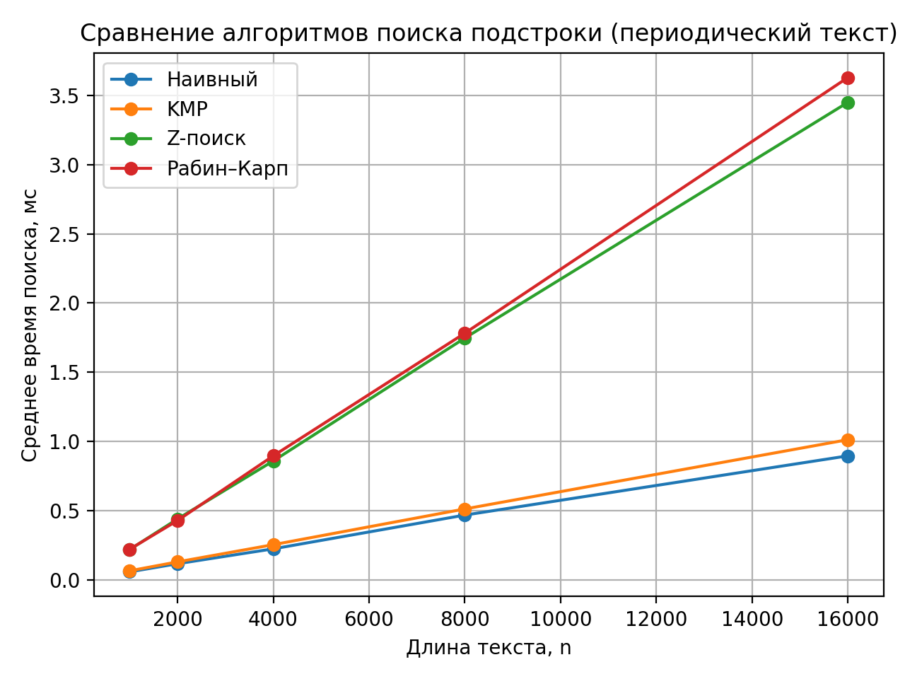
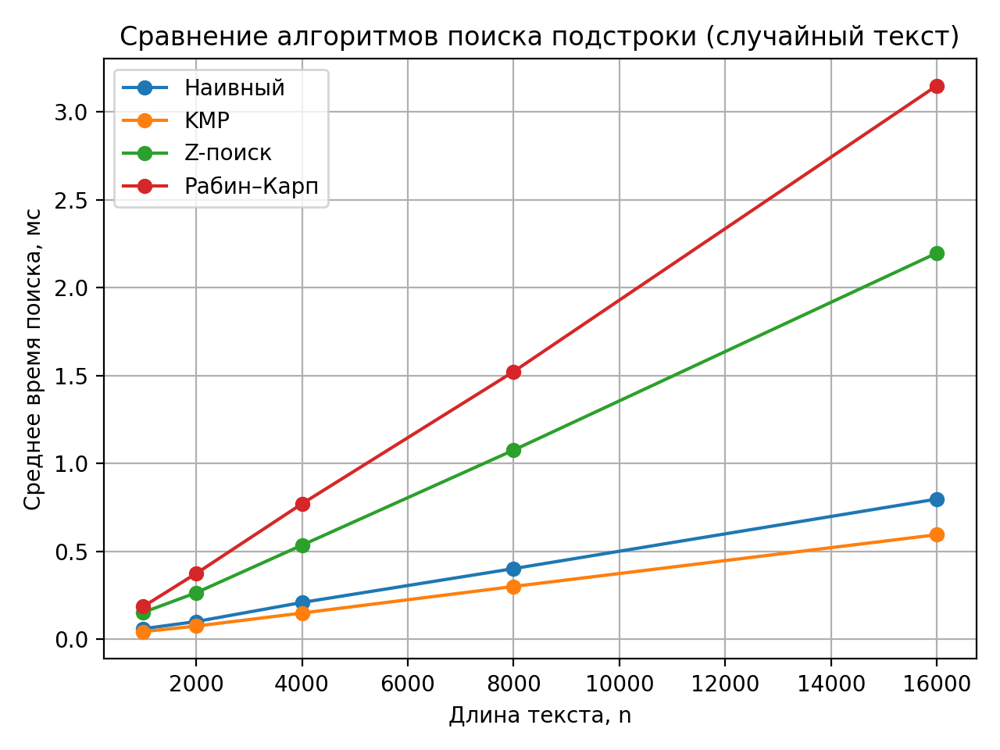
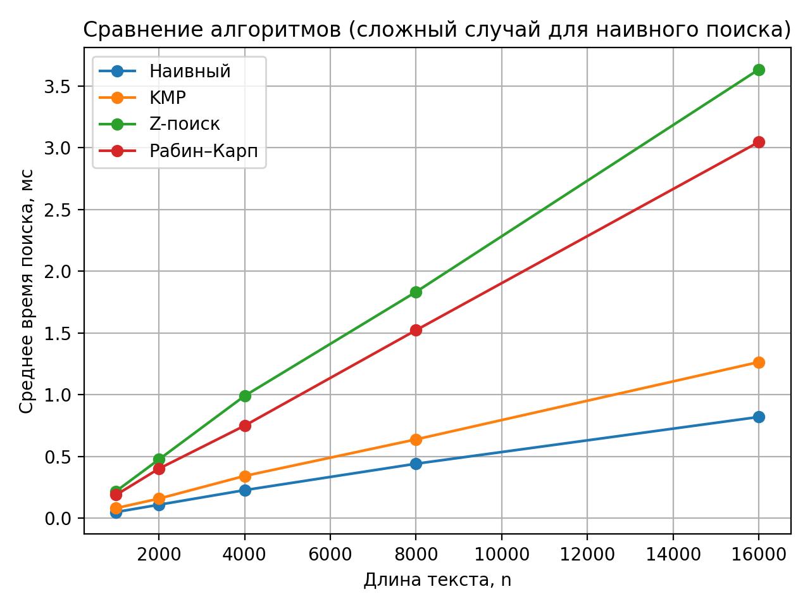
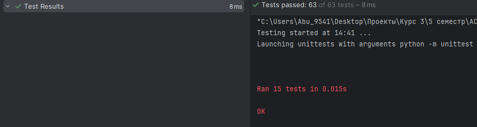

# Отчет по лабораторной работе 11
# Алгоритмы на строках.  


**Дата:** 2025-12-14  
**Семестр:** 5 семестр  
**Группа:** ПИЖ-б-о-23-1(1)  
**Дисциплина:** Анализ сложности алгоритмов  
**Студент:** Дондаев Абу Умар-Пашаевич  

## Цель работы
Изучить специализированные алгоритмы для эффективной работы со строками. Освоить методы поиска подстрок, вычисление префикс-функции и Z-функции. Получить практические навыки реализации и анализа алгоритмов обработки строк, исследовать их производительность.  
  
  

## Теоретическая часть 
Префикс-функция: Для строки S длиной n - массив π[0..n-1], где π[i] - длина наибольшего собственного префикса, который является суффиксом подстроки S[0..i]. Сложность вычисления: O(n).  
Алгоритм Кнута-Морриса-Пратта (KMP): Эффективный алгоритм поиска подстроки, использующий префикс-функцию. Сложность: O(n + m).  
Z-функция: Для строки S длиной n - массив z[0..n-1], где z[i] - длина наибольшего общего префикса строки S и суффикса S[i..n-1]. Сложность вычисления: O(n).  
Поиск подстроки: Помимо KMP существуют алгоритмы Бойера-Мура, Рабина-Карпа, каждый со своими особенностями и областью применения.  

 
  
  
## Практическая часть

### Выполненные задачи
Задание 1:  
1. Реализовать вычисление префикс-функции для строки.
2. Реализовать алгоритм Кнута-Морриса-Пратта для поиска подстроки.
3. Реализовать вычисление Z-функции.
4. Реализовать один из дополнительных алгоритмов поиска подстроки.
5. Провести сравнительный анализ эффективности алгоритмов на различных данных  
  


### Ключевые фрагменты кода
```python
# prefix_function.py


from __future__ import annotations

from typing import List


def prefix_function(s: str) -> List[int]:
    """Вычислить префикс-функцию строки.
    """
    n = len(s)
    pi: List[int] = [0] * n
    j = 0

    for i in range(1, n):
        while j > 0 and s[i] != s[j]:
            j = pi[j - 1]

        if s[i] == s[j]:
            j += 1

        pi[i] = j

    return pi


# z_function.py


from __future__ import annotations

from typing import List


def z_function(s: str) -> List[int]:
    """Вычислить Z-функцию строки.
    """
    n = len(s)
    z: List[int] = [0] * n
    l = 0
    r = 0

    for i in range(1, n):
        if i <= r:
            z[i] = min(r - i + 1, z[i - l])

        while i + z[i] < n and s[z[i]] == s[i + z[i]]:
            z[i] += 1

        if i + z[i] - 1 > r:
            l = i
            r = i + z[i] - 1

    return z


# kmp_search.py


from __future__ import annotations

from typing import List

from prefix_function import prefix_function


def kmp_search(text: str, pattern: str) -> List[int]:
    """Найти все вхождения pattern в text с помощью KMP.
    """
    n = len(text)
    m = len(pattern)

    if m == 0:
        return list(range(n + 1))

    pi = prefix_function(pattern)
    result: List[int] = []
    j = 0

    for i in range(n):
        while j > 0 and text[i] != pattern[j]:
            j = pi[j - 1]

        if text[i] == pattern[j]:
            j += 1

        if j == m:
            result.append(i - m + 1)
            j = pi[j - 1]

    return result


# string_matching.py


from __future__ import annotations

from dataclasses import dataclass
from typing import List, Literal, Sequence

from kmp_search import kmp_search
from prefix_function import prefix_function
from z_function import z_function

SearchMethod = Literal["naive", "kmp", "z", "rk"]


# 1) Поиск всех вхождений (базовые реализации)

def naive_search(text: str, pattern: str) -> List[int]:
    """Наивный поиск всех вхождений pattern в text."""
    n = len(text)
    m = len(pattern)

    if m == 0:
        return list(range(n + 1))

    res: List[int] = []
    for i in range(n - m + 1):
        if text[i: i + m] == pattern:
            res.append(i)
    return res


def z_search(text: str, pattern: str, sep: str = "#") -> List[int]:
    """Поиск всех вхождений pattern в text через Z-функцию.
    """
    if pattern == "":
        return list(range(len(text) + 1))

    if sep in pattern or sep in text:
        sep = "\x00"
        if sep in pattern or sep in text:
            raise ValueError("Не удалось подобрать разделитель для Z-поиска.")

    combined = pattern + sep + text
    z = z_function(combined)

    m = len(pattern)
    res: List[int] = []
    for i in range(m + 1, len(combined)):
        if z[i] >= m:
            res.append(i - (m + 1))
    return res


# 2) Рабин–Карп

@dataclass(frozen=True)
class RKParams:
    """Параметры rolling-hash для Рабина–Карпа."""
    base: int = 911382323
    mod: int = 1_000_000_007


def _rk_hash_init(s: str, params: RKParams) -> int:
    h = 0
    for ch in s:
        h = (h * params.base + ord(ch)) % params.mod
    return h


def _rk_prepare_power(length: int, params: RKParams) -> int:
    power = 1
    for _ in range(length):
        power = (power * params.base) % params.mod
    return power


def rabin_karp_search(text: str,
                      pattern: str,
                      params: RKParams | None = None) -> List[int]:
    """Поиск всех вхождений pattern в text методом Рабина–Карпа.
    При совпадении хеша выполняется проверка подстроки для исключения коллизий.
    """
    if params is None:
        params = RKParams()

    n = len(text)
    m = len(pattern)

    if m == 0:
        return list(range(n + 1))
    if m > n:
        return []

    pat_hash = _rk_hash_init(pattern, params)
    window_hash = _rk_hash_init(text[:m], params)

    power = _rk_prepare_power(m - 1, params)

    res: List[int] = []
    if window_hash == pat_hash and text[:m] == pattern:
        res.append(0)

    for i in range(1, n - m + 1):
        left = ord(text[i - 1])
        right = ord(text[i + m - 1])

        window_hash = (window_hash - left * power) % params.mod
        window_hash = (window_hash * params.base + right) % params.mod

        if window_hash == pat_hash and text[i: i + m] == pattern:
            res.append(i)

    return res


# 3) Единый интерфейс: поиск всех вхождений

def find_all_occurrences(text: str,
                         pattern: str,
                         method: SearchMethod = "kmp") -> List[int]:
    """Найти все вхождения pattern в text выбранным методом.
    """
    if method == "naive":
        return naive_search(text, pattern)
    if method == "kmp":
        return kmp_search(text, pattern)
    if method == "z":
        return z_search(text, pattern)
    if method == "rk":
        return rabin_karp_search(text, pattern)
    raise ValueError("method must be one of: 'naive', 'kmp', 'z', 'rk'")


# 4) Практическая задача: циклический сдвиг

def is_cyclic_shift(a: str, b: str, method: SearchMethod = "kmp") -> bool:
    """Проверить, является ли b циклическим сдвигом a.
    """
    if len(a) != len(b):
        return False
    if a == b:
        return True
    if len(a) == 0:
        return True  # обе пустые

    doubled = a + a
    return len(find_all_occurrences(doubled, b, method=method)) > 0


# 5) Практическая задача: минимальный период

def minimal_period_prefix(s: str) -> int:
    """Длина минимального периода строки через π-функцию."""
    n = len(s)
    if n == 0:
        return 0

    pi = prefix_function(s)
    p = n - pi[-1]
    if p != 0 and n % p == 0:
        return p
    return n


def minimal_period_z(s: str) -> int:
    """Длина минимального периода строки через Z-функцию."""
    n = len(s)
    if n == 0:
        return 0

    z = z_function(s)
    for p in range(1, n + 1):
        if n % p == 0:
            if p < n and z[p] >= n - p:
                return p
            if p == n:
                return n
    return n


def count_occurrences(positions: Sequence[int]) -> int:
    """Число вхождений по списку позиций."""
    return len(positions)

```

## Результаты выполнения

### Пример работы программы
Вывод файла analysis.py:  
```bash
Характеристики ПК для тестирования:
- Процессор: Intel Core i7-13620H @ 2.40GHz
- Оперативная память: 32 GB DDR5
- ОС: Windows 11
- Python: 3.13.3


Таблица: Случайный текст
n      | Наивный | KMP    | Z-поиск | Рабин–Карп
-------+---------+--------+---------+-----------
1000   | 0.060   | 0.044  | 0.153   | 0.187     
2000   | 0.101   | 0.075  | 0.265   | 0.375     
4000   | 0.210   | 0.150  | 0.536   | 0.771     
8000   | 0.402   | 0.301  | 1.077   | 1.523     
16000  | 0.798   | 0.595  | 2.198   | 3.150     

Таблица: Периодический текст
n      | Наивный | KMP    | Z-поиск | Рабин–Карп
-------+---------+--------+---------+-----------
1000   | 0.057   | 0.065  | 0.218   | 0.221     
2000   | 0.116   | 0.129  | 0.440   | 0.428     
4000   | 0.224   | 0.254  | 0.859   | 0.896     
8000   | 0.468   | 0.512  | 1.747   | 1.782     
16000  | 0.896   | 1.013  | 3.451   | 3.630     

Таблица: Худший случай для наивного
n      | Наивный | KMP    | Z-поиск | Рабин–Карп
-------+---------+--------+---------+-----------
1000   | 0.049   | 0.081  | 0.218   | 0.188     
2000   | 0.108   | 0.158  | 0.475   | 0.400     
4000   | 0.226   | 0.341  | 0.990   | 0.749     
8000   | 0.440   | 0.638  | 1.833   | 1.522     
16000  | 0.820   | 1.264  | 3.635   | 3.047 
```    


### Тестирование
Все юнит-тесты, написанные в файле "tests.py", прошли успешно. Смотреть в приложении ниже.


## Выводы
1. Анализ реализованных алгоритмов поиска подстроки показал, что наивный алгоритм обладает наименьшей устойчивостью к структуре входных данных и демонстрирует резкое ухудшение производительности на периодических строках и строках с большим числом совпадающих префиксов, что соответствует его квадратичной временной сложности.
2. Алгоритмы Кнута–Морриса–Пратта и поиска на основе Z-функции обеспечивают стабильное линейное время работы независимо от характера входных данных, что подтверждает их асимптотическую оптимальность и практическую эффективность для обработки больших текстов.
3. Алгоритм Рабина–Карпа в среднем показывает высокую скорость работы, однако его эффективность зависит от свойств хеш-функции и наличия коллизий, что делает его менее предсказуемым по сравнению с KMP и Z-поиском.
4. Префикс-функция и Z-функция показали высокую универсальность, так как позволяют решать не только задачу поиска подстроки, но и задачи анализа структуры строки, такие как поиск минимального периода и проверка циклического сдвига, за линейное время.
5. Сведение задачи проверки циклического сдвига строк к задаче поиска подстроки в удвоенной строке является вычислительно эффективным подходом и позволяет избежать перебора всех возможных сдвигов.
6. Экспериментальные результаты подтверждают, что использование асимптотически оптимальных строковых алгоритмов является оправданным и необходимым при работе с большими объёмами данных.
 


## Ответы на контрольные вопросы
1. **Что такое префикс-функция строки? Как она используется в алгоритме Кнута-Морриса-Пратта (KMP)?**

Префикс-функция (π-функция) для строки `S` — это массив `π[0..n-1]`, где `π[i]` равна длине наибольшего собственного префикса строки `S`, который одновременно является суффиксом подстроки `S[0..i]`.  
В KMP π-функция нужна для ускорения поиска: при несовпадении символов алгоритм не возвращается назад по тексту, а использует значения π, чтобы быстро определить, на сколько можно сдвинуть шаблон и какую длину совпавшего префикса сохранить. Это устраняет повторные сравнения и даёт сложность `O(n + m)`.

---

2. **В чем основное преимущество алгоритма KMP перед наивным алгоритмом поиска подстроки? Проиллюстрируйте на примере.**

Преимущество KMP в том, что он не выполняет повторные сравнения символов текста, которые уже были сопоставлены. Наивный алгоритм при сдвиге шаблона может пересравнивать одни и те же участки много раз, что приводит к худшей сложности `O(n*m)`.  
Например, для `text = "aaaaaaaaaaaaa"` и `pattern = "aaaaab"` наивный поиск часто сравнивает почти весь шаблон и затем сдвигается на 1, выполняя много лишних сравнений. KMP использует π-функцию и после несовпадения сразу выбирает следующую возможную длину совпадения, продолжая поиск без отката по тексту.

---

3. **Опишите, что такое Z-функция строки. Как с ее помощью можно решить задачу поиска подстроки?**

Z-функция для строки `S` — массив `z[0..n-1]`, где `z[i]` — длина наибольшего общего префикса строки `S` и её суффикса `S[i..]` (обычно `z[0] = 0`).  
Чтобы найти подстроку `P` в тексте `T`, строят строку `P + '#' + T`, вычисляют для неё Z-функцию и ищут индексы `i`, где `z[i] >= len(P)`. Каждое такое `i` соответствует вхождению `P` в `T`. Сложность подхода — `O(n + m)`.

---

4. **В чем заключается идея алгоритма Бойера-Мура? Какие эвристики он использует для ускорения поиска?**

Идея алгоритма Бойера–Мура — сравнивать шаблон с текстом справа налево и при несовпадении делать большие сдвиги шаблона, пропуская позиции, где совпадение невозможно.  
Используются две основные эвристики:  
- эвристика **плохого символа** (сдвиг зависит от того, встречается ли несовпавший символ в шаблоне);  
- эвристика **хорошего суффикса** (использует уже совпавший суффикс шаблона для выбора большего сдвига).  
На практике на естественных текстах алгоритм часто работает существенно быстрее наивного.

---

5. **Для каких практических задач, помимо поиска подстроки, могут применяться префикс- и Z-функции (например, поиск периода строки)?**

Префикс- и Z-функции применяются не только для поиска подстроки, но и для:
- поиска **минимального периода** строки;
- нахождения **границ** строки (префиксов, которые одновременно являются суффиксами);
- определения повторяющихся фрагментов и шаблонов;
- подсчёта количества вхождений префиксов в строку;
- задач сравнения подстрок и анализа повторов (например, в биоинформатике и обработке больших текстов).


## Приложения
-   
-   
-   
-   
